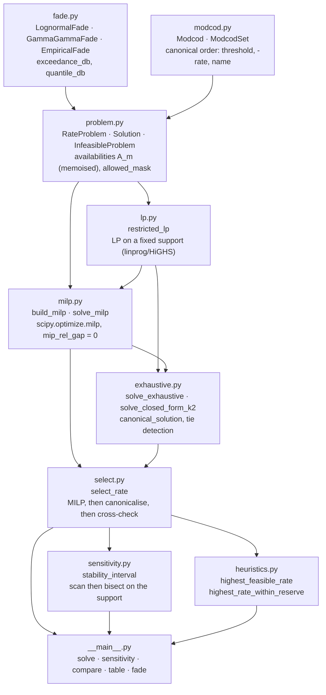
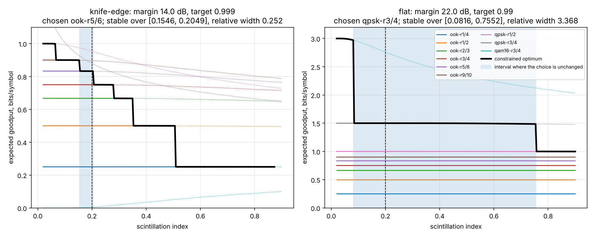
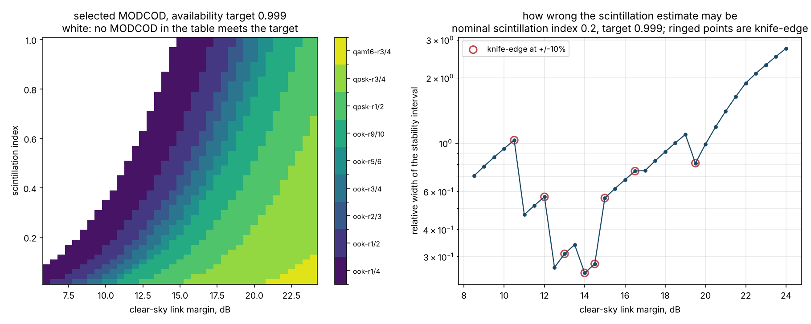
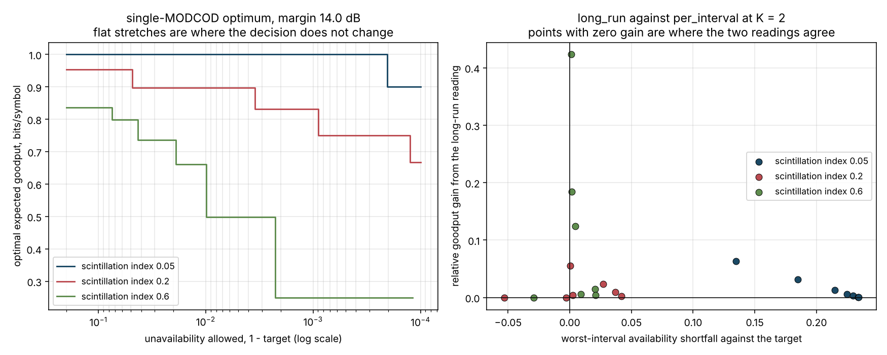
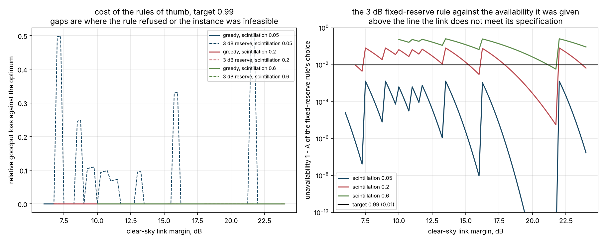

# CodeRateOpt

Availability-constrained MODCOD and code-rate selection on a fading optical link.


**Status: TESTING** · Class: compact · Validation level 2 (research grade) ·
No machine learning · Apache-2.0 · © 2026 OPTIMA Organisation

This software is research-grade. It is **not flight-qualified, not certified,
and not approved for operational aerospace use.** It selects a code rate under
a stated model of the channel; it does not qualify a modem, and the MODCOD
thresholds it consumes are yours to measure.

## The problem

A link designer has a MODCOD table, a clear-sky margin and an availability
number in the requirement, and picks the fastest MODCOD that still closes with
a few decibels of fade reserve. Nobody writes down which of the two readings of
"99.9 % availability" the reserve was chosen for -- every interval meeting the
requirement, or the long-run average meeting it -- and the two give different
answers as soon as the modem is allowed to switch rates. Nobody writes down how
wrong the scintillation estimate may be before the answer changes, so a 10 %
error in a number that was itself a guess silently moves the design point.

## What this does

- **States the optimisation instead of implying it.** Decision variables, the
  objective (expected goodput `sum_m R_m A_m x_m`), the cardinality and
  minimum-dwell constraints, and **both** forms of the availability constraint
  are written out in `coderateopt/problem.py`, with the four assumptions that
  bound what the answer means. The two forms give different answers at
  **511 of 684** grid points, median goodput gain **4.62 %**, median
  worst-interval availability shortfall **0.0207**
  (`validation/validate_mode_divergence.py`).
- **Earns the mixed-integer formulation only where it is earned.** With no
  minimum dwell the optimum is provably one entry (`per_interval`) or two
  (`long_run`), and a search over 909 feasible instances found no
  counterexample -- so the README tells you to write the NumPy one-liner. With
  a minimum dwell the proofs break and the integer variables matter: **13 of
  1922** targeted instances had a three-entry optimum, the best beating every
  two-entry mix by **4.345e-02 bits/symbol**
  (`validation/validate_support_size.py`).
- **Solves it three ways and checks they agree.** `scipy.optimize.milp`
  (HiGHS), subset enumeration with a plain LP per subset, and a solver-free
  closed form for two-entry mixes. Over **3000 random instances, 2216 of them
  feasible: 0 mismatches**, worst relative goodput difference **0.000e+00**
  (`validation/validate_milp_vs_exhaustive.py`).
- **Found two real solver defects by doing that.** `scipy.optimize.milp` leaves
  `mip_rel_gap` at the HiGHS default and returns the wrong *decision* on
  **3 of 481** feasible random instances, worst relative shortfall
  **6.87e-05** (`validation/validate_mip_gap.py`). Separately, the raw HiGHS
  allocation can miss the availability target by **1.66e-08** -- inside its
  primal feasibility tolerance -- and bank **5.0e-07** of relative goodput for
  it. Both are handled, and both are documented at the lines that handle them.
- **Reports how fragile the answer is, not just what it is.** The stability
  interval of the chosen MODCOD in the scintillation index, resolved by
  bisection to 1e-4. A **knife-edge** case: margin 14.0 dB, target 0.999,
  `ook-r5/6`, stable over **[0.1546, 0.2049]**, upward headroom **2.44 %**. A
  **flat** case: margin 22.0 dB, target 0.990, `qpsk-r3/4`, stable over
  **[0.0816, 0.7553]**, upward headroom **278 %**. A ratio of **13.4** in
  relative width between two instances of the same nine-entry table
  (`validation/validate_sensitivity.py`).
- **Refuses infeasible instances with the number that would fix them.** No
  least-bad fallback. The error names the best achievable availability, the
  MODCOD that achieves it and the margin in dB at which the instance would
  solve -- and `validation/validate_degenerate.py` checks that the named margin
  really does make it solve.

## Who it is for

- Anyone who has to defend a code-rate choice and wants the formulation, the
  assumptions and the sensitivity in one place rather than in a spreadsheet
  and a memory.
- Anyone who has been asked "what if the scintillation index is 20 % higher"
  and wants the answer resolved rather than sampled.
- Anyone whose MODCOD table is **not** well behaved -- non-monotone goodput,
  ties, entries that are faster but less available. On a deliberately
  non-monotone table the usual greedy rule loses **55.6 %** of the goodput
  (`validation/validate_degenerate.py`).
- Anyone who needs the per-interval versus long-run distinction stated and
  priced rather than assumed.
- Students and educators: the formulation is derived in a module docstring,
  every validation script prints its working, and the known-answer tests show
  the arithmetic.

## Who it is not for

- **Anyone whose problem is one MILP they can already write down.** Call
  `scipy.optimize.milp` directly. It is in SciPy, it is HiGHS underneath, it is
  the same solver this package calls, and wrapping it buys you nothing. Set
  `options={"mip_rel_gap": 0.0}` when you do -- see **Alternatives** for why.
- **Anyone who only wants the single best MODCOD on a well-behaved table.**
  Measured here: the greedy rule "fastest MODCOD whose own availability meets
  the target" matched the constrained optimum at **429 of 430** grid points,
  worst relative loss **0.000865** (`validation/validate_heuristic_gap.py`).
  That is one line of NumPy and it is almost always right. The code is in
  **Alternatives** below; use it.
- **Anyone who needs fade *dynamics*.** Everything here is a marginal
  distribution. Outage duration, fade rate, interleaver depth and feedback
  delay are not modelled. For fade-duration statistics on an Earth-space path,
  the methodology is ITU-R P.1623; this package does not implement it.
- **Anyone who needs a propagation model.** The scintillation index is an
  input. Aperture averaging, pointing jitter, beam wander and the turbulence
  profile must be folded into it before it is passed in.
- **Anyone who needs a modem model.** The MODCOD thresholds are inputs, and the
  shipped table is round illustrative constants, labelled as such everywhere.
- **Anyone needing to schedule switching.** `x_m` is a long-run time fraction.
  The model says what mix is optimal, not when to switch, and assumes
  switching is free and the channel state is known.

## Alternatives, honestly

| Alternative | What it does better | When to use this instead |
|---|---|---|
| **[`scipy.optimize.milp`](https://docs.scipy.org/doc/scipy/reference/generated/scipy.optimize.milp.html) on its own** (SciPy 1.18.1 here, HiGHS underneath) | **It is the right answer if you can state your problem as a MILP.** It is already installed, it is a global solver for a bounded feasible MILP, and this package is a caller of it, not a replacement. There is no performance story here: the MILP solve measured **3.48 ms** mean over 3000 instances, and the enumeration cross-check costs **11.20 ms**, so this package is the *slower* way to get the same number. | When you want the formulation, the availability-mode distinction, the sensitivity interval and the degenerate-case handling already worked out, and a second implementation watching the first. Two caveats this package exists partly to carry: `milp` inherits the HiGHS default `mip_rel_gap`, which changed the selected MODCOD on 3 of 481 instances here; and its solution can sit 1.66e-08 outside a tight availability row. Both are documented in `coderateopt/milp.py` with the instances that produce them. |
| **One line of NumPy** | Nothing to install, nothing to learn. For the per-interval formulation the optimum *is* `argmax` over the eligible entries, and that is a proof, not an approximation (`coderateopt/problem.py`, structural results): `i = np.argmax(np.where(A >= target, R * A, -np.inf))`. For the long-run formulation with no minimum dwell the optimum needs at most two entries, so `O(M**2)` pairs in closed form solve it exactly. Both were confirmed over 909 feasible random instances with 0 violations. | When you want the availability constraint checked rather than assumed, the stability interval, the infeasibility diagnostic, or a minimum dwell fraction. With `min_dwell_fraction > 0` the closed form is not slow, it is **wrong**: 13 of 1922 targeted instances had a three-entry optimum, the best beating every pair by 4.345e-02 bits/symbol. If none of those matter, write the line. |
| [`pulp`](https://pypi.org/project/pulp/) (4.0.0 on PyPI) | A readable algebraic modelling layer over many solvers, and a much nicer way to *write* a MILP than assembling constraint matrices by hand. | **In this build container `pulp.listSolvers(onlyAvailable=True)` returns `[]`** -- it installs and models but cannot solve, because no backend solver is present. It is listed here as a modelling front end that needs a solver this environment does not have, not as an alternative that was benchmarked. |
| [`cvxpy`](https://pypi.org/project/cvxpy/) (1.9.3 on PyPI) | Disciplined convex programming with a far richer expression language, mixed-integer support through its own backends, and parameter/DPP machinery for re-solving a family of instances quickly. If the objective stops being linear -- a concave utility of goodput, a risk term -- it is the better tool. | When the problem stays linear and the value is in the framing rather than in the modelling language. `cvxpy` is not installed in this environment and was not benchmarked against. |
| [`pyomo`](https://pypi.org/project/pyomo/) (6.10.1 on PyPI), [`mip`](https://pypi.org/project/mip/) (2.0.0 on PyPI) | Full modelling ecosystems: Pyomo for large structured models and solver portability, `mip` for a direct CBC/Gurobi interface with callbacks and lazy constraints. | When the model is nine MODCODs and two constraints, which is this one. Neither is installed here and neither was benchmarked. |
| [`itur`](https://pypi.org/project/itur/) (0.4.0 on PyPI) | ITU-R propagation models for Earth-space links -- attenuation, availability statistics, the recommendation-by-recommendation methodology this package explicitly does not implement. | When you already have a fade distribution, from `itur` or from measurements, and the question is what rate to run on it. The two compose: `itur` produces statistics, `EmpiricalFade` consumes samples. |
| A fixed decibel reserve | It is what most link budgets actually do, it needs no distribution, and it is defensible when the fade statistics are unknown. | When the availability number in the requirement has to be met. Measured here: a 3 dB reserve picked a MODCOD **below** the 0.99 availability target at **99 of 200** grid points (`examples/heuristic_gap.py`) and at **192 of 430** points on a wider grid (`validation/validate_heuristic_gap.py`). That is a specification miss, not a throughput loss. |

**The narrow defensible claim.** This is *the availability-constrained rate
selection problem written down with both readings of the constraint, solved
three independent ways that agree, with the stability interval of the decision
resolved and the degenerate cases handled.* It is **not** faster than calling
`scipy.optimize.milp`, **not** a propagation model, **not** a modem model, and
**not** necessary if your MODCOD table is well behaved and you only want the
single best entry.

## Install and first run

```bash
git clone https://github.com/OmAcharya-avtr/coderateopt.git
cd coderateopt
python -m venv .venv && source .venv/bin/activate
pip install -e ".[dev]"
python -m pytest tests/ -q
python -m coderateopt solve --margin-db 14 --target 0.999
```

Expected output of the last command:

```
method                     exhaustive (canonical=True)
mode                       per_interval
availability target        0.999000
expected goodput           0.832272 bits/symbol
achieved availability      0.999126
worst-interval availability 0.999126
mix:
  ook-r5/6       x=1.000000  threshold=  7.80 dB  A=0.999126
```

`python -m pytest tests/ -q` reports `152 passed`.

## A worked example

```python
from coderateopt import (
    LognormalFade, RateProblem, illustrative_modcod_table,
    scintillation_sensitivity, select_rate,
)

table = illustrative_modcod_table()          # 9 MODCODs, illustrative constants
fade = LognormalFade(scintillation_index=0.2)  # weak turbulence, E[I] = 1

problem = RateProblem(
    modcods=table,
    fade=fade,
    margin_db=14.0,              # clear-sky margin, same dB scale as thresholds
    availability_target=0.999,   # A_min
    max_entries=1,               # K: one MODCOD, no time-sharing
    mode="per_interval",         # every interval must meet the target
)

solution = select_rate(problem)
print(solution.support_names(table), solution.expected_goodput)

report = scintillation_sensitivity(problem)
print(report.lower, report.upper, report.is_knife_edge)
```

Actual output, from `validation/worked_example.py`:

```
availability target        0.999
chosen MODCOD              ook-r5/6
expected goodput           0.832272 bits/symbol
achieved availability      0.99912568
unique optimum             True

sensitivity in the scintillation index
nominal                    0.200000
stable over                [0.154590, 0.204883]
relative width             0.251465
headroom down / up         0.227051 / 0.024414
knife-edge at +/-10%       True
answer just below / above  ook-r9/10 / ook-r3/4

the same instance with time-sharing allowed and the long-run reading
  ook-r5/6     x = 0.951814  A = 0.99912568
  ook-r9/10    x = 0.048186  A = 0.99651734
  expected goodput          0.835384 bits/symbol
  long-run availability     0.99900000
  worst-interval availability 0.99651734
  goodput gain over per-interval 0.003740

the rules of thumb on the same instance
rule                              goodput   rel loss  meets target
highest_feasible_rate            0.832272   0.000000          True
highest_rate_within_reserve      0.952926  -0.144969         False
```

Read the last two lines together: the fixed-reserve rule reports 14.5 % *more*
goodput than the optimum because the MODCOD it picked does not meet the
availability target. A negative loss in this table is always a constraint
violation, never a gain.

## Architecture



`solve_milp` uses `lp.restricted_lp` to re-solve the continuous part on the
support HiGHS chose, which is what keeps the answer exactly on the availability
constraint. `select_rate` runs the MILP, canonicalises ties by enumeration when
that is cheap, and raises if the two disagree beyond tolerance rather than
quietly preferring one.

## Screenshots



The shaded band is the interval over which the chosen MODCOD does not change.
Notice that it is narrow on the left and wide on the right for the same
nine-entry table -- fragility is a property of the operating point, not of the
tool. Dotted curves are MODCODs whose availability is below the target there:
several of them sit *above* the solid optimum, which is the trap.



Left, the chosen MODCOD across margin and scintillation index; white is where
nothing in the table meets the target. Right, the relative width of the
stability interval against margin: it varies by an order of magnitude, and
**8 of 37** margins are knife-edge at a 10 % scintillation error.



The staircase on the left is the discrete MODCOD set: goodput is flat until an
entry stops clearing the target, then steps. On the right, every goodput gain
from the long-run reading sits at a positive worst-interval shortfall -- the
script asserts that no point gains goodput at zero cost.



Left, the greedy rule's loss is zero across this whole grid; the fixed-reserve
rule's is not. Right is the failure that matters, plotted as unavailability on
a log scale: the fixed-reserve rule's choice sits **above** the unavailability
its target allows at **99 of 200** points, and at scintillation index 0.6 it is
above it almost everywhere.

## Validation evidence

Every number is produced by a script in `validation/`, whose raw stdout is
committed beside it. Numbers that undercut this package are in the table on
purpose.

| Check | Reference / method | Result | Tolerance |
|---|---|---|---|
| MILP against subset enumeration, 3000 random instances | two independent implementations; `validate_milp_vs_exhaustive.py` | 2216 feasible compared, **0 mismatches**; worst relative difference **0.000e+00** | rel 1e-7 or abs 1e-9 |
| Solver-free closed form against enumeration | vertex enumeration in NumPy, no optimiser call; same script | 1456 applicable instances, **0 mismatches** | rel 1e-7 or abs 1e-9 |
| Feasibility agreement | same script | 784 instances infeasible in both, **0 disagreements** | exact |
| Optimal support size | same script | 2178 single-entry, 38 two-entry, **0 larger** | — |
| Gamma-gamma pdf mass and mean | Al-Habash, Andrews & Phillips, *Opt. Eng.* 40(8), 2001; `validate_fade_moments.py` | mass and E[I] = 1 to better than **1e-7** at 8 parameter pairs | abs 1e-7 |
| Gamma-gamma scintillation index from moments | `sigma_I^2 = E[I^2]/E[I]^2 - 1` against `1/a + 1/b + 1/(ab)`; same script | agrees to better than **1e-5** relative | rel 1e-5 |
| Gamma-gamma survival against product-of-gammas Monte Carlo | n = 300000; same script | all 9 comparisons within **4 binomial standard errors** | \|z\| < 4 |
| Lognormal dB parameters | Andrews & Phillips 2005; same script | `sigma_dB = 1.8543995855` at `sigma_I^2 = 0.2`, re-derived independently | abs 1e-13 |
| Lognormal normalisation `E[I] = 1` | Monte Carlo n = 400000; same script | within **4 standard errors** at three scintillation indices | \|z\| < 4 |
| Lognormal availability against Monte Carlo | n = 400000; same script | all 9 comparisons within **4 binomial standard errors** | \|z\| < 4 |
| Stability interval really is stable | 25 interior points per interval; `validate_sensitivity.py` | **0 failures** over 5 instances | exact support match |
| Stability boundary really is a boundary | 1e-3 past each resolved endpoint; same script | support changed at **every** resolved endpoint | exact |
| Knife-edge versus flat | 84 fully resolved grid instances; same script | relative width min **0.2515**, median **0.7573**, max **3.3682**; ratio **13.39**; **24 of 84** knife-edge at ±10 % | — |
| HiGHS default MIP gap changes the decision | `validate_mip_gap.py`, scipy 1.18.1 | **3 of 481** feasible random instances; worst relative shortfall **6.87e-05**. **This package's own options: 0 of 481.** | abs 1e-9 |
| Raw HiGHS allocation versus a tight availability row | `coderateopt/milp.py`, instance in `test_milp.py` | raw availability **0.989999983417085** against a 0.99 target, goodput excess **5.0e-07** relative; after the polish step, exactly 0.99 | abs 1e-12 |
| Greedy "fastest that closes" against the optimum | 430 grid instances; `validate_heuristic_gap.py` | matched the optimum at **429 of 430**; worst relative loss **0.000865** — **the heuristic essentially wins** | — |
| Greedy on a non-monotone table | hand-constructed; `validate_degenerate.py` | greedy loses **55.56 %** of the goodput (1.6 against 3.6) | exact |
| Fixed 3 dB reserve against the availability target | 430 grid instances; `validate_heuristic_gap.py` | **192 of 430** choices miss the target; of the 238 that meet it, 37 lose, mean loss **0.2422**, max **0.4968** | — |
| per_interval and long_run agree at K = 1 | 684 grid instances; `validate_mode_divergence.py` | **684 of 684** identical | exact |
| per_interval and long_run diverge at K = 2 | same script | **511 of 684** differ; median goodput gain **0.0462**, max **0.9771**; median worst-interval shortfall **0.0207**, max **0.4766** | — |
| Infeasible instances raise on every path | `validate_degenerate.py` | 4 of 4 entry points raised; the margin named in the message makes the instance solve | exact |
| Ties are deterministic | 20 repeated solves; same script | **1 distinct support** over 20 solves; both tied alternatives reported | exact |
| Structural result: per_interval optimum is one entry | 909 feasible random instances; `validate_support_size.py` | **0 violations** | exact |
| Structural result: long_run optimum needs at most two entries with no dwell | same script | **0 violations**; largest support found over the whole wide search is **2** | exact |
| A minimum dwell makes the integer variables necessary | 1922 feasible targeted instances; same script | **13** three-entry optima; the largest beats every pair by **4.345e-02 bits/symbol (2.30 %)** | abs 1e-9 |

## API reference

| Symbol | What it is |
|---|---|
| `LognormalFade(scintillation_index, median_preserving=False)` | Weak-turbulence marginal. `sigma_lnI = sqrt(ln(1+sigma_I^2))`; dB in, probability out. |
| `GammaGammaFade(alpha, beta)` / `.from_scintillation(si, ratio=1.0)` | Weak-to-strong marginal; survival by quadrature. `alpha`, `beta` dimensionless. |
| `EmpiricalFade(samples_db)` | Empirical survival function of a dB-fade sample; `.resolution` is the `1/n` floor. |
| `AvailabilityModel.availability(margin_db, threshold_db)` | `P[margin + fade >= threshold]`, dimensionless. |
| `AvailabilityModel.quantile_db(probability)` | Fade level in dB exceeded with that probability. |
| `Modcod(name, rate_bits_per_symbol, threshold_db, overhead_fraction=0.0)` | One table entry; `.net_rate` in bits/symbol. |
| `ModcodSet(entries)` / `.from_rows(rows)` | Canonically ordered table; `.rates`, `.thresholds_db`, `.names`, `.index(name)`. |
| `illustrative_modcod_table()` | Nine round illustrative entries. **Not** any standard's values. |
| `RateProblem(modcods, fade, margin_db, availability_target, max_entries=1, mode="per_interval", min_dwell_fraction=0.0)` | The instance. `margin_db` in dB, target in (0,1), `min_dwell_fraction` in [0,1). |
| `RateProblem.availabilities()` / `.goodputs()` | `A_m` and `R_m A_m` in canonical order; memoised, read-only. |
| `RateProblem.with_fade / .with_margin / .with_target` | Copies for sweeps. |
| `select_rate(problem, method="auto", canonicalise=True)` | The entry point. Raises `InfeasibleProblem`. |
| `solve_milp(problem)` | `scipy.optimize.milp` with `mip_rel_gap=0`, continuous part re-solved exactly. |
| `solve_exhaustive(problem)` | Subset enumeration; canonical support and tie list. |
| `solve_closed_form_k2(problem)` | Vertex enumeration, no solver call; requires effective `K <= 2`. |
| `build_milp(problem)` | The exact arrays and row labels handed to `milp`, for inspection. |
| `restricted_lp(problem, subset)` | Best goodput on a fixed support, or `None` if infeasible. |
| `Solution` | `.time_fractions`, `.support`, `.expected_goodput` (bits/symbol), `.achieved_availability`, `.worst_interval_availability`, `.tied_supports`, `.is_unique()`. |
| `scintillation_sensitivity / margin_sensitivity / target_sensitivity` | `SensitivityReport` with `.lower`, `.upper`, `.relative_width`, `.is_knife_edge`, `.is_flat`, the two `bounded_*_by_scan` flags. |
| `stability_interval(rebuild, nominal, ...)` | The same sweep for any scalar parameter. |
| `highest_feasible_rate / highest_rate_within_reserve / compare_to_optimum` | The rules of thumb and their measured gap. |
| `python -m coderateopt {solve,sensitivity,compare,table,fade}` | CLI; exit 0 on success, 2 on bad input, 3 on an infeasible instance. |

## Limitations

- **The greedy rule is usually as good.** On the shipped table the "fastest
  MODCOD that meets the target" rule matched the optimum at 429 of 430 grid
  points. This package's value is in the constraint check, the sensitivity
  interval, the mode distinction and the degenerate cases, not in the
  optimisation. If none of those are your problem, do not install this.
- **The binary variables do no work on the base formulation.** In
  `per_interval` mode the optimum is provably a single entry; in `long_run`
  mode with no minimum dwell it is provably at most two. Over 909 feasible
  random instances the MILP never returned a larger support than those proofs
  allow. They start earning their keep only when `min_dwell_fraction > 0`:
  **13 of 1922** targeted instances then had a three-entry optimum, the best
  of them beating every two-entry mix by **4.345e-02 bits/symbol (2.30 %)**
  (`validation/validate_support_size.py`). If your dwell fraction is zero, the
  MILP in this package is a cross-check and not a necessity.
- **Outage goodput is an approximation.** A frame is delivered with probability
  1 above threshold and 0 below. Real codes have a waterfall a fraction of a
  decibel wide, so the model is optimistic just above threshold and pessimistic
  just below. Finite blocklength is not modelled.
- **Marginal fade statistics only.** No correlation time, no fade duration, no
  level-crossing rate, no interleaver depth, no feedback delay. Two channels
  with the same marginal and very different dynamics get the same answer here,
  and only one of them may be acceptable.
- **Switching is assumed free and instantaneous**, and the channel state is
  assumed known. A real adaptive link pays acquisition time and acts on an
  estimate one round trip stale.
- **The sensitivity scan can miss a change narrower than one grid step.** The
  interval is found by a coarse scan then bisection; a signature that changes
  and changes back between two grid points is invisible. `grid_points` is
  reported so the step size is known.
- **A relative perturbation of a dB quantity is a weak test.** `is_knife_edge`
  applies a ±10 % relative perturbation, which is natural for a scintillation
  index and questionable for a margin in dB, where 10 % of 22 dB is 2.2 dB.
  Use the absolute width from `margin_sensitivity` for margins.
- **The lognormal model is weak-turbulence only** (`sigma_I^2` below about
  0.3). Above that use `GammaGammaFade`, which costs a quadrature per
  evaluation -- roughly 10**4 times the lognormal cost -- so sweeps over it are
  slow. `EmpiricalFade` is the fast path for an arbitrary distribution, with a
  `1/n` resolution floor: 10**4 samples say nothing about a 0.9999 target.
- **The shipped MODCOD table is illustrative.** The thresholds are round
  constants chosen to exercise the code paths. They are not measurements and
  not any standard's values.
- **Compute budget.** Developed and measured on **2 shared cores and 7.8 GiB,
  contended with four sibling build agents**. The test suite runs in **25 s**;
  the longest validation script is about **90 s**; nothing here needs more than
  one core or more than 3 minutes. A single solve is **3.5 ms** (MILP) or
  **11.2 ms** (enumeration cross-check).
- **Enumeration does not scale.** `sum_{k=1..K} C(M,k)` linear programmes: 45
  at M = 9, K = 2; 4525 at M = 30, K = 3; 7.9e7 at M = 100, K = 5. Above
  `CANONICAL_SUBSET_BUDGET = 20000` subsets, `select_rate` returns the MILP's
  own answer with `canonical=False`, and ties are then not detected.

## Reproducing every number

From a cold clone, with the package importable (`pip install -e .`):

```bash
python -m pytest tests/ -q --junit-xml=junit.xml   # 152 tests
ruff check src/ tests/ examples/ validation/

python validation/validate_fade_moments.py          # fade-model identities
python validation/validate_milp_vs_exhaustive.py    # three solvers, 3000 instances
python validation/validate_mip_gap.py               # the HiGHS default-gap defect
python validation/validate_sensitivity.py           # stability intervals
python validation/validate_degenerate.py            # infeasible, ties, non-monotone
python validation/validate_heuristic_gap.py         # what the rules of thumb cost
python validation/validate_mode_divergence.py       # per_interval against long_run
python validation/validate_support_size.py          # do the integer variables work
python validation/worked_example.py                 # the worked example above

MPLBACKEND=Agg python examples/knife_edge_vs_flat.py
MPLBACKEND=Agg python examples/sensitivity_map.py
MPLBACKEND=Agg python examples/goodput_vs_target.py
MPLBACKEND=Agg python examples/heuristic_gap.py
```

Every script is seeded (`SEED = 20261006` where randomness is used) and
deterministic. The committed `validation/*_output.txt` files are the raw stdout
of those commands.

## Licence

Apache-2.0. © 2026 OPTIMA Organisation. See `LICENSE`.

## Citation

See `CITATION.cff`. The references the package relies on:

- Andrews, L. C. and Phillips, R. L., *Laser Beam Propagation through Random
  Media*, 2nd ed., SPIE Press, 2005 — lognormal irradiance and the
  scintillation index.
- Al-Habash, M. A., Andrews, L. C. and Phillips, R. L., "Mathematical model for
  the irradiance probability density function of a laser beam propagating
  through turbulent media", *Optical Engineering* 40(8), 2001 — the
  gamma-gamma model. The moment identities used here are verified numerically
  in `validation/validate_fade_moments.py` rather than taken on trust.
- Goldsmith, A. J. and Chua, S.-G., "Variable-rate variable-power MQAM for
  fading channels", *IEEE Transactions on Communications* 45(10), 1997 — the
  adaptive-rate framing this problem sits in.
- Huangfu, Q. and Hall, J. A. J., "Parallelizing the dual revised simplex
  method", *Mathematical Programming Computation* 10(1), 2018 — HiGHS, the
  solver behind `scipy.optimize.milp`.
- ITU-R Recommendation P.1623, "Prediction method of fade dynamics on
  Earth-space paths" — named as the methodology for fade-duration statistics.
  **Not implemented here**, and this package's marginal-only treatment cannot
  substitute for it.
- ITU-R Recommendation P.618, "Propagation data and prediction methods required
  for the design of Earth-space telecommunication systems" — named as the
  propagation-availability methodology whose outputs this package consumes.
  **Not implemented here.**

## Credits

Built for the OPTIMA aerospace software portfolio.
This is under reserved rights obtained by OPTIMA Organisation.
