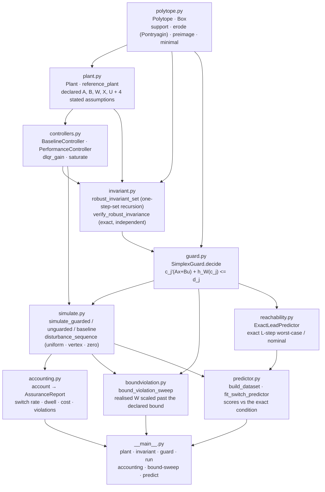
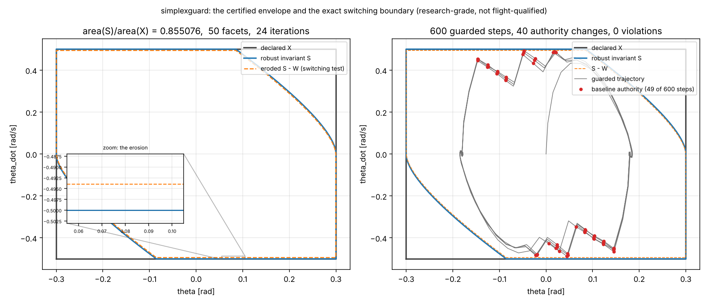
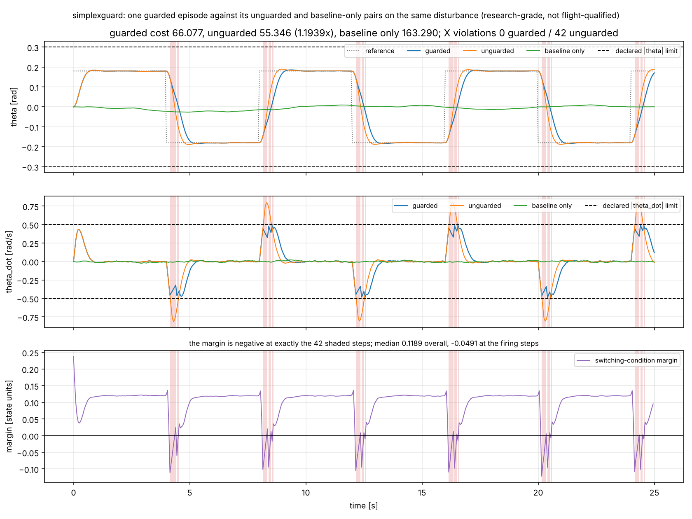
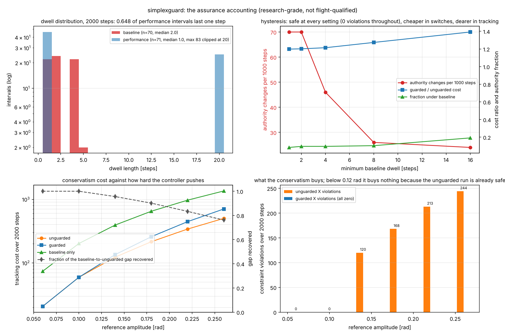
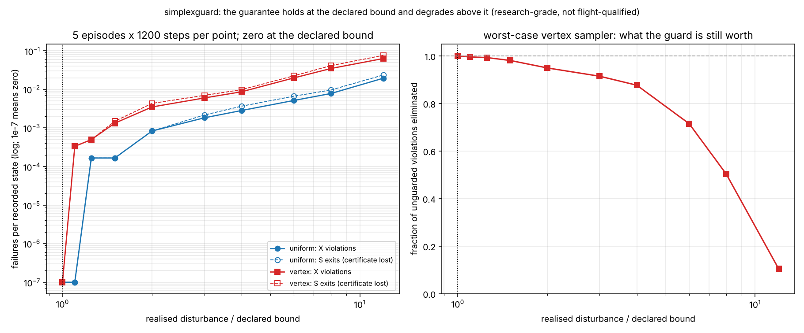
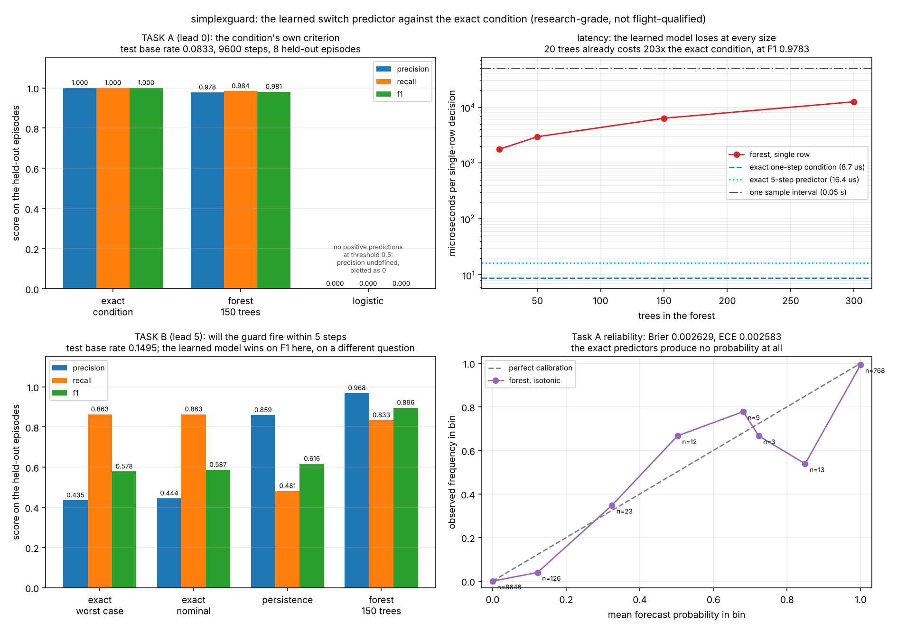

# SimplexGuard

Runtime-assurance benchmark: an exact Simplex switching condition and what it costs.


**Status: TESTING** · Class: flagship · Validation level 3 (research grade) ·
Learned component present and benchmarked against an exact computation ·
Apache-2.0 · © 2026 OPTIMA Organisation

This software is research-grade. It is **not flight-qualified, not certified,
and not approved for operational aerospace use.** **It is not a verification
tool.** It computes a robust invariant set for the discrete-time linear plant it
is given, under the disturbance bound it is told to assume, and it **proves
nothing whatsoever about any plant it was not given**. Every safety statement it
makes is conditional on a bound that you declared and it cannot check.

## The problem

You have a learned or otherwise unverified controller that performs well, a
conservative controller you can argue about, and a reviewer asking what happens
when you put one inside the other. The Simplex architecture answers the
structural question and stops there: it does not tell you how often the guard
fires, what the switching costs in performance, whether the safety argument
actually survives contact with the disturbance you declared, or what happens on
the day the declared bound turns out to be 25 % too small. Those four numbers
are the ones a review asks for, and the libraries that own the underlying
primitives — polytope algebra, temporal-logic monitoring, barrier functions —
are each excellent at the primitive and silent about the accounting.

## What this does

- **Computes the certificate rather than assuming it.** The maximal robust
  invariant set of the baseline closed loop, by the one-step-set recursion, and
  verifies it afterwards by an independent exact support-function test rather
  than by sampling. On the shipped plant: **24 iterations, 50 facets, 85.507589 %
  of the declared constraint set, worst facet invariance margin -5.551e-17**
  (`validation/validate_invariant_set.py`).
- **Evaluates the switching condition exactly.** The performance input is
  admitted if and only if `A x + B u + w` lies in `S` for *every* `w` in the
  declared `W`, by support function on the declared polytope. Checked against
  brute-force vertex enumeration over **40000** state-input pairs, 10000 of them
  bisected onto the switching boundary: **0 mismatches** above a margin of 1e-12
  (`validation/validate_guard_exactness.py`).
- **Reports the assurance accounting, which is the actual product.** Switch
  rate, dwell-time distribution, authority share, paired conservatism cost and
  the constraint-violation count. On the reference scenario: **140 authority
  changes in 2000 steps, 8.4 % of the episode under baseline control, 19.83 %
  tracking-cost penalty, 0 violations against the unguarded run's 168**
  (`validation/validate_accounting.py`).
- **Measures where the guarantee fails when the declared bound is wrong.** A
  **10 %** underestimate of the disturbance bound is already enough to produce
  constraint violations under a worst-case sampler, and at 12x the bound the
  guard eliminates only **19.8 %** of the violations it eliminates completely at
  1x (`validation/validate_bound_violation.py`).
- **Benchmarks a learned switch predictor against the exact condition and
  publishes the loss.** On the condition's own criterion the exact computation
  scores F1 **1.000000** at **8.68 µs** per decision; a calibrated 150-tree
  forest scores **0.980685** at **7343.16 µs**, losing on accuracy and on cost
  by a factor of **846**. No retune was attempted
  (`validation/validate_predictor.py`).

## Who it is for

- Anyone who has to defend a runtime-assurance architecture in a review and
  wants the switch rate, the dwell distribution, the conservatism cost and the
  violation count in one report rather than four scripts.
- Anyone who wants the switching condition written down exactly, with the
  support-function identity it rests on property-tested, rather than a tuned
  distance-to-boundary threshold.
- Anyone who wants to know, with a number, how wrong the declared disturbance
  bound can be before the architecture stops helping.
- Anyone about to put a classifier in a safety path, who would like to see the
  measurement that says a closed-form inequality beats it on both accuracy and
  latency before they do.
- Students and educators: the recursion, the Pontryagin difference and the
  switching condition are derived in module docstrings, the one-dimensional case
  has a hand-computed closed form shown in a test comment, and every validation
  script prints its working.

## Who it is not for

- **Anyone who needs polytope algebra and nothing else.** Use
  [`pytope`](https://pypi.org/project/pytope/). It has the same Pontryagin
  difference, the same support function, V-representation through `pycddlib`,
  and plotting. See **Alternatives**.
- **Anyone who needs a verification tool.** Nothing here proves anything about
  a physical system. The guarantee is "if your declared `W` is right, and your
  `A` and `B` are right, and the state is measured exactly, and there is no
  computation delay, then the state stays in `S`". Four assumptions, all stated
  in `simplexguard/plant.py`, none of them checked by this package.
- **Anyone with a nonlinear plant.** The recursion, the switching condition and
  the multi-step predictor are all linear-system constructions. A nonlinear
  plant needs a different certificate, and a linearisation is not one unless you
  can bound the linearisation error and fold it into `W`, which this package
  does not do for you.
- **Anyone needing output feedback.** The state is assumed measured exactly.
  An observer-based runtime guard needs a robust set in the estimation error as
  well, and that is not implemented.
- **Anyone needing continuous time or a barrier-function formulation.** This is
  a discrete-time set-membership switch. For continuous-time barrier functions
  with a QP safety filter, see [`cbfpy`](https://pypi.org/project/cbfpy/).
- **Anyone who wants a learned safety monitor.** The headline measurement of
  this package is that the learned predictor loses to the closed-form inequality
  on the inequality's own criterion, on both accuracy and cost. If you came for
  the model, the answer is in **Validation evidence** and it is no.
- **Anyone who needs temporal-logic requirements over traces.** Use
  [`rtamt`](https://pypi.org/project/rtamt/). This package monitors one
  set-membership predicate, not a specification language.

## Alternatives, honestly

Versions checked with `pip index versions` on 2026-10-07, and each package was
downloaded and its source read before being described here.

| Alternative | What it does better | When to use this instead |
|---|---|---|
| **[`pytope`](https://pypi.org/project/pytope/) 0.0.4** | **The right choice if you only need polytope algebra.** It has `Polytope` in both H- and V-representation with conversion through `pycddlib`, `support()` by linear programme citing the same Kolmanovsky and Gilbert 1998 source this package cites, `minkowski_sum`, `pontryagin_difference` by the identical halfspace identity, `linear_map`, `intersection`, `scale`, redundancy removal and matplotlib plotting. Its Pontryagin difference and this package's `Polytope.erode` compute the same thing. | When you want the invariant-set recursion, the switching condition, the simulation harness and the assurance accounting on top. `pytope` ships three modules (`polytope.py`, `demo.py`, `__init__.py`), has no control, no invariant-set computation and no simulation, and pulls in `pycddlib` and `matplotlib` as runtime dependencies, which this batch's dependency policy does not allow. This package's set algebra is deliberately smaller: H-representation only, no vertex enumeration except a 2-D plotting helper. |
| **[`polytope`](https://pypi.org/project/polytope/) 0.2.5** | Much more than halfspace algebra: `Region` objects for non-convex unions, set difference (`mldivide`, `region_diff`), four projection algorithms including Fourier-Motzkin and ESP, Monte-Carlo volume, Chebyshev ball, adjacency and partition tools. If you need to subtract one polytope from another, this is the package. | **It has no support function and no Pontryagin difference** — neither name appears in its source. Those are exactly the two operations the switching condition is built from, so a user would have to write them anyway. Use `polytope` for the region algebra and keep the erosion here. |
| **[`rtamt`](https://pypi.org/project/rtamt/) 0.3.5** | Signal temporal logic done properly: discrete-time and dense-time specifications, offline and online evaluation, standard and interface-aware robustness semantics, a C++ online backend, and a pastifier that rewrites bounded-future formulas into past-time ones so they can be monitored online. A real specification language with a real parser. | When your requirement is "the state stays in this polytope under this disturbance bound" and the hard part is computing the polytope, not expressing the requirement. `rtamt` monitors a signal you give it; it does not compute a robust invariant set, does not know what a disturbance bound is, and will not tell you what the switching cost. The two compose: compute the margin here, monitor it with `rtamt`. |
| **[`cbfpy`](https://pypi.org/project/cbfpy/) 0.1.0** | Control barrier functions in JAX with a QP safety filter: `CBF` and `CLFCBF`, relative-degree-1 and -2 constraints of the form `Lf h + Lg h u >= -alpha(h)`, input constraints in the QP, JIT compilation, and worked environments for a drone, a car, an arm and a point robot. Continuous-time, nonlinear-capable, and a smoother intervention than a hard switch. | When the architecture you have to defend is a **switch**, not a filter, and the question is how often it fires and what it costs. A CBF modifies the input continuously; Simplex hands over authority. They answer different review questions. `cbfpy` also requires `jax` and `qpax`, which are not in this batch's declared dependency set, and its safety argument needs a valid barrier function, which is as hard to come by as a valid invariant set. |
| **`scipy.optimize.linprog` and fifty lines of your own** | Nothing to install beyond SciPy, which you already have. The Pontryagin difference is one line given a support function, the support function of a box is `abs(c) @ r`, and the one-step-set recursion is a `while` loop. For a single plant you understand, writing it is a morning. | When you want the recursion's failure modes handled (empty set, non-convergence, each with its own exception rather than a wrong answer), the certificate verified by an independent exact test, and the accounting, the bound-violation sweep and the learned-model benchmark already written and validated. This package is a caller of `linprog`, not a replacement for it. |

**The narrow defensible claim.** This is *the Simplex switching condition
implemented exactly from a declared disturbance bound, with the assurance
accounting that the switching costs, the experiment that measures where the
declared bound stops being true, and a learned switch predictor benchmarked
against the exact condition and published as losing.* It is **not** a
verification tool, **not** faster than writing the recursion yourself, **not** a
polytope library (use `pytope`), **not** a specification monitor (use `rtamt`),
and **not** applicable to any plant you have not written down as `A`, `B`, `W`,
`X`, `U`.

## Install and first run

```bash
git clone https://github.com/OmAcharya-avtr/simplexguard.git
cd simplexguard
python -m venv .venv && source .venv/bin/activate
pip install -e ".[dev]"
python -m pytest tests/ -q
python -m simplexguard run --steps 2000
```

Expected output of the last command, from `validation/validate_cli.py`:

```
guarded     cost=  258.591875 baseline_fraction=0.084000 X violations=0      S exits=0      worst X residual=-4.33444e-03
unguarded   cost=  215.682228 baseline_fraction=0.000000 X violations=168    S exits=188    worst X residual= 3.17519e-01
baseline    cost=  657.521845 baseline_fraction=1.000000 X violations=0      S exits=0      worst X residual=-2.76133e-01
```

`python -m pytest tests/ -q` reports `218 passed`. There is no install step for
the tests: `pythonpath = ["src"]` is set in `pyproject.toml`, so the suite runs
from a cold clone.

Read the three lines together. The unguarded run is **cheaper** and it is
cheaper because it spends 168 steps outside the declared constraint set. The
baseline-only run is safe and costs 2.5 times the unguarded run. The guarded run
is safe and costs 1.20 times the unguarded run. That trade is the product.

## A worked example

```python
import numpy as np
from simplexguard import (
    SimplexGuard, account, disturbance_sequence, reference_controllers,
    reference_plant, robust_invariant_set, simulate_baseline,
    simulate_guarded, simulate_unguarded, square_wave_reference,
)

plant = reference_plant()                       # single-axis attitude, dt = 0.05 s
baseline, performance = reference_controllers(plant)

result = robust_invariant_set(plant, baseline)  # the certificate
guard = SimplexGuard(plant, baseline, result.polytope, verify=True)

rng = np.random.default_rng(51)
w = disturbance_sequence(plant, 2000, rng, "uniform")    # inside the declared bound
reference = square_wave_reference(0.18, 80, plant.n_states)

guarded = simulate_guarded(plant, guard, performance, 2000, reference, w)
unguarded = simulate_unguarded(plant, performance, 2000, reference, w)
base_only = simulate_baseline(plant, baseline, 2000, reference, w)

print(account(guarded, unguarded, base_only, result.polytope).describe())
```

Actual output, from `validation/worked_example.py`:

```
steps                            2000  (100.0 s at dt = 0.05 s)

1  switch rate
   authority changes             140
   per 1000 steps                70.000
   per second                    1.4000

2  dwell-time distribution (steps)
   baseline   n=70     min=1    median=2.00    mean=2.400    max=5     len-1 fraction=0.314
   performance n=71    min=1    median=1.00    mean=25.803   max=83    len-1 fraction=0.648
   baseline dwell histogram      {'1': 22, '2': 24, '3': 0, '4': 22, '5': 2, '6': 0, '7': 0, '8': 0, '9': 0, '10': 0, '>10': 0}

3  authority share
   fraction under baseline       0.084000
   steps held by min-dwell       0

4  conservatism cost (weights state=[10.0, 0.1], input=[0.01])
   guarded cost                  258.634365
   unguarded cost                215.826971
   baseline-only cost            650.257772
   guarded / unguarded           1.198341
   guarded - unguarded           42.807394
   fraction of the baseline-to-unguarded gap recovered  0.901463

5  constraint violations against the declared X
   guarded                       0
   unguarded                     168
   baseline only                 0
   guarded worst row residual    -1.612008461e-03
   unguarded worst row residual  3.197937271e-01

6  invariant-set exits (certificate lost)
   guarded                       0
   unguarded                     189

   switching-condition margin
   minimum over the episode      -1.226786374e-01
   median over the episode       1.189731172e-01
   median at the firing steps    -4.822443534e-02
```

The same script prints one decision in full, at the first step of the episode
where the guard actually took over:

```
the first step of the episode at which the guard actually fired
  step                     83  (t = 4.15 s)
  state                    [0.144800 rad, -0.455328 rad/s]
  reference                -0.180000 rad
  mode                     baseline
  proposed input           -3.000000 rad/s^2
  applied input            0.627627 rad/s^2
  switching margin         -0.111327708
  binding facet of S       3
  state margin inside S    0.044672292
  condition holds          False
```

The state is still inside the certified set with 0.044672 of slack. The
performance controller, saturated at -3 rad/s^2 chasing a reference step, would
have taken it out of the set under the worst admissible disturbance by 0.1113,
so the baseline applies +0.627627 rad/s^2 instead. The number that decided it is
a support-function evaluation on facet 3, not a threshold.

## Architecture



`robust_invariant_set` builds `S` with `Polytope.erode` and `Polytope.preimage`
and then `verify_robust_invariance` checks it again from scratch, so the
certificate is produced by one path and confirmed by another.
`ExactLeadPredictor` is built before `predictor.py` and is imported by it: the
analytic baseline is a dependency of the learned model's benchmark, not an
afterthought.

## Screenshots



Left, the declared constraint set `X`, the robust invariant set `S` and the
eroded set `S - W` that the switching condition tests against. Notice that `S`
touches the angle facets of `X` exactly — there is no slack there — and that the
erosion is invisible at this scale, which is why there is an inset. Right, 600
guarded steps: the handover points cluster on the rate boundary where the
aggressive performance controller is accelerating, and nothing leaves `S`.



Top, the tracked angle; middle, the body rate with its declared limit; bottom,
the switching-condition margin. The unguarded trace reaches ±0.8 rad/s against a
declared limit of 0.5, and it does so while reporting the lower tracking cost.
The margin in the bottom panel crosses zero at exactly the shaded steps, with no
tuned threshold anywhere in the figure.



Top left, the dwell distribution: most performance intervals last a single step,
so the guard chatters and the mean dwell of 25.8 steps hides it completely. Top
right, the hysteresis trade — safe at every setting, cheaper in switches, dearer
in tracking, with a plateau at a dwell of 2 that costs authority for nothing.
Bottom, the conservatism cost against how hard the controller is asked to push,
and the violations that cost is buying; below 0.12 rad it buys nothing.



Left, violations and certificate losses per recorded state against the factor by
which the realised disturbance exceeds the declared bound, on log axes; both are
exactly zero at a factor of 1 and the worst-case sampler fails first. Right, the
fraction of the unguarded run's violations the guard still eliminates: 1.0 at
the declared bound, 0.10 at twelve times it. This curve is the honest summary of
what a declared bound is worth.



Top left, the condition's own criterion: the exact computation is at 1.0 by
construction and the forest is not. Top right, single-row latency on a log
scale, with the exact condition three orders of magnitude below the forest at
every forest size. Bottom left, the five-step anticipation task, where the
learned model wins on F1 because the exact predictor is answering "may fire"
rather than "will fire". Bottom right, the reliability diagram — the one thing
the exact computation cannot produce at all.

## Validation evidence

Full detail, including every check that failed or went against this package, is
in [`validation/VALIDATION.md`](validation/VALIDATION.md). Every number comes
from a script in `validation/` whose raw stdout is committed beside it.

| Check | Reference / method | Result | Tolerance |
|---|---|---|---|
| Pontryagin difference against vertex shifts | Kolmanovsky and Gilbert 1998; `validate_support_function.py` check 5 | 20000 points over 100 random polytopes, **0 mismatches** | exact membership |
| Support function, box closed form against LP | Rockafellar 1970 §13; same script, check 1 | 4000 directions in dimensions 1–5, worst relative difference **8.284e-16** | 1e-9 |
| One-dimensional invariant set against hand arithmetic | closed form shown in `tests/test_invariant.py`; `validate_invariant_set.py` check 1 | 4 cases including one that must empty, worst absolute difference **0.000e+00** | 1e-12 |
| `S` is robustly invariant, verified exactly | `h_S(A_b' c) + h_W(c) <= e` per facet, one LP per facet; same script, check 2c | **true**, worst facet margin **-5.551e-17** — zero, because `S` is maximal | 1e-9 |
| Sampled invariance, second opinion | 50 vertices of `S` plus 4000 interior samples × 4 vertices of `W`; same script, check 3 | **14604** pairs, worst residual **5.551e-17** | 1e-12 |
| Switching condition against vertex enumeration | `validate_guard_exactness.py` check 1 | 40000 pairs, 10000 bisected onto the boundary: **0 mismatches**, plus **4 disagreements at \|margin\| ≤ 5.551e-17** — reported, not tuned away | 1e-12 on the margin |
| Guarded episodes under the worst-case sampler | same script, check 5 | 8 × 1500 = **12000** steps, **0 exits from S**, **0 violations of X** | exact |
| Assurance accounting, 10 seeds × 2000 steps | `validate_accounting.py` check 2 | **0** guarded violations against **1680** unguarded; cost ratio mean **1.199811**, sd **0.000905** | — |
| Minimum baseline dwell of 2 | same script, check 5a | **no reduction in switch rate** (70.00 per 1000 both ways) while the authority fraction rises 0.084 → 0.096 — **a negative result, and the check was weakened from strict to non-strict monotonicity when it was measured** | — |
| Reference amplitude below 0.12 rad | same script, check 6 | the guard never fires and provides **no benefit**: cost ratio exactly 1.000000, 0 unguarded violations | — |
| Declared bound exceeded, uniform sampler | `validate_bound_violation.py` check 2 | first violation at **rho = 1.25** | — |
| Declared bound exceeded, worst-case sampler | same script, check 3 | first violation at **rho = 1.10** — a **10 %** underestimate is enough. Facet-wise slack of `S` inside `X` is **[0, 0, 0, 0]** | — |
| The guard's worth at 12x the declared bound | same script, check 6 | eliminates **19.79 %** of the unguarded run's violations, against **100 %** at 1x | — |
| Certificate lost before constraint broken | same script, check 4 | exits ≥ violations at **every** scale, ratio up to **1.31** | structural |
| **Learned forest against the exact condition, lead 0** | `validate_predictor.py` check 2 | **the exact computation wins.** F1 **1.000000** against **0.980685**; 18 false positives and 13 false negatives in 9600 held-out steps | — |
| **Learned forest cost against the exact condition** | same script, checks 2c, 5 | **the exact computation wins.** **8.68 µs** against **7343.16 µs**, a factor of **846**; even a 20-tree forest is **198x** | — |
| Learned logistic, lead 0 | same script, check 2 | **no positive predictions at all** at threshold 0.5; a single hyperplane cannot represent a 50-facet intersection | — |
| Learned forest against the exact predictors, lead 5 | same script, check 3a | **the learned model wins on F1**, 0.895825 against 0.586724, because the exact predictor answers "may fire" and over-predicts by construction (precision 0.444484 at recall 0.862841) | — |
| Exact worst-case predictor soundness on realised episodes | same script, check 3b | recall **0.862841**, so it **misses 13.7 %** of realised firings; caused by the two approximations it states, with saturation measured at **9.3729 %** of steps | — |
| Lead time, exact worst-case predictor | same script, check 4 | mean **12.861** steps (0.6430 s) with **0.0000** of 287 events unanticipated, against **6.624** and **0.0418** for the forest | — |
| Forest calibration | same script, check 6 | Brier **0.002629**, ECE **0.002583** over 10 bins, against **0.076467** for an always-negative forecaster | — |

## API reference

| Symbol | What it is |
|---|---|
| `Polytope(A, b)` | `{x : A x <= b}`. `.support`, `.support_many`, `.erode`, `.preimage`, `.intersect`, `.minimal`, `.contains`, `.slack`, `.chebyshev_radius`, `.contains_polytope`, `.vertices_2d`, `.area_2d`. Dimensionless. |
| `Box(lower, upper)` / `box(half_widths)` | Axis-aligned box with the closed-form support `c.m + abs(c).r`; `.vertices()` enumerates `2**n`. |
| `Plant(A, B, disturbance, state_constraints, input_constraints, dt, ...)` | The declared model. `.step(x, u, w)` applies `x' = A x + B u + w` and does **not** check `w` against `W`. |
| `reference_plant(dt=0.05, angle_limit_rad=0.30, rate_limit_rad_s=0.50, accel_limit_rad_s2=3.0, disturbance_accel_rad_s2=0.12)` | The shipped illustrative single-axis attitude plant. All five numbers are illustrative. |
| `dlqr_gain(plant, q_diag, r_diag)` | Discrete infinite-horizon LQR gain, shape `(m, n)`. |
| `BaselineController(gain, input_set)` / `PerformanceController(gain, input_set)` | `u = sat_U(-K x)` and `u = sat_U(-K (x - x_ref))`; `.unsaturated`, `.saturates_at`. Input in input units. |
| `reference_controllers(plant, baseline_r=1.0, ...)` | The shipped illustrative pair. |
| `robust_invariant_set(plant, baseline, max_iterations=200, tol=1e-10, reduce_every_iteration=True)` | The certificate. Returns `InvariantSetResult`; raises `EmptyInvariantSet` or `RecursionDidNotConverge` rather than returning a non-certificate. |
| `verify_robust_invariance(plant, baseline, invariant)` | The three properties checked exactly and reported separately, with their margins. |
| `SimplexGuard(plant, baseline, invariant_set, min_baseline_dwell=1, verify=False)` | `.decide(x, u)` → `GuardDecision`; `.allows`, `.condition_margin`, `.brute_force_allows`, `.eroded_set`, `.disturbance_offsets`, `.reset`. |
| `GuardDecision` | `.mode`, `.applied_input`, `.proposed_input`, `.baseline_input`, `.margin` (state units), `.binding_facet`, `.input_admissible`, `.certificate_lost`, `.state_margin`, `.forced_by_dwell`, `.condition_holds`. |
| `disturbance_sequence(plant, n_steps, rng, mode="uniform", scale=1.0)` | `mode` is `uniform`, `vertex` or `zero`; `scale > 1` leaves the declared bound. |
| `square_wave_reference(amplitude, period_steps, n_states)` | Reference on the first state coordinate, in its units. |
| `simulate_guarded / simulate_unguarded / simulate_baseline` | Three architectures on one disturbance sequence. Return `Episode`. |
| `Episode` | `.states` (n+1 rows), `.inputs`, `.modes`, `.margins`, `.cost()`, `.constraint_violations()`, `.invariant_exits(S)`, `.worst_constraint_residual()`, `.baseline_fraction`. |
| `CostWeights(state, input)` | Diagonal tracking-cost weights; reported alongside every cost. |
| `account(guarded, unguarded, baseline_only, invariant_set)` | `AssuranceReport` with the six quantities; raises if the episodes are not paired. |
| `AssuranceReport.describe()` | The fixed-width report reproduced above. |
| `bound_violation_sweep(plant, guard, performance, invariant_set, scales, ...)` | The deliberate bound-violation experiment. Returns `BoundSweep`. |
| `ExactLeadPredictor(guard, performance, horizon, mode="worst_case")` | Exact `L`-step prediction. `.predict`, `.first_step`, `.predict_many`, `.score_many`. Horizon 0 reproduces the one-step condition exactly. |
| `build_dataset(plant, guard, performance, n_episodes, n_steps, seed, lead, ...)` | `SwitchDataset`; split by episode with `.select_episodes`. |
| `fit_switch_predictor(train, calibration, kind="forest", ...)` | Isotonic-calibrated classifier. `kind` is `forest` or `logistic`. |
| `guard_condition_scores / exact_predictor_scores / score_binary / lead_times / expected_calibration_error / measure_decision_cost` | The benchmark surface. |
| `python -m simplexguard {plant,invariant,guard,run,accounting,bound-sweep,predict}` | CLI; exit 0 on success, 2 on bad input, 3 on an empty or non-converged invariant set. |

## Limitations

- **The declared bound has essentially no margin.** A 10 % underestimate of the
  disturbance bound produces constraint violations under a worst-case sampler.
  This is structural, not a tuning accident: the recursion computes the
  *maximal* robust invariant set, whose invariance holds with equality on some
  facet (measured margin -5.551e-17), and whose facet-wise slack inside `X` is
  exactly zero. A maximal set has spent all of its margin by construction. If
  you want margin, declare a larger `W` than you believe and pay for it in
  conservatism; this package will price that for you but will not do it.
- **The guard chatters.** 64.8 % of performance intervals and 31.4 % of baseline
  intervals last one step on the reference scenario. A real actuator would not
  thank you. A minimum baseline dwell is available and is safe at every setting,
  but a dwell of 2 reduces nothing while costing authority, and a dwell of 16
  costs 19 % more tracking error than no hysteresis at all.
- **`S` covers 85.5 % of `X`.** The other 14.5 % of the declared constraint set
  is outside the certificate, and the guard will refuse to let the performance
  controller operate there even though those states satisfy every declared
  constraint.
- **Four assumptions bound every statement**, all in `simplexguard/plant.py`:
  `A` and `B` exactly known with no parametric uncertainty; `w` an arbitrary
  sequence in `W` rather than a stochastic process; the state measured exactly
  with no observer and no measurement noise; and no computation delay. One step
  of delay changes the switching condition and this package does not implement
  the one-step-ahead version.
- **Linear plants only.** No nonlinearity, no parameter variation, no switched
  or hybrid dynamics.
- **The exact multi-step predictor makes two stated approximations**, both
  measured: it ignores the saturation of the performance input (9.3729 % of
  steps) and the guard's own intervention inside the horizon. Together these
  cost it 13.7 % of recall on realised episodes, so it is **not** sound on a
  realised trajectory despite being a worst-case construction.
- **The learned predictor is not recommended for the switching decision.** It
  loses on accuracy and on latency on the condition's own criterion, and the
  latency gap is scikit-learn's per-call overhead rather than anything that a
  smaller model fixes: a 20-tree forest is still 163x the exact condition.
- **The invariant-set recursion does not scale.** One linear programme per facet
  per iteration, plus one per facet for redundancy removal. On the shipped 2-D
  plant: 24 iterations, 50 facets, 3.14 s. Near the disturbance scale at which
  the certificate stops existing, the facet count and the iteration count both
  grow sharply (86 facets and 42 iterations at 2.0x the declared bound). With
  redundancy removal off, the row count doubles every iteration and reaches 6144
  by iteration 10.
- **Two dimensions is not a validation of higher dimensions.** The set algebra
  and the switching condition are dimension-general and the support-function
  checks run in dimensions 1 to 5, but the invariant-set recursion, the whole
  accounting and every reported number come from a 2-state plant, and nothing
  here establishes how the recursion behaves at, say, 12 states.
- **The shipped plant and controllers are illustrative.** The sample interval,
  the limits, the disturbance bound and the two LQR weightings are chosen so
  that the certificate is non-trivial and the guard fires measurably. They are
  not a measurement of any spacecraft and the conservatism cost is reported
  against a tracking-cost weighting that is an arbitrary choice, stated
  alongside every cost.
- **Compute budget.** Developed and measured on **2 shared cores and 7.8 GiB,
  contended with four sibling build agents**. The test suite runs in **91 s**;
  the longest validation script is **64 s**; the longest example is **29 s**; the
  longest single model fit is **4.0 s**. Nothing here needs more than two cores
  or more than three minutes. Every microsecond latency in this README is wall-clock
  under that contention and moves by 10–20 % between runs; the accuracy figures
  are seeded and do not move at all.

## Reproducing every number

From a cold clone, no install step needed:

```bash
python -m pytest tests/ -q --junit-xml=junit.xml   # 218 tests
ruff check src/ tests/ examples/ validation/
python -m simplexguard --help

python validation/validate_support_function.py     # set algebra, 14 s
python validation/validate_invariant_set.py        # the certificate, 64 s
python validation/validate_guard_exactness.py      # the switching condition, 8 s
python validation/validate_accounting.py           # the accounting, 6 s
python validation/validate_bound_violation.py      # the bound-violation sweep, 11 s
python validation/validate_predictor.py            # the AI benchmark, 36 s
python validation/validate_cli.py                  # the CLI, 25 s
python validation/worked_example.py                # the worked example above

MPLBACKEND=Agg python examples/invariant_set.py
MPLBACKEND=Agg python examples/guarded_episode.py
MPLBACKEND=Agg python examples/bound_violation.py
MPLBACKEND=Agg python examples/predictor_benchmark.py
MPLBACKEND=Agg python examples/accounting_tradeoff.py
```

Seeds: 51051 (set algebra), 51052 (invariant set), 51053 (guard exactness), 51
and 51–60 (accounting), 51055 (bound violation), 5101 (predictor). The committed
`validation/*_output.txt` files are the raw stdout of exactly these commands and
the committed PNGs are exactly what these example scripts produce.

## Licence

Apache-2.0. © 2026 OPTIMA Organisation. See `LICENSE`.

## Citation

See `CITATION.cff`. The results this package relies on:

- Rockafellar, R. T., *Convex Analysis*, Princeton University Press, 1970,
  section 13 — the support function.
- Schneider, R., *Convex Bodies: the Brunn-Minkowski Theory*, Cambridge
  University Press, 1993, section 1.7 — support functions and Minkowski
  additivity.
- Gilbert, E. G. and Tan, K. T., "Linear systems with state and control
  constraints: the theory and application of maximal output admissible sets",
  *IEEE Transactions on Automatic Control* 36(9), 1991 — the one-step-set
  recursion.
- Kolmanovsky, I. and Gilbert, E. G., "Theory and computation of disturbance
  invariant sets for discrete-time linear systems", *Mathematical Problems in
  Engineering* 4(4), 1998 — the Pontryagin difference in halfspace form, which
  is the identity the switching condition is built on.
- Blanchini, F. and Miani, S., *Set-Theoretic Methods in Control*, Birkhäuser,
  2008, and Borrelli, F., Bemporad, A. and Morari, M., *Predictive Control for
  Linear and Hybrid Systems*, Cambridge University Press, 2017 — invariant sets
  for constrained linear systems.
- Raković, S. V., Kerrigan, E. C., Kouramas, K. I. and Mayne, D. Q., "Invariant
  approximations of the minimal robust positively invariant set", *IEEE
  Transactions on Automatic Control* 50(3), 2005 — the **minimal** robust
  invariant set, named here because it is a different object from the maximal
  set this package computes.
- Seto, D., Krogh, B., Sha, L. and Chutinan, A., "The Simplex architecture for
  safe online control system upgrades", *Proceedings of the American Control
  Conference*, 1998, and Sha, L., "Using simplicity to control complexity",
  *IEEE Software* 18(4), 2001 — the architecture.
- Schierman, J. D., DeVore, M. D., Richards, N. D. and Clark, M. A., "Runtime
  assurance for autonomous aerospace systems", *Journal of Guidance, Control,
  and Dynamics*, 2020 — runtime assurance in an aerospace setting.
- Anderson, B. D. O. and Moore, J. B., *Optimal Control: Linear Quadratic
  Methods*, Prentice-Hall, 1990 — the discrete LQR gain.
- Franklin, G. F., Powell, J. D. and Workman, M. L., *Digital Control of Dynamic
  Systems*, 3rd ed., Addison-Wesley, 1998 — zero-order-hold discretisation.
- Zadrozny, B. and Elkan, C., *KDD*, 2002, and Niculescu-Mizil, A. and Caruana,
  R., *ICML*, 2005 — isotonic calibration of classifier scores.
- Brier, G. W., "Verification of forecasts expressed in terms of probability",
  *Monthly Weather Review* 78(1), 1950 — the Brier score.
- Huangfu, Q. and Hall, J. A. J., "Parallelizing the dual revised simplex
  method", *Mathematical Programming Computation* 10(1), 2018 — HiGHS, the
  solver behind `scipy.optimize.linprog`.

No page number is quoted that was not checked against a source available in this
environment.

## Credits

Built for the OPTIMA aerospace software portfolio.
This is under reserved rights obtained by OPTIMA Organisation.
