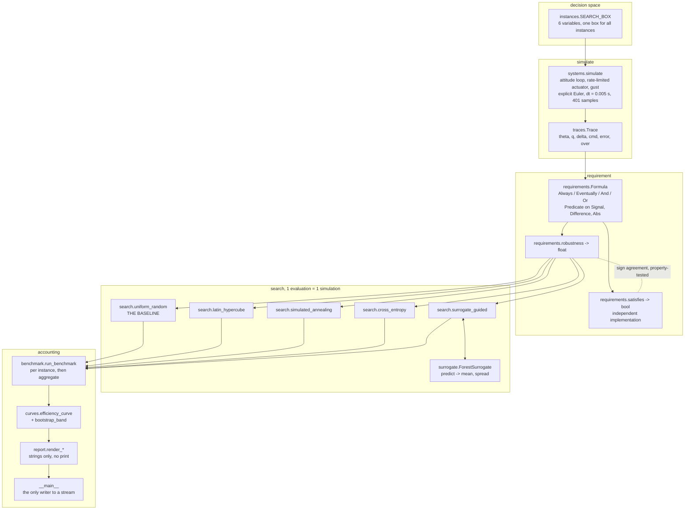
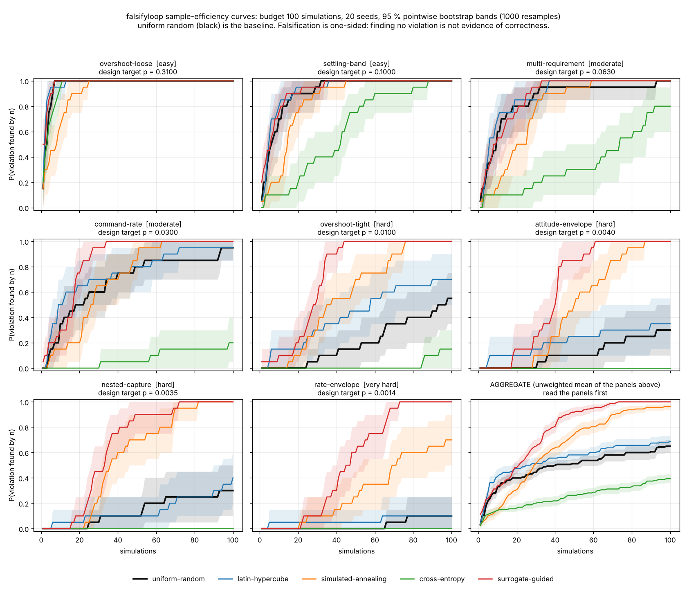
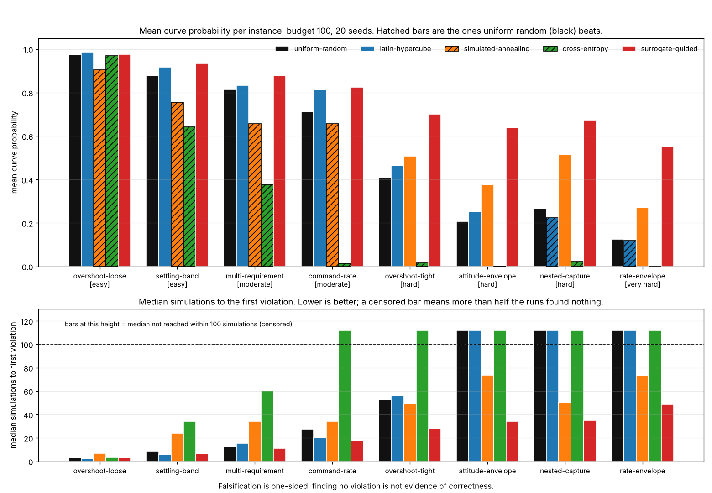
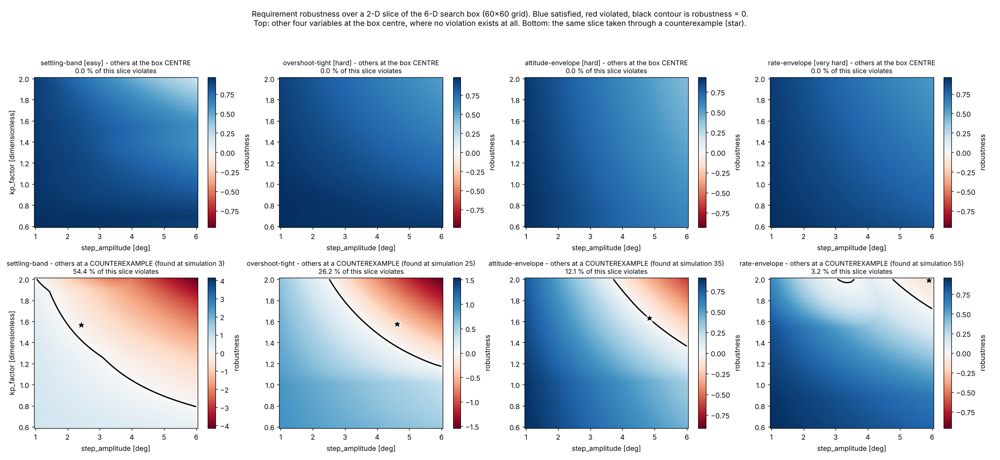
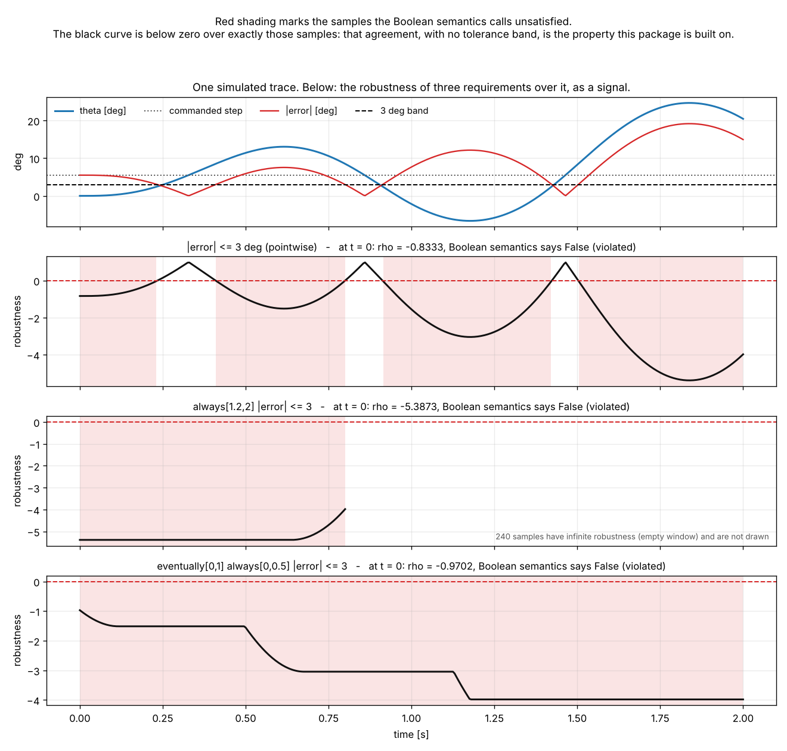
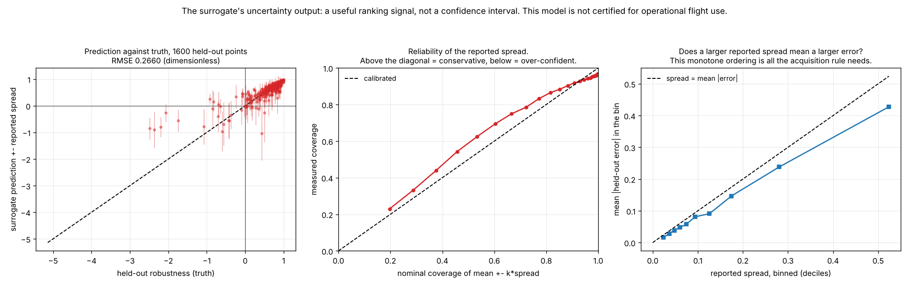
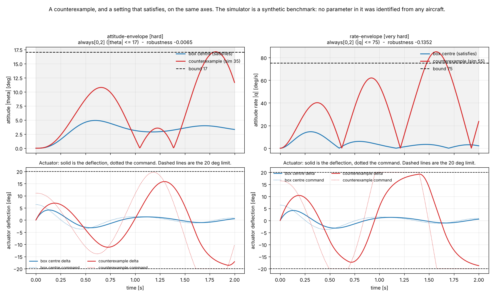

# FalsifyLoop

Find the setting that violates a requirement, and count the simulations it took.


**Status: TESTING** · Class: flagship · Validation level 3 (research grade) ·
Learned component present and benchmarked against the baseline it has to beat ·
Apache-2.0 · © 2026 OPTIMA Organisation

This software is research-grade. It is **not flight-qualified, not certified,
and not approved for operational aerospace use.**

> **Falsification is one-sided: finding no violation is not evidence of
> correctness.** Every search here can return a counterexample or the statement
> that it found none within its budget. The second is a fact about the search.
> Nothing in this repository verifies anything, and the command-line tool is
> built so that it cannot print anything that reads as a pass.

## The problem

You have a control loop in a simulator, a requirement written down somewhere,
and a budget of simulations. Someone asks whether the loop meets the
requirement, and the only honest thing you can do is look for a setting where it
does not. The question that decides whether the exercise is worth running is not
*can this be falsified* but **how many simulations does it take**, and whether
the clever search you were sold actually beats drawing uniformly at random.

## What this does

- **A requirement language whose robustness is negative exactly when the
  requirement is violated** — bounded always and eventually, bounds on signals
  and on their first differences, conjunction and disjunction. The equivalence
  is checked against an independently implemented Boolean semantics over
  **44694 exhaustively enumerated formula-trace pairs with 0 disagreements**,
  including **32070** samples at exactly zero robustness and **16848** at
  infinite robustness (`validation/validate_semantics.py`).
- **Eight seeded benchmark instances spanning a 254-fold range of difficulty**,
  from a uniform-violation probability of **0.321933** down to **0.001267**,
  each with an exact Clopper-Pearson interval from 15000 draws
  (`validation/validate_difficulty.py`).
- **Five search strategies over the same instances, budget and seeds** — uniform
  random (the baseline), Latin hypercube, simulated annealing, cross-entropy,
  and a random-forest surrogate-guided search. 8 × 5 × 30 = **1200 searches**
  in 26–50 s depending on container load
  (`validation/validate_benchmark.py`).
- **Sample-efficiency curves with bootstrap confidence bands**, reported
  per instance before any aggregate, with the instances where the baseline wins
  named: **Latin hypercube and cross-entropy never beat uniform random on any
  of the eight**, and simulated annealing loses resolvably on four of them.
- **A statistical-distinguishability column on every comparison**, because a
  win/loss ledger over 30 seeds is itself uncertain: **14 of 32** comparisons
  are undecided at that repeat count and the README says so rather than
  presenting a table as settled.

## Who it is for

- Anyone who has to justify a simulation budget for a requirement-based test
  campaign and wants the number of simulations to a counterexample, with an
  interval on it, rather than a vendor's assurance.
- Anyone about to adopt a guided falsification search who would like to see it
  measured against uniform random on instances of stated difficulty first.
- Anyone who wants a small requirement language whose sign convention is
  property-tested rather than asserted, as a reference for a larger one.
- Anyone who needs to explain to a reviewer, with a figure, why a
  one-variable-at-a-time sweep found nothing: on every instance here, the slice
  through the box centre contains **no violation at all**.

## Who it is not for

- Anyone who needs to **prove** a requirement holds. This is falsification. It
  is one-sided and it proves nothing.
- Anyone who needs a complete specification language. This fragment has no
  negation (deliberately — see below), no `until`, no past operators, no dense
  time, and no parser. **Use `rtamt`.**
- Anyone with a mature falsification toolchain. `psy-taliro` already provides
  models, specifications, optimizers and parallel execution.
- Anyone looking for an aircraft model. The simulator here is a synthetic
  benchmark and **no parameter value in it was identified from any vehicle.**
- Anyone whose simulator costs seconds rather than microseconds and who
  therefore cannot afford 1200 searches to compare strategies. The method
  transfers; the compute budget in this repository does not.

## Alternatives, honestly

All versions below were checked with `pip index versions` in the build container
on 2026-10-08, and the two packages that could be read were downloaded as wheels
and unpacked before being described here.

| Alternative | What it does better | When to use this instead |
|---|---|---|
| **`rtamt` 0.3.5** (BSD, Nickovic & Yamaguchi) | **Its specification language is far more complete than ours, and that is not close.** Full STL and interface-aware STL with an ANTLR grammar, past *and* future operators, `until`, `since`, `once`, `historically`, `rise`, `fall`, arithmetic and `abs`/`exp`/`pow` on terms, discrete *and* dense time, offline *and* online monitoring, and a C++ backend. If you need to write a requirement, write it in rtamt. | Only if you want the search and the sample-efficiency accounting. rtamt is a monitor: it contains no falsification, no optimiser and no benchmark harness (`grep -ril "falsif\|optimiz" rtamt/` over the unpacked 0.3.5 wheel returns nothing). |
| **`psy-taliro` 1.0.0** (ASU CPSLab, the Python successor to MATLAB S-TaLiRo) | A real falsification framework: `Blackbox` and `Ode` models, rtamt-backed discrete and dense specifications, `UniformRandom` and `DualAnnealing` optimizers, a decorator API for your own, signal interpolation and `pathos`-based parallel runs. Mature, maintained, and the right default. | If you want the sample-efficiency curve itself: probability of a violation against simulation count, with bootstrap bands, over a graded instance suite. The 1.0.0 wheel contains no occurrence of "bootstrap", "efficiency" or "confidence" anywhere in its source. |
| **`py-taliro` 0.2.1** | Exists on PyPI at 0.2.1 and 0.2.0. | **Not described further here, because it could not be read in this container**: its sdist requires Cython at metadata-generation time and no wheel is published. Claiming anything about its capabilities would be a guess. |
| **S-TaLiRo** (MATLAB, ASU) | The original, with years of published falsification benchmarks behind it. | If you are not in MATLAB. |
| `scipy.optimize` (`dual_annealing`, `differential_evolution`) | Better-engineered global optimisers than the two written here. | If you want the falsification-specific accounting: stopping at the first violation, right censoring, and a curve rather than a final objective value. |
| `SALib` 1.6.0 | Global sensitivity analysis, which tells you *which* variables matter. | Sensitivity and falsification answer different questions; use both. |

**What this does that none of them does:** it reports the **probability of
having found a violation against simulation count**, with bootstrap bands, over
a suite of instances whose difficulty is independently measured, and it names
the instances where uniform random beats the method being sold. That accounting
is the product. The monitoring and the optimisation are commodity, and the
alternatives above do both better.

## Install and first run

```bash
git clone https://github.com/OmAcharya-avtr/falsifyloop.git
cd falsifyloop
python -m venv .venv && source .venv/bin/activate
pip install -e ".[dev]"
python -m pytest tests/ -q
python examples/sample_efficiency_curves.py
```

The test run ends with:

```
282 passed in 13.65s
```

and the example prints:

```
wrote screenshots/sample_efficiency_curves.png

strategy                aggregate mean P   instances lost to baseline
uniform-random                    0.4918                            0
latin-hypercube                   0.5526                            0
simulated-annealing               0.6495                            3
cross-entropy                     0.2543                            8
surrogate-guided                  0.7768                            0

hardest instance for the baseline: rate-envelope
benchmark wall clock: 25.9 s
```

(That example runs 20 seeds at base seed 7100 to stay quick. The committed
headline figures use 30 seeds at base seed 52000; see
`validation/validate_benchmark_output.txt`. The difference between the two
ledgers is the point of the "undecided" column — see Limitations.)

A first look from the command line, which never prints anything that reads as a
pass:

```bash
python -m falsifyloop instances
python -m falsifyloop falsify --instance rate-envelope --strategy uniform-random \
    --budget 5 --seed 0
```

```
instance    : rate-envelope  [very hard]
requirement : always[0,2] (|q| <= 75)
strategy    : uniform-random
seed        : 0
budget      : 5 simulations
simulations : 5 actually run
min robustness: +0.741306 (dimensionless; negative exactly when the requirement is violated)
NO VIOLATION FOUND within 5 simulations.
Falsification is one-sided: finding no violation is not evidence of correctness.
The search spent its budget and returned nothing. That is a statement about the search, not about the requirement.
```

That is the committed output of the sixth invocation in
`validation/validate_cli_output.txt`. A budget of five is deliberately too small
for an instance whose violation probability is 0.001267 — the point is what the
tool says when it finds nothing, which is that it found nothing.

## A worked example

This is `validation/worked_example.py`, and the output beneath it is that
script's committed output.

```python
from falsifyloop import (
    Abs, Always, Predicate, Signal, bootstrap_band, efficiency_curve,
    instance, robustness, satisfies, simulate, surrogate_guided, uniform_random,
)
from falsifyloop.systems import LoopInput

# State a requirement and evaluate it two independent ways on one simulation.
trace = simulate(LoopInput(5.0, 1.8, 0.30, 2.0, 8.0, 0.9))
requirement = Always(Predicate(Abs(Signal("error")), "<=", 3.0, scale=3.0), 1.2, 2.0)
rho = robustness(requirement, trace)
print(rho, satisfies(requirement, trace), (rho < 0.0) == (not satisfies(requirement, trace)))

# Search a shipped instance with the baseline, then with the surrogate.
inst = instance("attitude-envelope")
for run in (uniform_random, surrogate_guided):
    result = run(inst, budget=100, seed=7)
    print(result.strategy, result.first_violation, result.best_robustness)

# Build the sample-efficiency curve with a bootstrap band.
runs = [uniform_random(inst, 100, s).first_violation for s in range(20)]
curve = efficiency_curve(runs, 100)
lower, upper = bootstrap_band(runs, 100, n_boot=2000, seed=0)
```

```
requirement        : always[1.2,2] (|error| <= 3)
robustness         : -2.244031  (dimensionless, normalised by the 3 deg band)
Boolean semantics  : satisfied = False
sign agreement     : (rho < 0) == (not satisfied) -> True

instance           : attitude-envelope [hard]
requirement        : always[0,2] (|theta| <= 17)

uniform-random     first violation at simulation 63
                   min robustness -0.083447 after 63 simulations
surrogate-guided   first violation at simulation 35
                   min robustness -0.048979 after 35 simulations

uniform-random sample-efficiency curve over 20 seeds, budget 100:
    n  P(found by n)       95% bootstrap band
---------------------------------------------
   10          0.100 [    0.000,     0.250]
   25          0.150 [    0.000,     0.300]
   50          0.200 [    0.050,     0.400]
   75          0.350 [    0.150,     0.550]
  100          0.400 [    0.200,     0.600]

runs that found nothing: 12 of 20
```

Twelve of twenty runs found nothing. That is twelve runs that found nothing.

## Architecture



## Screenshots



The headline deliverable. Nine panels: eight instances ordered by difficulty,
then the aggregate. Black is uniform random. Notice that on the three easiest
panels every strategy is on top of the baseline or below it, and that the
surrogate's separation only opens up from `overshoot-tight` rightwards — the
learned method earns its place exactly where the baseline runs out, and nowhere
else. Notice also that green (cross-entropy) is at the bottom of every panel.



The same result as bars, with every bar uniform random beats drawn hatched.
Lower panel: median simulations to the first violation, with censored bars
pushed above the dashed line to mark that more than half the runs found nothing.



Why falsification needs a search. Top row: a two-dimensional slice through the
**box centre** — on all four instances it is entirely blue, with no violation
anywhere. Bottom row: the same slice through a **counterexample**, where the
violating region appears. The violating sets need several variables away from
the centre at once, which is why a one-at-a-time sweep finds nothing.



The semantics made visible. Red shading marks the samples the Boolean semantics
calls unsatisfied; the black robustness curve is below zero over exactly those
samples. The middle panel shows 240 of 401 samples with infinite robustness
because their time window has run off the end of the trace — the vacuous-truth
case the empty-window convention exists to handle.



What the learned component's confidence output is worth. Left: predictions with
the reported spread as an error bar. Middle: the reliability curve, which sits
*above* the diagonal at low nominal coverage and dips slightly below at high —
conservative in the body, thin in the tails, so not calibrated. Right: the
property that actually matters for the search, that a larger reported spread
means a larger error, in order.



A counterexample beside a setting that satisfies, with the bound drawn on. The
lower panels show the actuator: in both counterexamples the command (dotted)
sits outside what the deflection (solid) can follow, which is the mechanism.

## Validation evidence

Full table, with every tolerance, in
[`validation/VALIDATION.md`](validation/VALIDATION.md). Selected rows,
**including the ones the baseline won**:

| Check | Reference | Result | Criterion | Script |
|---|---|---|---|---|
| Sign agreement, exhaustive | independently implemented Boolean semantics | **44694 pairs, 0 disagreements** | exact, no tolerance | `validate_semantics.py` |
| — hard cases actually visited | — | 32070 at zero robustness, 16848 at infinite | must be nonzero | `validate_semantics.py` |
| Sign agreement on simulator traces | as above | 2400 pairs, 156 violating, 0 disagreements | exact | `validate_semantics.py` |
| Euler against exact ZOH solution | `scipy.linalg.expm` | 0.009032 deg worst error at dt = 0.005 s; ratios 2.034 / 2.017 / 2.008 / 2.004 | first order | `validate_simulator.py` |
| Euler, both clips active | same scheme at dt/40 | 0.429770 deg worst discrepancy | reported, not bounded | `validate_simulator.py` |
| **Counterexamples surviving dt/4** | same scheme at dt/4 | **22 of 304 flip (7.2 %)**, worst flipped margin 0.135888 | reported, not filtered | `validate_simulator.py` |
| Instance difficulty | 15000 uniform draws, seed 52052 | p from 0.001267 to 0.321933 | Clopper-Pearson exact | `validate_difficulty.py` |
| Tier labels | measured p | 0 of 8 outside their band | all inside | `validate_difficulty.py` |
| Baseline against closed form `1-(1-p)^n` | the closed form | 1 of 40 intervals disagree | ≈5 % expected | `validate_benchmark.py` |
| **Latin hypercube against the baseline** | uniform random | **loses on 8 of 8 instances**, resolvably on 2 | — | `validate_benchmark.py` |
| **Cross-entropy against the baseline** | uniform random | **loses on 8 of 8**, resolvably on 6; aggregate 0.2955 vs 0.6130 | — | `validate_benchmark.py` |
| **Simulated annealing against the baseline** | uniform random | **loses resolvably on all 4 easy/moderate instances**; wins resolvably on 1 | — | `validate_benchmark.py` |
| Surrogate against the baseline | uniform random | aggregate 0.8016 vs 0.6130; wins resolvably on the 4 hardest; **loses on `settling-band`** (−0.0050, undecided) | — | `validate_benchmark.py` |
| **Comparisons undecided at 30 seeds** | bootstrap on the difference | **14 of 32** | reported, not hidden | `validate_benchmark.py` |
| Surrogate held-out accuracy | predicting the training mean | RMSE ratio 1.523–2.425; R² 0.5631–0.8270 | must beat the trivial predictor | `validate_surrogate.py` |
| **Surrogate uncertainty coverage** | nominal 0.9500 / 0.6827 | **0.9356 at 1.96σ, 0.7631 at 1σ** — not calibrated | reported as measured | `validate_surrogate.py` |
| Spread as a ranking signal | — | Spearman 0.4853 mean, 0.6343 pooled | positive | `validate_surrogate.py` |
| `n_jobs=2` slower at single-row predict | `n_jobs=1` | **8.6x slower** (8.9x, 7.9x, 8.6x over three runs) | confirms the known defect | `validate_surrogate.py` |
| CLI exit statuses and vocabulary | — | 14 invocations + `--help`, 0 failures | 0 | `validate_cli.py` |

### Where uniform random wins, in full

At base seed 52000, 30 seeds, budget 100, measured on the mean curve
probability over the whole budget:

| strategy | instances the baseline beats it on | of which resolvable at 30 seeds |
|---|---|---:|
| latin-hypercube | all eight | 2 (`attitude-envelope`, `nested-capture`) |
| simulated-annealing | `overshoot-loose`, `settling-band`, `multi-requirement`, `command-rate` | 4 |
| cross-entropy | all eight | 6 |
| surrogate-guided | `settling-band` | 0 (undecided, interval [−0.0397, +0.0320]) |

**The surrogate wins on average and does not lose resolvably anywhere, but it
also does not win resolvably on any of the four easiest instances**, and on
`overshoot-loose` all thirty of its violations came during its unlearned Latin
hypercube warm start. Its one point-estimate loss is reported above because the
rule here is that ties are not wins.

**Cross-entropy on `rate-envelope` found nothing in 30 runs of 100 simulations**
and its best robustness across all 3000 simulations was **+0.0213** — never once
negative. That is the clearest negative result in this repository and it is not
tuned away.

## API reference

<details>
<summary>Public surface, one line each, with units</summary>

**Traces** — `falsifyloop.traces`

| Name | Meaning |
|---|---|
| `Trace(times, signals)` | Uniformly sampled trace. `times` in seconds, signals in the caller's units. |
| `Trace.dt` / `.length` / `.duration` / `.names` | Sample interval [s], sample count, duration [s], sorted signal names. |
| `Trace.signal(name)` | The named signal, shape `(T,)`. |

**Requirements** — `falsifyloop.requirements`

| Name | Meaning |
|---|---|
| `Signal(name)` | Term: the signal itself, in its own unit. |
| `Difference(name)` | Term: backward difference with a forward difference at the left edge, unit per second. |
| `Abs(term)` | Term: magnitude, unit unchanged. |
| `Predicate(term, op, bound, scale=1.0)` | `op` is `"<="` or `">="`; robustness `(bound − term)/scale` or its negative. `scale > 0`, unit of `term`. |
| `And(*f)` / `Or(*f)` | `min` / `max` robustness, `all` / `any` satisfaction. |
| `Always(f, lo, hi)` / `Eventually(f, lo, hi)` | Bounded over `[lo, hi]` seconds, which must be integer multiples of `dt`. |
| `robustness(f, trace) -> float` | Robustness at `t = 0`. Negative exactly when violated. |
| `satisfies(f, trace) -> bool` | Boolean semantics, computed independently. |
| `violated(f, trace) -> bool` | `robustness(...) < 0`. |
| `check_horizon(f, trace)` | Raises if the trace is too short for the formula's windows. |

**Simulator** — `falsifyloop.systems`

| Name | Meaning |
|---|---|
| `LoopParameters(...)` | Declared loop constants: `M_q` [1/s], `M_delta` [deg/s² per deg], `tau` [s], limits [deg/s, deg], gains. |
| `LoopParameters.nominal_modes()` | `(wn [rad/s], zeta)` of the unsaturated zero-lag loop. |
| `LoopInput(...)` / `.to_array()` / `.from_array(v)` | The six decision variables; see the box table below. |
| `simulate(input, parameters, dt, horizon) -> Trace` | Explicit Euler. `dt`, `horizon` in seconds. Deterministic. |
| `simulate_linear_zoh(...)` | Exact ZOH solution of the **unsaturated** loop, for validation only. |

**Instances** — `falsifyloop.instances`

| Name | Meaning |
|---|---|
| `SEARCH_BOX` | `(6, 2)` array of declared bounds. |
| `suite()` / `instance(id)` / `SUITE_ORDER` | The eight instances, easiest design target first. |
| `Instance.evaluate(vector) -> float` | **One simulation.** The unit every curve counts. |
| `Instance.sample(rng, size)` / `.clip(v)` / `.centre()` / `.widths()` | Box operations. |
| `Instance.describe() -> str` | One block of text. Returns it; prints nothing. |

**Search** — `falsifyloop.search`

| Name | Meaning |
|---|---|
| `uniform_random(instance, budget, seed)` | **The baseline.** |
| `latin_hypercube(...)` | One LHS design, evaluated in order. |
| `simulated_annealing(..., step_fraction, initial_temperature, cooling)` | Metropolis walk, reflecting proposals. |
| `cross_entropy(..., population, elite_fraction, smoothing, min_sigma_fraction)` | Gaussian CE with a standard-deviation floor. |
| `surrogate_guided(..., n_initial, n_candidates, refit_every, kappa, n_estimators)` | Forest surrogate with a lower-confidence-bound acquisition. |
| `analytic_random_curve(p, budget)` | `1 − (1−p)^n`, the exact baseline curve. |
| `SearchResult` | `.history`, `.first_violation` (1-based or `None`), `.best_vector`, `.best_robustness`, `.found`, `.simulations`. |

**Surrogate** — `falsifyloop.surrogate`

| Name | Meaning |
|---|---|
| `ForestSurrogate(n_estimators, min_samples_leaf, random_state)` | `n_jobs` is fixed at 1 and not exposed; see Limitations. |
| `.fit(x, y)` / `.predict(x) -> (mean, spread)` | `spread` is the tree-to-tree standard deviation, in the unit of `y`. |
| `.lower_confidence_bound(x, kappa)` | `mean − kappa·spread`, the acquisition. |

**Curves and benchmark** — `falsifyloop.curves`, `falsifyloop.benchmark`

| Name | Meaning |
|---|---|
| `efficiency_curve(first_violations, budget)` | `P(found by n)` for `n = 1..budget`. |
| `bootstrap_band(..., n_boot, alpha, seed)` | Pointwise percentile band; resampling unit is one run. |
| `aggregate_curve` / `bootstrap_aggregate_band` | Unweighted mean over instances; stratified bootstrap. |
| `median_first_violation` | Median simulations, or `None` when censored. |
| `success_rate` / `area_under_curve` | Fraction of runs that found something; mean of the curve. |
| `clopper_pearson(k, n, alpha)` | Exact binomial interval. |
| `run_cell` / `run_benchmark` | One cell, or the whole grid with its wall clock. |
| `BenchmarkReport.baseline_wins(strategy)` | **The instances where the baseline beat that strategy.** |

**The search box**

| variable | range | unit |
|---|---|---|
| `step_amplitude` | 1.0 – 6.0 | deg, commanded attitude step |
| `kp_factor` | 0.6 – 2.0 | dimensionless, multiplies nominal `Kp` |
| `kd_factor` | 0.25 – 1.2 | dimensionless, multiplies nominal `Kd` |
| `tau_factor` | 0.6 – 3.0 | dimensionless, multiplies actuator `tau` |
| `gust_amplitude` | 0.0 – 15.0 | deg/s², sinusoidal gust |
| `gust_frequency` | 0.1 – 3.0 | Hz |

</details>

## AI model details

The learned component is a **random-forest regression of requirement robustness
on the six decision variables**, refit every 8 simulations inside the search and
used to rank 256 uniform candidate points by a lower-confidence-bound
acquisition `mean − 2·spread`. Full card:
[`MODEL_CARD.md`](MODEL_CARD.md). Data: [`DATASET_CARD.md`](DATASET_CARD.md).

- **Baseline, implemented first**: uniform random. It is a strong baseline and
  the comparison is given in full above, including where it wins.
- **Uncertainty output**: `ForestSurrogate.predict` returns `(mean, spread)`
  where `spread` is the tree-to-tree standard deviation. Measured coverage of
  `mean ± 1.96·spread` is **0.9356** against a nominal 0.95, and of
  `mean ± 1·spread` is **0.7631** against a Gaussian's 0.6827. It is
  **conservative in the body and thin in the tails, therefore not calibrated**,
  and is used only as a ranking signal.
- **Test split**: training and test points are drawn from the same uniform
  distribution over the declared box at **different seeds** (4100 and 9400), 120
  train and 200 test per instance, so no point appears in both.
- **Failure cases**: on the four easiest instances the learned part never gets a
  turn, because the warm start finds the violation first; and the acquisition
  depends on a spread whose magnitude is not trustworthy.
- **This model is not certified for operational flight use.**

## Hardware requirements

None beyond a CPU. Everything runs in one process with no parallelism; the
forests are fit and queried with `n_jobs = 1`. The figures in this repository
were produced on a container reporting **2 available CPU cores**
(`os.sched_getaffinity`), with about 7.8 GiB of RAM, of which this package uses
a small fraction. **There is no hardware-pending measurement here and nothing in
this repository should be read as a hardware characteristic.**

## Compute budget

| run | simulations | wall clock |
|---|---:|---:|
| `python -m pytest tests/ -q` | — | 13.6 s |
| `validate_semantics.py` | 2400 traces + 44694 enumerated pairs | 4.1 s |
| `validate_simulator.py` | ~24000 | 7.0 s |
| `validate_difficulty.py` | 120000 | 51.0 s |
| `validate_benchmark.py` | 64000 + up to 120000 in 1200 searches | 62.0 s |
| `validate_surrogate.py` | 2560 | 7.8 s |
| all six examples | ~110000 | 72.8 s |

One simulation plus one requirement evaluation costs **0.31–0.37 ms** across the
runs in this build. Every
run finishes well inside three minutes. **These are wall clocks on a shared
container; they move by 10–20 % between runs and they are not hardware
characteristics.** The primary metric everywhere is a seeded simulation count,
which does not move at all.

## Limitations

1. **Falsification is one-sided. Finding no violation is not evidence of
   correctness.** It is stated in those words in the library docstring, in the
   CLI epilogue, in every report this package renders, and here.
2. **The requirement language has no negation, no `until`, no past operators,
   no dense time and no parser.** The absence of negation is deliberate: with a
   `Not` node the sign agreement would fail on the zero set, because
   `rho(Not f) = −rho(f) = 0` would score a violated formula as non-negative.
   Every predicate therefore comes in both directions and every formula is in
   negation normal form by construction. **`rtamt`'s language is far more
   complete and you should use it if you need one.**
3. **The simulator is a synthetic benchmark and no parameter in it was
   identified from any aircraft.** The structure is standard; the values are
   this package's own. Violating settings routinely drive the attitude past the
   small-angle regime in which the declared second-order model is even nominally
   valid — `validation/validate_simulator.py` check 3 observed a worst `|theta|` of
   **24.1727 deg** over 4000 uniform draws. That is a property of the benchmark,
   not a prediction about a vehicle.
4. **7.2 % of counterexamples do not survive a four-times-finer integration
   step.** 22 of 304 violating draws flip at dt/4, with a worst flipped
   robustness of 0.135888. A counterexample with a smaller margin than that
   should be re-simulated before it is believed.
5. **Half the per-instance win/loss ledger is statistically undecided at 30
   seeds** — 14 of 32 comparisons. Re-running the grid at a different base seed
   moves exactly those entries: at seed 7300 with 20 seeds, Latin hypercube
   loses to the baseline on 2 instances instead of 8 and the surrogate on 0
   instead of 1. **A single such table is not a settled result** and this README
   gives two deliberately so that the spread is visible.
6. **The bootstrap bands are pointwise, not simultaneous**, and they are
   degenerate — exactly zero width — wherever every run agrees, which happens at
   every `n` on the easy instances. 11 of 40 band widths in the consistency
   check were zero for that reason. Read them as estimates of run-to-run spread,
   not as coverage statements at a curve's floor or ceiling.
7. **The surrogate's uncertainty is not calibrated** (see the AI section) and
   must never be reported as a confidence interval.
8. **The surrogate's sample-efficiency gain is paid for in CPU time**, at
   roughly 15–25 simulations' worth of wall clock per simulation bought on this
   simulator. On a cheaper simulator the trade reverses.
9. **`n_jobs` is not exposed on the surrogate** because `n_jobs = 2` is about
   eight times *slower* at the single-row inference this search does on a 2-core
   container. That is measured, in `validate_surrogate.py` check 5, not assumed.
10. **Difficulty estimates are estimates.** `rate-envelope`'s rests on 19
    violations in 15000 draws, interval [0.000763, 0.001977] — a factor of 2.6
    wide. Everything derived from it inherits that width.
11. **The strategies are reference implementations, not state of the art.**
    `scipy.optimize.dual_annealing` is a better-engineered annealer than the one
    here. The comparison is honest because all five were written to the same
    standard and run under the same rules; it is not a claim that these are the
    best available versions of each method.
12. **The suite is eight instances on one simulator.** Nothing here generalises
    to a different simulator, a different box, or a different requirement
    language, and the aggregate curve is a mean over eight instances that are
    not a random sample of anything.

## Reproducing every number

See [`validation/VALIDATION.md`](validation/VALIDATION.md) for the full list and
every seed. In short, from the repository root:

```bash
pip install -e ".[dev]"
python -m pytest tests/ -q
ruff check src/ tests/ examples/ validation/
python -m falsifyloop --help

python validation/validate_semantics.py
python validation/validate_simulator.py
python validation/validate_difficulty.py
python validation/validate_benchmark.py
python validation/validate_surrogate.py
python validation/validate_cli.py
python validation/worked_example.py

MPLBACKEND=Agg python examples/sample_efficiency_curves.py
MPLBACKEND=Agg python examples/per_instance_comparison.py
MPLBACKEND=Agg python examples/robustness_landscape.py
MPLBACKEND=Agg python examples/surrogate_uncertainty.py
MPLBACKEND=Agg python examples/counterexample_trace.py
MPLBACKEND=Agg python examples/requirement_monitor.py
```

Each validation script writes its raw output to
`validation/<script>_output.txt`, which is committed. Every number in this file
appears in one of those.

## Safety statement

This software is research-grade. It is **not flight-qualified, not certified,
and not approved for operational aerospace use.** It is not a verification tool:
it searches for counterexamples inside a box you declared, under a requirement
you wrote, on a simulator you supplied, and **a search that returns nothing is
not evidence that nothing is there.**

## Roadmap

- A parser, so requirements can be written as text rather than as a syntax tree.
- `until` and past operators, which would require re-deriving the sign agreement
  at the boundary or accepting a tolerance band.
- Adaptive budgets: stopping a strategy comparison early when the bootstrap
  interval on the difference has excluded zero.
- A second simulator, because twelve of this README's claims are conditional on
  having only one.

## License

Apache-2.0. © 2026 OPTIMA Organisation. See [LICENSE](LICENSE).

## Credits

This is under reserved rights obtained by OPTIMA Organisation.

## Citation

See [CITATION.cff](CITATION.cff). The principal references for the methods used
are Fainekos & Pappas (2009) for the robustness semantics, Donze & Maler (2010)
for the bounded operators, Annpureddy et al. (2011) for falsification as
optimisation, Breiman (2001) for the forest, Efron & Tibshirani (1993) for the
bootstrap, and Clopper & Pearson (1934) for the exact binomial interval.
