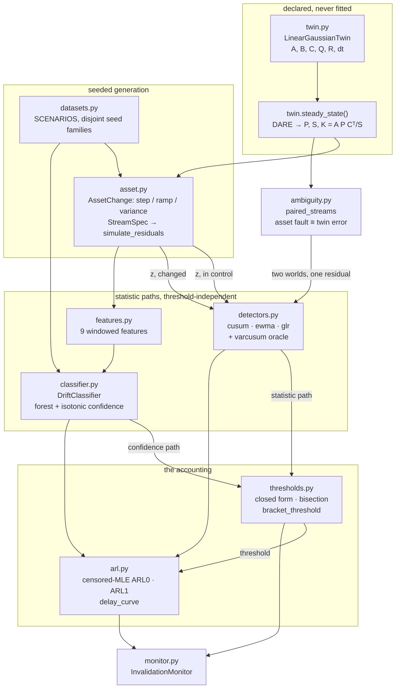
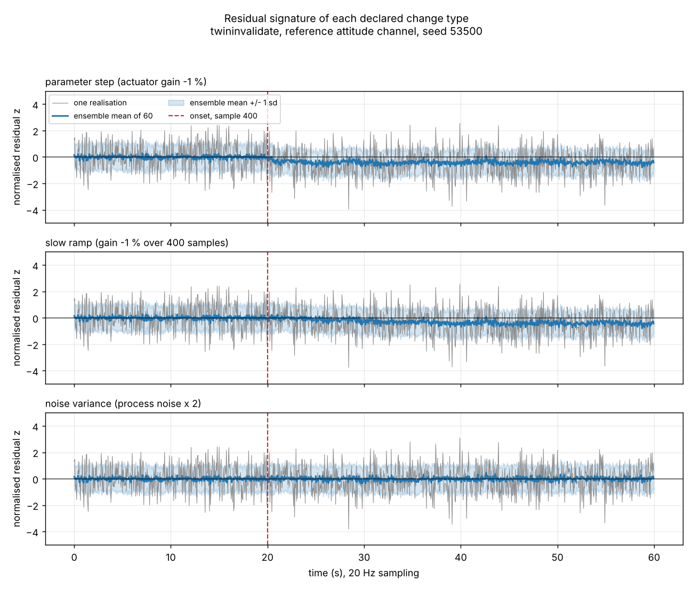
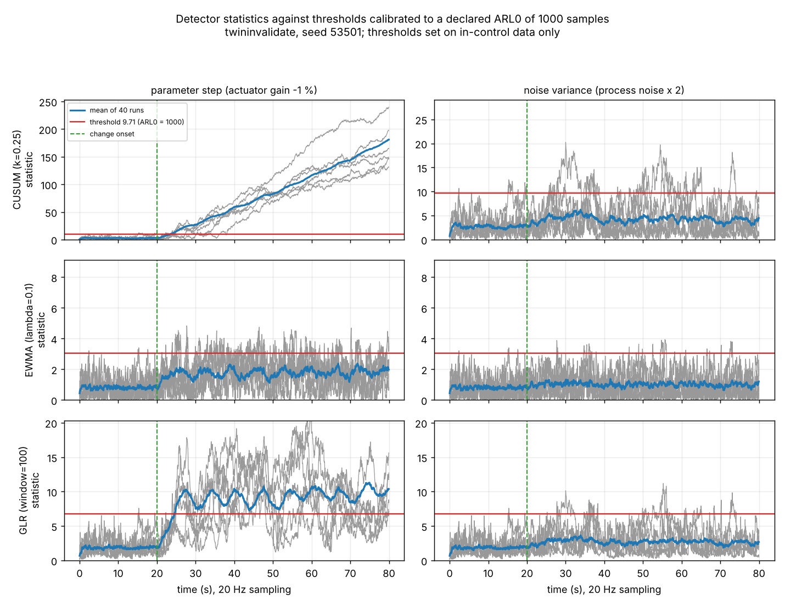
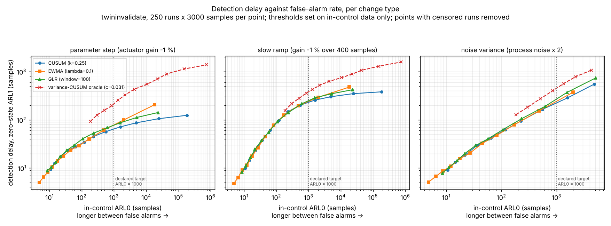
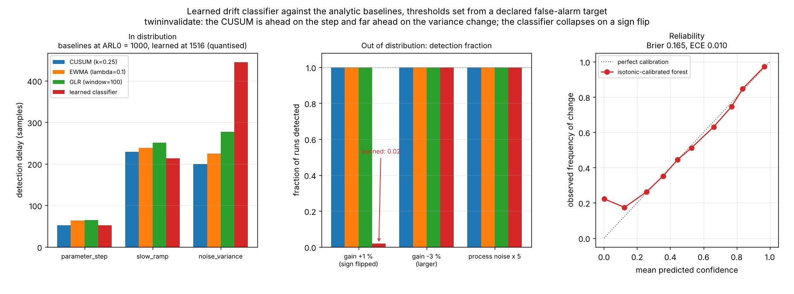
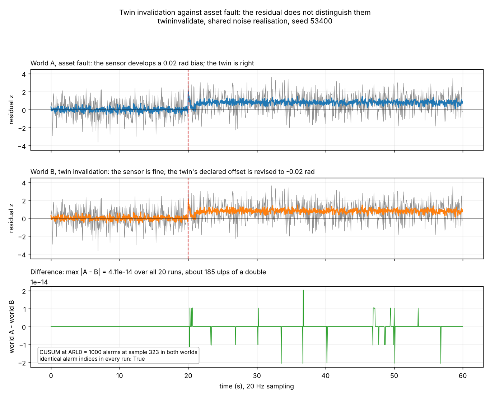

# twininvalidate

Decide when a digital twin no longer describes its asset, and report how long that took.


**Status: TESTING** · Class: medium · Validation level 3 (research grade) ·
Learned component present, benchmarked against analytic baselines, and its
failures published · Apache-2.0 · © 2026 OPTIMA Organisation

This software is research-grade. It is **not flight-qualified, not certified,
and not approved for operational aerospace use.**

**It cannot tell you whether the asset is faulty or the twin is wrong.** An
alarm means the two no longer agree. Section
[Twin invalidation is not asset fault](#twin-invalidation-is-not-asset-fault)
shows two physically different situations whose residual streams are
identical to 6.17e-14, and every detector in this package returns the same
alarm sample in both.

## The problem

You have a digital twin of a hardware asset and a filter producing residuals
from it. Someone asks the question a review always asks: how many samples
after the asset actually changes do you notice, and what does that cost in
false alarms per thousand hours. The change-detection libraries each
implement a detector well and stop there — none of them sets your threshold
from a declared false-alarm target, none reports the delay-against-false-alarm
trade-off per kind of change, and none tells you which kind of change your
detector is structurally unable to see.

## What this does

- **Sets every threshold from a declared false-alarm target, never from a
  delay.** Two cases have exact closed forms (GLR with window 1, EWMA with
  λ = 1); the rest are bisected onto a censored-MLE in-control ARL0. The
  Monte-Carlo calibrator agrees with the closed form to 0.50 %, 1.79 % and
  0.97 % at targets of 200, 1000 and 5000 samples
  (`validation/validate_thresholds.py`).
- **Produces the detection-delay against false-alarm-rate curve per change
  type.** Three change kinds, four detectors, 12 thresholds each, 300 runs ×
  3000 samples per point, in 15 s on two cores
  (`validation/validate_arl_curve.py`).
- **Names the change type every method does badly on, with the reason.** A
  process-noise change takes 3.1 to 3.5 times longer than a parameter step of
  comparable detectability, because it leaves the residual mean at exactly
  zero and every mean-shift statistic therefore has no post-change drift.
- **Benchmarks a learned drift classifier against the analytic baselines at a
  declared false-alarm budget — and publishes that it loses.** The CUSUM beats
  it on 2 of 3 in-distribution scenarios and 3 of 4 out-of-distribution ones;
  on a change of the same size and the opposite sign the classifier detects
  **2 % of runs** where every baseline detects 100 %
  (`validation/validate_classifier.py`).
- **Demonstrates, rather than asserts, that it cannot attribute a residual to
  a cause.** Two worlds, one shared noise realisation, max difference
  6.17e-14 over 48 000 samples.

## Who it's for

- Someone with a linear-Gaussian twin and a residual stream who has to defend
  a detection-delay number and a false-alarm budget to a reviewer.
- Someone who wants to know, before building a monitor, which kinds of change
  their chosen statistic is structurally blind to.
- Someone deciding whether a learned drift detector is worth its cost over a
  CUSUM, who would rather read a measurement than an opinion.

## Who it's not for

- Anyone needing a production streaming-detector library. Use
  [`river`](https://riverml.xyz): it has a dozen detectors, online learning,
  and years of use behind it. This package has three detectors and an oracle.
- Anyone needing offline change-point **segmentation** — where were the
  breakpoints in this recorded signal. Use
  [`ruptures`](https://pypi.org/project/ruptures/). This package is online
  and answers a different question.
- Anyone with a nonlinear twin, a multi-output measurement, a non-Gaussian
  residual, or a residual that is not white in control. Every threshold here
  rests on `z ~ i.i.d. N(0,1)`.
- Anyone who needs to know **why** the twin and the asset disagree. This
  package proves it cannot tell you.
- Anyone needing a certified or flight-qualified monitor. This is not one and
  will not become one.

## Alternatives, honestly

| Alternative | What it does better | When to use this instead |
|---|---|---|
| [`river`](https://riverml.xyz) (v0.26.1, verified on PyPI 2026-10-08) | A production streaming-ML library with ADWIN, Page-Hinkley, KSWIN, DDM/EDDM, online models and a large user base. Far more detectors, far better maintained. | When you need the ARL0-against-ARL1 accounting rather than a detector: thresholds set from a declared false-alarm target, delay curves per change type, and a learned model benchmarked against the analytic test at a matched false-alarm rate. `river` gives you the detector and leaves the accounting to you. |
| [`scipy.stats`](https://scipy.org) (v1.18.1) | The reference implementation of every distribution and hypothesis test here, including the normal quantile this package's closed-form thresholds call. | Never instead — this package calls it. `scipy` has no sequential change detector, no ARL machinery and no notion of detection delay. |
| [`ruptures`](https://pypi.org/project/ruptures/) (v1.1.10, verified on PyPI 2026-10-08) | Offline change-point detection and segmentation: Pelt, binary segmentation, dynamic programming, many cost functions. Mature and well documented. | When the question is online — how long until I notice — rather than retrospective. `ruptures` locates breakpoints in a finished record; it does not give an average run length. |
| [`changefinder`](https://pypi.org/project/changefinder/) (v0.3, verified on PyPI 2026-10-08) | A compact SDAR-based online change-score implementation. | Almost always. It is at version 0.3 and gives a change score, not a calibrated false-alarm rate. This package's contribution over it is the threshold discipline. |
| Writing the three recursions yourself | They are four lines each and you will understand yours. | When you want the calibration, the censoring-aware ARL estimators, the curve machinery and the negative results already measured. The recursions are the easy part; the honest accounting around them is not. |

What this package does that none of them does: it converts a **declared
false-alarm requirement** into a threshold without ever looking at a
detection delay, reports the resulting delay per change type with its
censoring, names the change type on which every method fails and why, and
publishes the cases where its own learned component loses.

## Install and first run

```bash
git clone https://github.com/OmAcharya-avtr/twininvalidate.git
cd twininvalidate
python -m venv .venv && source .venv/bin/activate
pip install -e ".[dev]"
python -m pytest tests/ -q
python examples/arl_curve.py
```

Expected output:

```
243 passed in 19.66s
wrote screenshots/arl_curve.png
rightmost uncensored point of each curve:
  parameter_step  CUSUM (k=0.25)                  ARL0   185590 -> delay   124.2
  parameter_step  EWMA (lambda=0.1)               ARL0    18353 -> delay   206.3
  parameter_step  GLR (window=100)                ARL0    23447 -> delay   141.9
  ...
```

The CLI:

```bash
python -m twininvalidate --help
python -m twininvalidate twin          # the declared twin and its steady-state gain
python -m twininvalidate scenarios     # the three declared change scenarios
python -m twininvalidate calibrate     # thresholds from a declared ARL0 target
python -m twininvalidate curve noise_variance
python -m twininvalidate benchmark     # learned classifier against the baselines
python -m twininvalidate ambiguity     # asset fault against twin error
```

## A worked example

```python
import numpy as np
from twininvalidate import (
    DetectorSpec, InvalidationMonitor, changed_streams,
    in_control_streams, reference_twin,
)

# 1. The declared twin and its fixed-gain residual generator.
twin = reference_twin()
filt = twin.steady_state()
print(f"innovation sd sqrt(S)      {np.sqrt(filt.S):.6e} rad")

# 2. Calibrate a CUSUM to a declared in-control ARL0 of 1000 samples
#    (50 s at 20 Hz) using in-control residuals ONLY.
in_control = in_control_streams(n_runs=200, n_samples=2000, seed=53001)
monitor = InvalidationMonitor.from_target(DetectorSpec("cusum"), in_control, 1000.0)
print(f"CUSUM threshold            {monitor.threshold:.4f}")
print(f"achieved in-control ARL0   {monitor.calibration.achieved_arl0:.1f} samples")
print(f"false alarms per 1000 h    "
      f"{monitor.false_alarms_per_1000h(monitor.calibration.achieved_arl0):.0f}")

# 3. Inject the declared 1 % actuator-gain loss and measure the delay.
changed = changed_streams("parameter_step", n_runs=200, n_samples=2000)
delay = monitor.arl1(changed)
print(f"detection delay            {delay.value:.1f} +- {delay.stderr:.1f} samples "
      f"= {delay.value * twin.dt:.2f} s")
print(f"runs detected              {delay.detection_fraction * 100:.0f} %")
```

Actual output (`validation/worked_example.py`, full version in
`validation/worked_example_output.txt`):

```
innovation sd sqrt(S)      1.079405e-02 rad
CUSUM threshold            9.7082
achieved in-control ARL0   996.1 samples
false alarms per 1000 h    72283
detection delay            64.5 +- 2.4 samples = 3.22 s
runs detected              100 %
single stream, change at 300: 1/1 run(s) alarmed at threshold 9.708; earliest at sample 353, mean alarm index 354.0 samples
the alarm says the twin and the asset disagree; it does not say which
one moved. See twininvalidate.ambiguity.
```

## Architecture



The load-bearing design decision: **a statistic path does not depend on the
threshold**, so one simulation produces a whole delay-against-false-alarm
curve by sweeping thresholds over stored matrices. That is what makes the
headline deliverable affordable on two cores.

## Screenshots



Notice that the noise-variance panel's ensemble mean sits exactly on zero
after the change while the band widens. Every statistic in this package
accumulates a function of the mean, so that panel is the one they are blind
to.



Notice the CUSUM climbing linearly after the step while the windowed GLR
plateaus: the GLR's 100-sample window truncates the accumulation. In the
right-hand column no statistic has any drift at all.



The headline figure. Notice that every curve rises to the right — there is no
threshold that buys both a longer time between false alarms and a shorter
delay — and that the red dashed variance-CUSUM oracle is the **highest** curve
in the right-hand panel, despite being the correctly specified test for that
change.



Notice the middle panel. The learned classifier's bar for a sign-flipped
change is at 0.03 while all three baselines are at 1.00.



The top two panels are not similar traces. They are the same trace, produced
by two physically different situations.

## Validation evidence

Full record in [`validation/VALIDATION.md`](validation/VALIDATION.md); raw
output in `validation/*_output.txt`. Every number below was produced by a
script in this repository in the build session.

| Check | Reference | Result | Tolerance | Verdict |
|---|---|---|---|---|
| Steady-state Riccati residual | Anderson & Moore 1979 | 7.047e-19 | < 1e-15 | PASS |
| In-control residual mean / sd | Kailath 1968 innovations property | +0.000814 (+1.03 se) / 1.000302 | 4 se | PASS |
| In-control lag-1 autocorrelation | Kailath 1968 | −0.000141 (−0.18 se) | 4 se | PASS |
| Parameter-step mean shift vs closed form | derived, eq. (10) in `twin.py` | 0.16 % error | 3 % | PASS |
| Detector known answers, 12 cases | Page 1954, Roberts 1959, Willsky & Jones 1976 | max error 0.000e+00 | 1e-12 | PASS |
| GLR(window=1) closed-form threshold | hand calculation | 5.4137830853 | 1e-8 | PASS |
| Monte-Carlo calibrator vs closed form | internal consistency | 0.50 / 1.79 / 0.97 % | 5 % | PASS |
| ARL0 transfer to fresh banks, three baselines | — | within +3.4 % / −8.7 % | 8.8 % (3 se) | PASS 9/9 |
| **ARL0 transfer, variance-CUSUM oracle** | — | **−8.6 % and +13.5 %** | 8.8 % | **FAIL 2/3** |
| Residual identity, asset fault vs twin error | derivation in `ambiguity.py` | 6.17e-14 (≈278 ulps) | 1e-10 | PASS |
| Identical alarm indices in both worlds | — | identical in every run, 4 detectors | exact | PASS |
| CLI exit statuses, 15 cases | — | all as specified | exact | PASS |

### Headline: detection delay at a matched in-control ARL0 of 1000 samples

Zero-state convention, 300 runs × 3000 samples per cell, delays in samples
(one sample = 50 ms), detection fraction 1.00 except where noted.

| Change type | CUSUM | EWMA | GLR | variance-CUSUM oracle |
|---|---|---|---|---|
| parameter step, actuator gain −1 % | **62.3 ± 2.0** | 72.6 ± 2.9 | 75.7 ± 2.5 | 216.4 ± 8.0 |
| slow ramp, gain −1 % over 400 samples | **232.5 ± 5.4** | 258.7 ± 6.3 | 258.7 ± 6.5 | 407.9 ± 11.0 |
| **noise variance, process noise × 2** | **211.0 ± 11.5** | 223.5 ± 12.8 | 262.3 ± 14.1 | 466.6 ± 22.5 (det 0.99) |

## The results that went against expectation

<details>
<summary><b>1. CUSUM beats the windowed GLR on all three change types</b></summary>

The specification expected a GLR to be hard to beat on a Gaussian residual.
Measured ordering at a matched ARL0:

```
parameter_step   cusum (62) < ewma (73) < glr (76)
slow_ramp        cusum (232) < ewma (259) < glr (259)
noise_variance   cusum (211) < ewma (224) < glr (262)
```

A CUSUM accumulates without bound, so a persistent shift drives it linearly
for as long as the shift lasts. A windowed GLR truncates accumulation at its
window and pays a maximum-over-onset penalty that raises the threshold needed
for the same ARL0. The GLR's real advantage — needing no declared shift
magnitude — is invisible here because the CUSUM's declared reference value
happens to suit the change. On a change far from the CUSUM's design shift the
ordering could reverse; that was not measured and is not claimed.
</details>

<details>
<summary><b>2. Using the correct statistic makes the variance change worse, not better</b></summary>

The variance-CUSUM oracle is handed the post-change residual variance and
accumulates `z² − 1`, the sufficient statistic for a scale change in a
zero-mean Gaussian. It is the **slowest** method on the noise-variance
change: 466.6 samples against 211.0 for the mis-specified mean CUSUM.

At this effect size its per-sample standardised shift is only
`0.059/√2 = 0.042`, because `Var(z²) = 2` under H0, while the mean CUSUM's
alarm rate responds to residual scale through an exponentially sensitive
tail. Correct specification is not the same as more information per sample.
</details>

<details>
<summary><b>3. The analytic CUSUM beats the learned classifier, and the one win the classifier keeps is a specification advantage</b></summary>

Thresholds set from the same declared in-control ARL0 target of 1000 samples
on the same in-control bank, in-control data only. Steady-state protocol with
the change at sample 50, 200 runs × 2500 samples, four disjoint seed families,
splits by run.

The classifier's confidence is quantised by its isotonic calibration (1857
distinct levels), so it **cannot** be operated at ARL0 1000. Both achievable
bracketing thresholds are shown: `learned-cons` at ARL0 1516 (fewer false
alarms allowed than the baselines — a handicap) and `learned-gen` at ARL0 874
(more allowed — an advantage). Cells are mean delay in samples / fraction of
runs detected.

| Scenario | CUSUM | EWMA | GLR | learned-cons | learned-gen |
|---|---|---|---|---|---|
| parameter step, gain −1 % | **52 / 1.00** | 64 / 1.00 | 65 / 1.00 | 53 / 1.00 | 47 / 1.00 |
| slow ramp | 229 / 1.00 | 238 / 1.00 | 251 / 1.00 | **213 / 1.00** | 183 / 1.00 |
| noise variance × 2 | **200 / 1.00** | 225 / 1.00 | 277 / 1.00 | 445 / 0.99 | 338 / 1.00 |
| OOD: gain **+1 %**, sign flipped | 54 / 1.00 | 65 / 1.00 | 67 / 1.00 | 8 / **0.02** | 75 / **0.04** |
| OOD: gain −0.4 %, smaller | 225 / 1.00 | 277 / 1.00 | 312 / 1.00 | **174 / 1.00** | 136 / 1.00 |
| OOD: gain −3 %, larger | 20 / 1.00 | **19 / 1.00** | 20 / 1.00 | 26 / 1.00 | 23 / 1.00 |
| OOD: process noise × 5 | **71 / 1.00** | 71 / 1.00 | 76 / 1.00 | 184 / 1.00 | 169 / 1.00 |

**At a comparable false-alarm budget the CUSUM wins 2 of 3 in distribution and
3 of 4 out of distribution.** The classifier's only surviving win is the slow
ramp, by 7 %. It is 122 % slower on the variance change it was trained on,
159 % slower on a larger one, and on a gain change of the **same magnitude and
the opposite sign** it detects 2 % of runs where every baseline detects 100 %.

The ramp win is a specification advantage, not a learning advantage: the
training set contains only negative gain changes, so the classifier has
learned an effectively one-sided test, while the two-sided CUSUM spends half
its false-alarm budget on the other direction and is tuned to a declared 0.5σ
shift rather than the true 0.404σ. Nothing was retuned after these results
were seen; the one change made after a benchmark had run was a correctness fix
to the seed allocation (VALIDATION.md, error 4), and it moved the result
*against* the learned model.

Cost, for completeness: 10.5 ms per decision against 0.006 ms per sample for
the CUSUM recursion — a factor of order 2000, which moves between runs because
both are short — and the windowed classifier cannot alarm before its 50-sample
window fills.

Confidence quality: Brier 0.1589, expected calibration error 0.0208 over ten
bins, on 90 120 held-out windows.

**Recommendation, against this package's own AI component: use the CUSUM.**
</details>

<details>
<summary><b>4. A validation check that fails</b></summary>

The threshold calibrated for the variance-CUSUM oracle on one in-control bank
transfers to three pooled fresh banks with a bias of −8.6 % at a target ARL0
of 200 and +13.5 % at 1000, both outside the declared tolerance of three
standard errors (8.8 %). The three declared baselines transfer within
+3.4 % / −8.7 % and pass all nine of their checks.

The variance CUSUM's increments `z² − 1` are right-skewed with a heavy upper
tail, so its own upper tail is built from fewer, larger excursions and the
bisected threshold lands on a bank-specific extreme. The tolerance was not
widened. The oracle is not one of the three declared baselines and no headline
curve depends on it; the overshoot makes it look slightly *better* than a
fairly matched comparison would, and it loses anyway.
</details>

## Twin invalidation is not asset fault

The same residual means either. This package cannot tell them apart, and the
claim is demonstrated rather than asserted.

Take a constant offset `b` in the measurement path appearing at sample 400,
realised two ways on one shared noise realisation:

- **World A, asset fault.** The sensor develops a bias. `y = Cx + b + v`, twin
  declares offset 0, so `e = C(x − x̂) + b + v`.
- **World B, twin invalidation.** The sensor is fine and the asset is
  unchanged, but the twin's declared offset is revised to `−b`. `y = Cx + v`,
  so `e = C(x − x̂) + b + v`.

Same function of the same quantities, and the state recursions are identical.
Measured over 40 runs × 1200 samples:

| Quantity | Value |
|---|---|
| max \|world A − world B\| | **6.17e-14** |
| typical \|residual\| | 0.964 |
| difference in units in the last place of a double | about 278 |
| CUSUM / EWMA / GLR / variance-CUSUM alarm indices | identical in every run |

This package does not claim the streams are bitwise identical — World A adds
`b` to the measurement and World B subtracts it from the prediction, so the
two sums round differently. The identity is established by the derivation;
6.17e-14 is the measurement that corroborates it.

**An alarm means the twin and the asset no longer agree.** Deciding which one
moved needs information this monitor is not given: a second, independently
instrumented measurement path, a known-good reference manoeuvre, or a
maintenance record.

## API reference

<details>
<summary>Public surface, one line each, with units</summary>

### The twin (`twininvalidate.twin`)

| Name | Returns |
|---|---|
| `LinearGaussianTwin(A, B, C, Q, R, dt, offset=0.0)` | Declared model; `C` must be `(1, n)`, `R` strictly positive, `Q` symmetric PSD |
| `.steady_state()` | `SteadyStateFilter` with `P`, `S` (rad²), `K = A P Cᵀ/S` |
| `.with_offset(offset)` | Copy with a new declared measurement offset (rad) |
| `SteadyStateFilter.riccati_residual()` | Max-abs residual of the Riccati equation, dimensionless |
| `SteadyStateFilter.spectral_radius()` | Spectral radius of `A − KC`; must be < 1 |
| `zoh_discretise(a_c, b_c, dt)` | `(A, B)` zero-order-hold equivalent over `dt` seconds |
| `cwna_process_noise(dt, sigma_a)` | `(2,2)` discrete process noise for continuous white-noise acceleration |
| `attitude_channel(omega_n, zeta, dt, sigma_a, sigma_meas, offset)` | The shipped illustrative channel |
| `reference_twin()` | `attitude_channel()` at its declared defaults |
| `reference_excitation(n, dt)` | `(n, 1)` input, `1.0 + 0.2 sin(2π·0.15·t)` rad/s² |

### Changes and streams (`twininvalidate.asset`, `.datasets`)

| Name | Returns |
|---|---|
| `AssetChange(kind, onset, magnitude, ramp_samples)` | A declared change; `kind` in `CHANGE_KINDS` |
| `StreamSpec(change, n_runs, n_samples, seed, burn_in, ...)` | Everything needed to regenerate a batch |
| `simulate_residuals(spec)` | `(n_runs, n_samples)` normalised residuals, dimensionless |
| `in_control_streams(n_runs, n_samples, seed)` | In-control streams |
| `changed_streams(scenario, n_runs, n_samples, seed)` | Streams with a declared scenario from sample 0 |
| `training_set()` / `calibration_set()` | `LabelledWindows` from the declared seed families |

### Detectors (`twininvalidate.detectors`)

| Name | Returns |
|---|---|
| `cusum_statistic(z, reference=0.25)` | `(n_runs, n_samples)` two-sided CUSUM path, dimensionless |
| `ewma_statistic(z, lam=0.10)` | EWMA path standardised by its asymptotic sd, dimensionless |
| `glr_statistic(z, window=100)` | Windowed GLR path, nats |
| `variance_cusum_statistic(z, reference=0.031)` | Oracle scale-change CUSUM path, dimensionless |
| `DetectorSpec(name, ...)` | Detector plus its declared design constants, no threshold |
| `first_alarm(statistic, threshold)` | `(n_runs,)` first crossing index, `-1` for censored |

### Thresholds and ARLs (`twininvalidate.thresholds`, `.arl`)

| Name | Returns |
|---|---|
| `glr_window1_threshold(T)` / `ewma_lambda1_threshold(T)` | Exact threshold for a target ARL0 in samples |
| `calibrate_threshold(spec, in_control, target_arl0)` | `Calibration` with threshold, achieved ARL0, stderr |
| `bracket_threshold(statistic, target_arl0)` | `ThresholdBracket` for a quantised statistic |
| `arl0_from_rate(fa_per_1000h, hz)` / `rate_from_arl0(samples, hz)` | Unit conversion |
| `arl0_estimate(statistic, threshold)` | Censored-MLE ARL0 in samples, with stderr and censoring |
| `arl1_estimate(statistic, threshold)` | Zero-state delay in samples, with detection fraction |
| `delay_after_onset(statistic, threshold, onset)` | `(estimate, n_pre_onset_false_alarms)`, steady-state protocol |
| `delay_curve(spec, in_control, out_of_control, thresholds)` | List of `CurvePoint` |
| `threshold_grid(statistic, n_points)` | Geometric grid over the useful range |

### Learned component (`twininvalidate.features`, `.classifier`)

| Name | Returns |
|---|---|
| `window_features(z, window=50)` | `(n_runs, n_windows, 9)` dimensionless features |
| `DriftClassifier(window, n_estimators, max_depth, seed)` | Unfitted model |
| `.fit(x_train, y_train, x_calibration, y_calibration)` | Fitted model, isotonic-calibrated |
| `.confidence(x)` | Calibrated P(changed) in `[0, 1]` — the uncertainty output |
| `.statistic(z)` | `(n_runs, n_samples)` confidence path, zero until the window fills |
| `.feature_importance()` | Impurity importances by feature name |
| `brier_score(confidence, label)` | Mean squared error of the forecast |
| `reliability_diagram(...)` / `expected_calibration_error(bins)` | Calibration evidence |

### Monitor and ambiguity (`twininvalidate.monitor`, `.ambiguity`)

| Name | Returns |
|---|---|
| `InvalidationMonitor.from_target(spec, in_control, target_arl0, hz)` | Monitor with a threshold bought by a declared target |
| `.run(z)` | `MonitorVerdict` with alarm indices and the statistic path |
| `.arl0(in_control)` / `.arl1(out_of_control)` | `ArlEstimate` in samples |
| `.false_alarms_per_1000h(arl0_samples)` | False alarms per 1000 operating hours |
| `paired_streams(offset, onset, n_runs, n_samples, seed)` | `PairedStreams`: the two worlds |
| `max_absolute_difference(pair)` | Largest difference between them, dimensionless |

</details>

## Limitations

- **It cannot attribute a cause.** Demonstrated above, not merely disclaimed.
- **The headline false-alarm rate is unrealistically high.** The declared
  target ARL0 of 1000 samples is 72 000 false alarms per 1000 h at 20 Hz. A
  real requirement of 10 per 1000 h is an ARL0 of 7.2e6 samples, which needs
  about 7e9 in-control samples to resolve with 1000 alarms and does not fit
  the compute budget. The curve's **shape** is the deliverable; the operating
  point a real requirement implies is off its right-hand end and is **not
  measured**.
- **Detectability requires excitation.** A parameter change is only visible if
  the asset is being driven. With `u = 0` and the state at the origin, an
  actuator-gain error produces no innovation at all. The shipped excitation is
  a constant command of 1.0 rad/s² with a 0.2 rad/s² dither at 0.15 Hz. On a
  quiescent asset this monitor has nothing to work with.
- **Scalar measurements only.** `C` must be `(1, n)`. The exact closed-form
  thresholds depend on the residual being a scalar standard normal.
- **Linear and Gaussian throughout.** Every threshold rests on
  `z ~ i.i.d. N(0,1)` in control. Nothing here is validated for a nonlinear
  twin, a coloured residual or a heavy-tailed one.
- **The three declared baselines are all mean-shift statistics.** None is the
  likelihood-ratio test for a variance change, which is why the
  noise-variance scenario is the hard case. The variance-CUSUM oracle is
  provided to measure the cost of that mis-specification, and it has its own
  failing calibration-transfer check (see above).
- **The learned model is trained on three change kinds at one magnitude
  each.** It fails on the opposite sign and degrades on other magnitudes. Do
  not deploy it.
- **The learned model's threshold is quantised** by the isotonic calibration
  and cannot be set to an arbitrary false-alarm rate.
- **Delay conventions are not interchangeable.** The headline curve is
  zero-state; the learned-model comparison is steady-state with a 50-sample
  run-up. Do not compare a number from one table with a number from the other.
- **Two conventions for a censored run.** `arl0_estimate` uses the censored
  MLE; `arl1_estimate` reports the mean over detected runs plus the detection
  fraction and a lower bound. A delay quoted without its detection fraction is
  not interpretable.
- **Wall-clock figures are container measurements, not hardware
  characteristics.** 2 cores, 7.8 GiB, Python 3.13.16; they move 10–20 %
  between runs.
- **No hardware has been involved at any point.**

## Reproducing every number

```bash
pip install -e ".[dev]"

# tests and lint
python -m pytest tests/ -q
ruff check src/ tests/ examples/ validation/

# validation evidence (about 150 s total on 2 cores)
python validation/validate_twin.py
python validation/validate_detectors.py
python validation/validate_thresholds.py
python validation/validate_arl_curve.py      # the headline deliverable
python validation/validate_classifier.py     # the AI benchmark and its failures (~65 s)
python validation/validate_ambiguity.py
python validation/validate_cli.py
python validation/worked_example.py

# figures
python examples/residual_stream.py
python examples/detector_statistics.py
python examples/arl_curve.py
python examples/classifier_benchmark.py
python examples/invalidation_vs_fault.py
```

Every seed is declared in `src/twininvalidate/datasets.py`. No data file is
committed; regeneration is deterministic.

## Licence, citation, credits

Apache-2.0. © 2026 OPTIMA Organisation. See [LICENSE](LICENSE).

Citation metadata in [CITATION.cff](CITATION.cff). Model documentation in
[MODEL_CARD.md](MODEL_CARD.md) and [DATASET_CARD.md](DATASET_CARD.md).
Numbered requirements and their tests in
[docs/REQUIREMENTS.md](docs/REQUIREMENTS.md).

### Credits

This is under reserved rights obtained by OPTIMA Organisation.
