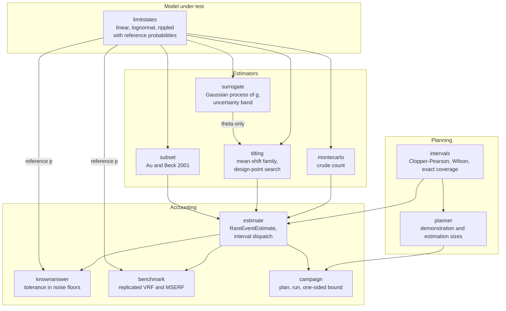
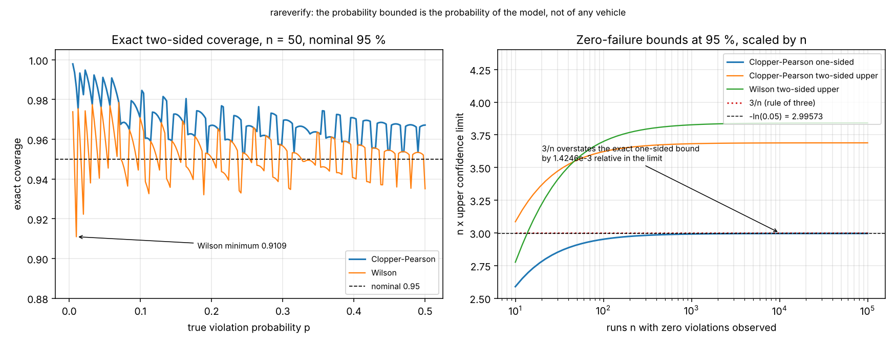
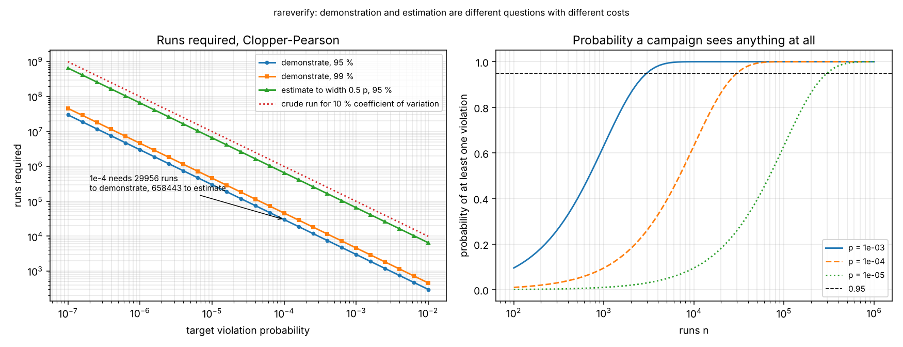
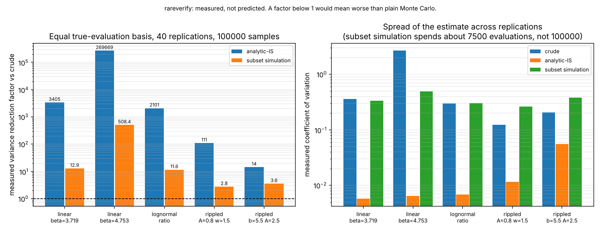
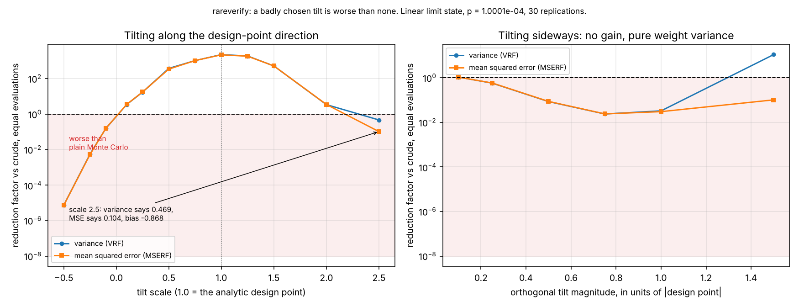
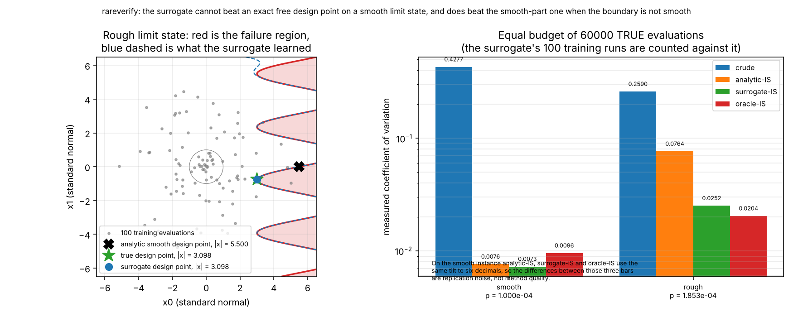

# rareverify

Plan and execute a Monte-Carlo campaign for a rare requirement violation, with defensible bounds.

**Status:** `TESTING` · **Class:** medium · **Validation level:** 2 · **AI:** yes


## The problem, in three sentences

A requirement says the model must not violate a condition more often than once
in ten thousand runs, so you run ten thousand simulations and see nothing, and
now you have to write down what that actually proves. Someone else on the
programme has heard that importance sampling makes rare-event campaigns
cheaper, turns it on, and gets an answer four orders of magnitude too small
with a tight-looking error bar. By the time the review asks where the number
came from, nobody can say whether the interval around it is valid for the
estimator that produced it.

**Every probability this package reports is the probability that the simulated
model violates the requirement.** It is not the probability that a vehicle
fails. The gap between the two is model error, input-distribution error and
requirement-specification error, none of which is estimated here and none of
which any interval in this package covers. That conflation is the single most
common misquotation of a number like these.

## What this does

- **Sizes the campaign.** `ceil(ln(alpha) / ln(1 - p_target))` runs to
  demonstrate a target from zero failures: **29 956** runs for `p = 1e-4` at
  95 %, against **658 443** to estimate it to within half its own value and
  **999 900** for a 10 % coefficient of variation.
  (`validation/validate_planner.py`)
- **Bounds it correctly, including the zero-failure case the campaign actually
  hits.** Clopper-Pearson and Wilson, with exact coverage computed rather than
  simulated: Clopper-Pearson never drops below **0.951900** on the test grid,
  Wilson drops to **0.904610**. (`validation/validate_intervals.py`)
- **Refuses to put a binomial interval around a weighted estimator.**
  `binomial_interval` raises on an importance-sampling or subset-simulation
  result; subset simulation's own standard error is labelled a lower bound
  because it understates the measured spread by a mean factor of **2.69**.
  (`validation/validate_variance_reduction.py`)
- **Measures variance reduction instead of predicting it.** 40 replications,
  equal true-evaluation basis: importance sampling at the design point gives a
  factor of **3405** on a linear limit state at `p = 1e-4` and **2.697e+05** at
  `p = 1e-6`; subset simulation gives **12.9** and **508**.
  (`validation/validate_variance_reduction.py`)
- **Shows where importance sampling is worse than none.** **26 of 40** swept
  tilts are measurably worse than plain Monte Carlo at the same cost: a
  sideways tilt at full design-point magnitude by a factor of **3943** in
  variance, a wrong-direction tilt by **1.0e+05**, and an over-tilted case
  returns **4.82921e-10 for a true 1.00006526e-04** with a standard error to
  match. (`validation/validate_is_worse.py`)

## Who it's for

- Someone who has to defend a rare-event number in a review and needs the
  interval, the assumptions and the evidence in one place.
- Someone deciding whether variance reduction is worth the risk on their
  problem, who wants the failure modes measured rather than described.
- Someone benchmarking a learned surrogate against a classical reliability
  baseline and wanting the comparison done on an equal evaluation budget.

## Who it's not for

- Anyone who needs a general uncertainty-quantification framework: this has
  three synthetic limit states and one tilting family. Use OpenTURNS or UQpy.
- Anyone doing global sensitivity analysis. Use `SALib`.
- Anyone who needs intervals for anything other than a binomial proportion or
  a weighted mean. Use `scipy.stats` directly.
- Anyone who wants a probability about a real vehicle. Nothing here provides
  one, and the package says so in eleven places.
- Anyone needing a non-Gaussian input space: everything here works in standard
  normal space and no transformation is implemented.

## Alternatives, honestly

Versions checked with `pip index versions` in the build container on
2026-10-08.

| Alternative | What it does better | When to use this instead |
|---|---|---|
| **OpenTURNS** 1.27.post1 | A complete uncertainty-quantification platform: distributions, copulas, FORM/SORM, directional sampling, Kriging, sensitivity, with two decades of industrial use. Anything this package does, it does too, usually with more options. | Only if you want the campaign-accounting layer: the sample-size plan, the measured-not-predicted variance reduction, the explicit refusal to pair a binomial interval with a weighted estimator, and a published table of the tilts that make things worse. |
| **UQpy** 4.2.1 | Broad and actively developed: subset simulation, stratified and importance sampling, surrogates, reliability, inference. Its subset-simulation implementation is more general than the one here. | Only for the accounting layer above. For subset simulation itself, use UQpy. |
| **`SALib`** 1.6.0 | Global sensitivity analysis — Sobol, Morris, FAST. Which inputs matter. | This answers a different question: how often the requirement is violated, not which input drives it. Use both. |
| **`scipy.stats`** 1.18.1 | `scipy.stats.binomtest(...).proportion_ci(method="exact")` gives the same Clopper-Pearson interval this package gives, from a far better tested library. | Use `scipy.stats` for the interval itself. Use this for the zero-failure closed forms, the one-sided planning arithmetic, the exact-coverage computation, and the enforcement that the interval matches the estimator. |
| Writing it yourself | Fifty lines gets you a crude estimator and a Clopper-Pearson interval, and for many campaigns that is the right answer. | When you are about to add importance sampling, which is where the fifty-line version stops being safe. |

**What this does that none of them does:** it treats "which interval is valid
for this estimator" as a computed property rather than a convention, and it
publishes the measured cases where its own variance reduction makes the answer
worse. Nothing stops OpenTURNS or UQpy from being used to do the same; they
just do not ship the table.

## Install and first run

```bash
git clone https://github.com/OmAcharya-avtr/rareverify.git
cd rareverify
python -m venv .venv && source .venv/bin/activate
pip install -e ".[dev]"
python -m pytest tests/ -q
python examples/interval_coverage.py
```

Expected output of the test run:

```
........................................................................ [ 35%]
........................................................................ [ 70%]
...........................................................              [100%]
203 passed in 36.14s
```

The example writes `screenshots/interval_coverage.png` and prints nothing.

A first campaign from the command line:

```bash
$ python -m rareverify plan --target-probability 1e-4
target violation probability : 1.000000e-04
confidence                   : 0.95
interval method              : clopper-pearson
runs to demonstrate (k=0)    : 29956
  upper bound if k=0         : 9.999942e-05
  E[violations] at p_target  : 2.995600
  P(k=0) at p_target         : 0.049999
runs to estimate to 0.5*p : 658443
crude runs for a 10 % coefficient of variation: 999900
probability of seeing at least one violation in the demonstration run: 0.950001
```

## A worked example

```python
import numpy as np
from rareverify import (
    LinearGaussianLimitState, analytic_mean_shift, binomial_interval,
    crude_monte_carlo, importance_sampling, interval_for,
    plan_campaign, samples_for_zero_failure_bound,
)

state = LinearGaussianLimitState(beta=4.753, dimension=2)   # true p = 1.0021e-06
print("reference probability:", state.analytic_probability())
print("runs to demonstrate 1e-6 at 95 %:", samples_for_zero_failure_bound(1e-6, 0.95))
print("budget actually available: 200000")

crude = crude_monte_carlo(state, 200_000, rng=np.random.default_rng(1))
print(crude.describe())
print("zero-failure bound:", binomial_interval(crude, side="upper").upper)

tilted = importance_sampling(
    state, analytic_mean_shift(state), 200_000, rng=np.random.default_rng(2)
)
print(tilted.describe())
print(interval_for(tilted).describe())

try:
    binomial_interval(tilted)
except ValueError as error:
    print("refused:", error)
```

```
reference probability: 1.0021017399753196e-06
runs to demonstrate 1e-6 at 95 %: 2995731
budget actually available: 200000
crude: p_hat=0.000000e+00 se=0.000000e+00 cov=inf n=200000 evals=200000 ess=0.00
zero-failure bound: 1.4978549188181866e-05
importance-sampling: p_hat=1.006163e-06 se=5.205994e-09 cov=0.0052 n=200000 evals=200000 ess=31474.90
normal-weighted 0.95: [9.959598e-07, 1.016367e-06] (weighted estimator: central-limit interval, effective sample size 31474.90)
refused: estimator 'importance-sampling' is not a binomial proportion, so a clopper-pearson interval is not valid for it; use interval_for() or bootstrap_interval() instead
```

The crude run at the affordable budget can only say `p <= 1.50e-05`, fifteen
times the true value. The same budget spent on importance sampling resolves it
to 0.5 %.

## Architecture



The one edge that carries the whole AI argument is `surrogate -->|theta only|
tilting`: the learned model supplies the mean shift and nothing else, and every
accepted sample is evaluated on the true limit state. That makes the estimator
unbiased for any surrogate, good or bad.

## Screenshots



Left: coverage computed exactly, by summing binomial mass, not by simulation.
Notice that the Wilson curve crosses below the nominal line repeatedly and
reaches 0.9109 at `n = 50`, while Clopper-Pearson stays above it everywhere.
Right: the three zero-failure bounds scaled by `n`, which is the only way to
see them apart. Notice that `3/n` sits just above the exact one-sided bound
and stays there, and that the Wilson curve crosses the Clopper-Pearson one near
`n = 46`.



Left: demonstrating a target and estimating it are different questions with
costs a decade apart. Notice the gap between the blue and green lines: at
`p = 1e-4` it is 29 956 runs against 658 443. Right: the probability a campaign
sees anything at all, which is 0.95 at the demonstration size by construction.



Left: measured variance reduction factors, log scale, 40 replications each.
Notice that subset simulation's factors are one to three orders of magnitude
below importance sampling's on these problems — but it spends about 7500
evaluations rather than 100 000, and it needs no design point. Right: the
spread of each estimator. Notice the crude bar at `beta = 4.753`: a coefficient
of variation of 2.68 is what 100 000 runs buys at `p = 1e-6`.



The shaded region is worse than plain Monte Carlo. Notice that the two curves
separate on the right of the left panel: at tilt scale 3 the variance metric
says the method is 1.8e+08 times better and the mean-squared-error metric says
it is ten times worse, because the estimate has collapsed to 4.8e-10 against a
true 1.0e-04. Notice also that the right panel is almost entirely inside the
shaded region: tilting sideways is never useful.



Left: the rough limit state. Notice that the analytic smooth-part design point
(black cross, `|x| = 5.500`) is nowhere near the nearest failure point, and
that the surrogate's design point sits exactly on the true one (`|x| = 3.098`),
with its learned boundary matching the true one across the sampled region.
Right: measured coefficients of variation at an equal budget of 60 000 true
evaluations. Notice that on the smooth instance the analytic, surrogate and
oracle bars are the same height to within replication noise — the surrogate has
nothing to win there — and that on the rough instance the surrogate closes most
of the gap between the analytic baseline and the oracle.

## Validation evidence

Full detail, including every raw output file, in
[validation/VALIDATION.md](validation/VALIDATION.md). Nine scripts, 92 checks,
0 failures. The checks that the baseline won are in the table, because those
are the credible ones.

| Check | Reference | Result | Tolerance |
|---|---|---|---|
| Clopper-Pearson exact coverage, minimum over `n` in {20, 50, 100, 1000} and nine `p` | Clopper & Pearson 1934 | **0.951900** | must be ≥ 0.95 |
| Wilson exact coverage, same grid | Wilson 1927 | **0.904610** — **under-covers** | reported, not required |
| Zero-failure bound, `k=0`, `n=100`, 95 % one-sided | hand: `1 - 0.05**(1/100)` = 0.0295130496070399 | 0.029513049607039932 | < 1e-15 |
| Demonstration sample size, `p=1e-4`, 95 % | hand: `ceil(29955.8)` | 29956, and 29955 fails the bound | exact |
| Known-answer, 8 limit states × crude and importance sampling | `Phi(-beta)` and Gauss-Hermite | **16 of 16 pass**, worst 0.985 floors | 4 counting-noise floors |
| Known-answer, subset simulation, mean of 20 replications | same references | **8 of 8 pass**, worst `z` = 0.982 | 4 standard errors of the mean |
| Negative control: correct estimate vs a wrong reference | deliberately 1e-2 | **reported FAIL at 31.466 floors** | must fail |
| Importance sampling VRF, linear `beta=3.719` | measured, 40 replications | **3405** | > 1 |
| Importance sampling VRF, linear `beta=4.753` | measured | **2.697e+05** | > 1 |
| Subset simulation VRF, linear `beta=4.753` | measured, 12 305 evaluations | **508.4** | > 1 |
| Subset simulation reported standard error vs measured spread | its own `se_ratio` | **0.300 to 0.442** — understates by 2.69x on average | reported |
| Crude plug-in standard error at `p=1e-6`, `n=1e5` | its own `se_ratio` | **0.281** — understates by 3.6x | reported |
| Tilts measurably worse than plain Monte Carlo | measured, 40 tilts | **26** | reported |
| Over-tilt at scale 3 | true `p` = 1.00006526e-04 | estimate **4.82921e-10**, VRF 1.836e+08, **MSERF 0.09998** | reported |
| Design point, two independent searches vs closed form | ray search and SLSQP | agree to **4.0e-08** relative or better on 5 instances | < 1e-5 |
| Raw ray search in 6 dimensions, 192 directions | true `beta` = 3.072735 | **8.665e-02 relative error** — the fast search's own limitation | reported |
| Gauss-Hermite reference, 400 nodes, frequencies up to 12 | 3200-node value | worst **2.524e-06** relative | < 1e-5 |
| **Surrogate vs analytic baseline, smooth limit state** | measured, equal 60 000 evaluations | variance ratio **1.1006**, inside the 0.485–2.063 noise band: **no gain** | reported |
| **Surrogate vs analytic baseline, rough limit state** | measured, equal 60 000 evaluations | variance ratio **10.6563**: **surrogate wins** | reported |
| Surrogate vs the oracle tilt, rough limit state | measured | VRF 155.8 against 224.2: **surrogate falls 31 % short** | reported |
| Surrogate-only estimator bias, `n_train = 20` | quadrature 4.48938469e-04 | estimate 3.298484e-05, **511.66 times its own standard error** | reported |

### The honest negatives, stated plainly

1. **On a smooth analytic limit state the learned surrogate cannot beat the
   analytic baseline, and the measurement confirms it.** At `n_train = 100` the
   surrogate's tilt is `[3.71900589, 0.0]` against the analytic `[3.719, 0.0]`,
   a distance of **5.890e-06** standard-normal units. The two estimators are
   the same estimator. What is left is cost: the surrogate pays 100 of 60 000
   true evaluations, a deterministic **0.167 % variance penalty**, plus a
   measured fit and search time against a closed form that costs nothing. The
   observed variance ratio of 1.1006 is inside the ±3-sigma replication-noise
   band of 0.485 to 2.063 and is not evidence of anything. No retune was
   attempted; the result is structural, not a tuning failure.
2. **The variance reduction factor, on its own, is a trap, and this package
   fell into it during the build.** The first tilt sweep reported an
   over-tilted sampler as "better" with a factor of 1.8e+08 while its estimate
   was 2.07e5 times too small. The fix was to add a mean-squared-error
   reduction factor and make it the verdict. Recorded in VALIDATION.md §7 and
   pinned by a regression test.
3. **Subset simulation's own error bar is optimistic by a factor of 2.69 on
   average** and by 3.33 at worst, because it assumes independence within a
   level that Markov chains do not provide. The package labels that standard
   error and puts `LOWER BOUND` in the rationale of any interval built on it.
4. **The campaign wrapper originally sized itself with one bound and judged
   itself with another**, so a campaign that had demonstrated its target
   reported failure. Fixed, recorded, and pinned by an integration test.
5. **The fast design-point search is wrong by 8.7 % in six dimensions** without
   its polish step. Found by cross-checking against SLSQP, not by inspection.
6. **The sample-efficiency curve is flat**, so there is no interesting
   training-size trade-off to report on these two-dimensional problems. Said
   rather than dressed up.

## API reference

<details>
<summary>Public surface, one line each (all probabilities dimensionless)</summary>

**Intervals** (`rareverify.intervals`)

- `clopper_pearson(k, n, confidence=0.95, side="two-sided") -> ProportionInterval` — exact binomial interval by Beta quantiles.
- `wilson(k, n, confidence=0.95, side="two-sided") -> ProportionInterval` — score interval, no continuity correction.
- `proportion_interval(k, n, confidence, method, side)` — dispatch by method name.
- `zero_failure_upper(n, confidence=0.95, method, side="upper") -> float` — closed-form bound after no violation.
- `rule_of_three_upper(n) -> float` — the `3/n` approximation, for comparison.
- `exact_coverage(n, p, confidence, method, side) -> float` — coverage by exact binomial summation, no simulation.

**Planning** (`rareverify.planner`, `rareverify.montecarlo`)

- `samples_for_zero_failure_bound(p_target, confidence=0.95, method) -> int` — runs to demonstrate a target from zero failures.
- `samples_for_relative_width(p, relative_width=0.5, confidence, method, max_samples, back_scan) -> int` — runs for an interval of stated relative width.
- `expected_violations(n, p) -> float`, `probability_of_zero_violations(n, p) -> float`, `detection_probability(n, p) -> float`.
- `required_samples_for_cov(p, target_cov=0.1) -> int` — crude runs for a target coefficient of variation.
- `plan_campaign(p_target, confidence, relative_width, method, max_samples) -> CampaignPlan`.

**Limit states** (`rareverify.limitstates`), all on standard normal inputs

- `LinearGaussianLimitState(beta, dimension, direction)` — `g = beta - a.x`, exact `P = Phi(-beta)`.
- `LognormalRatioLimitState(mu_r, sigma_r, mu_s, sigma_s)` — `g = R - S`, nonlinear in `x`, exact `P`.
- `RippledLimitState(beta, amplitude, frequency, dimension, quadrature_nodes)` — `g = beta - a.x + A sin(w b.x)`, `P` by Gauss-Hermite.
- Each exposes `g(x)`, `failure(x)`, `analytic_probability()`, `reference_kind`, `design_point()`.

**Estimators**

- `crude_monte_carlo(limit_state, n_samples, rng, batch_size) -> RareEventEstimate`.
- `importance_sampling(limit_state, tilt, n_samples, rng, batch_size) -> RareEventEstimate`.
- `subset_simulation(limit_state, n_per_level=2000, p0=0.1, max_levels, proposal_std, rng) -> RareEventEstimate`.
- `MeanShiftTilt(theta, label)` — the declared family `q(x) = phi(x - theta)`, with `sample`, `weight`, `log_weight`.
- `analytic_mean_shift(ls)`, `scaled_mean_shift(ls, scale)`, `orthogonal_mean_shift(ls, scale)`, `oracle_mean_shift(ls, n_starts, rng)`.
- `find_design_point(g, dimension, n_starts, rng, start_radius, max_iter, start_point) -> (point, converged)` — SLSQP.
- `find_design_point_radial(g, dimension, n_directions, max_radius, n_grid, n_bisect, n_refine, refine_spread, polish, rng) -> (point, converged)` — vectorised ray search with optional SLSQP polish.

**Intervals for estimators** (`rareverify.estimate`)

- `interval_for(est, confidence, binomial_method) -> EstimateInterval` — the interval that is valid for this estimator.
- `binomial_interval(est, confidence, method, side) -> ProportionInterval` — raises for a weighted estimator.
- `bootstrap_interval(est, confidence, n_bootstrap, rng) -> EstimateInterval` — percentile bootstrap on the contributions.
- `normal_interval(estimate, standard_error, confidence) -> (lower, upper)`.
- `counting_noise_floor(p, n) -> float` — `sqrt(p(1-p)/n)`, the tolerance basis for every known-answer check.

**Surrogate** (`rareverify.surrogate`)

- `radial_design(dimension, n_train, p_prior, radius_scale, rng) -> ndarray` — the declared training design.
- `fit_surrogate(limit_state, n_train=300, p_prior, radius_scale, rng, n_restarts=0) -> SurrogateFit` — spends exactly `n_train` true evaluations.
- `SurrogateFit.predict(x, return_std, chunk)`, `.straddle_fraction(x, k=2.0)`, `.surrogate_limit_state(sigma_offset)`.
- `surrogate_design_point(fit, k_sigma=2.0, n_directions, rng) -> SurrogateDesignPoint` — design point with its posterior band; the confidence output.
- `surrogate_guided_importance_sampling(ls, fit, n_samples, rng, k_sigma, batch_size) -> (RareEventEstimate, SurrogateDesignPoint)` — unbiased; counts `n_train` against the budget.
- `surrogate_probability(fit, n_samples, tilt, rng) -> RareEventEstimate` — **biased**, provided so the bias can be measured.

**Accounting** (`rareverify.benchmark`, `rareverify.knownanswer`, `rareverify.campaign`)

- `replicate(estimator, n_replications, seed) -> list[RareEventEstimate]`.
- `summarise(label, results, reference_probability) -> ReplicationSummary`.
- `variance_reduction(candidate, reference, true_probability) -> VarianceReduction` — carries both VRF and MSERF.
- `check_against_reference(name, estimate, reference, reference_kind, tolerance_multiples=4.0) -> KnownAnswerCheck`.
- `run_campaign(limit_state, p_target, confidence, estimator, n_samples, tilt, interval_method, rng) -> CampaignReport`.

</details>

**CLI:** `python -m rareverify {plan, interval, coverage, mc, is, tilt-sweep,
subset, surrogate, benchmark, known-answer, campaign}`. Exit 0 on success, 2 on
invalid input, 3 on a failed known-answer check or an unmet campaign target.

## AI model details

A Gaussian-process surrogate of the limit-state function, used to place the
importance-sampling mean shift when no analytic design point exists. Full card
in [MODEL_CARD.md](MODEL_CARD.md), data in [DATASET_CARD.md](DATASET_CARD.md).

- **Baseline, implemented first:** the analytic design-point tilt in
  `rareverify.tilting`, benchmarked before the surrogate existed.
- **Architecture:** `sklearn.gaussian_process.GaussianProcessRegressor`,
  anisotropic RBF times a constant kernel plus a white-noise term, fitted to
  `n_train` true limit-state evaluations on a radial design.
- **Uncertainty output:** the design point is located three times, on the
  posterior mean and on the mean plus and minus `k` posterior standard
  deviations, giving a reliability-index band and hence a probability band;
  `straddle_fraction` reports where the posterior band crosses zero.
- **Result:** loses on a smooth analytic limit state (variance ratio 1.1006,
  inside a noise band of 0.485–2.063, with a deterministic 0.167 % evaluation
  penalty and a structural reason it cannot win); wins by a factor of **10.66**
  on a rough one; falls **31 % short of the oracle tilt** there.
- **This model is not certified for operational flight use.**

## Hardware requirements

A CPU. The build container has 2 cores and 7.84 GiB of memory; everything in
the package is single-threaded numpy. Crude Monte Carlo runs at 36.2 million
samples per second in two dimensions and 7.2 million in ten; a Gaussian-process
fit at `n_train = 800` takes 6.75 s. Peak array memory is 4.0 MB at dimension 2
and 20.0 MB at dimension 10, bounded by the 250 000-sample batch. No GPU, no
accelerator, no hardware-pending benchmark.

## Limitations

- **The probability is the model's, not a vehicle's.** No interval here covers
  model error, a mis-specified input distribution, or a wrongly written
  requirement. All three are normally larger than the statistical uncertainty.
- **Independence is assumed and not checked.** A campaign that reuses a seed or
  correlates runs through a shared stochastic input breaks every interval here,
  and nothing in the package detects it.
- **Standard normal inputs only.** No Rosenblatt or Nataf transformation is
  implemented; a non-Gaussian model must be transformed before it gets here.
- **One tilting family.** Mean shift with identity covariance. A multi-modal
  failure region is not served by a single mean shift and that failure is not
  characterised here. Subset simulation is the fallback the package offers.
- **Subset simulation's reported standard error is a lower bound**, optimistic
  by a measured mean factor of 2.69. Use replications for its real spread.
- **The relative-width planner is not provably minimal.** The predicate is
  non-monotone in `n` because `k = round(n p)` jumps, so the returned size is
  the smallest found by bracketing plus a 512-step downward scan.
- **The fast ray search degrades with dimension** — 8.7 % relative error in six
  dimensions at 192 directions without its polish step — and assumes the
  failure region is star-shaped along each sampled ray.
- **The surrogate is given prior information:** its radial training design uses
  a declared order-of-magnitude prior on the failure probability. Without it a
  design drawn from the input distribution would contain no point near a 1e-4
  boundary. This is stated rather than hidden; the analytic baseline is given
  the exact design point, so neither side is unfairly handicapped.
- **Every result is for a 2- to 10-dimensional problem with one connected,
  mildly non-convex failure region.** Nothing here establishes behaviour at
  high dimension.
- **Wall-clock figures move 10–20 % between runs** on this container and are
  budgeting numbers, not characteristics of any method or hardware.

## Safety statement

This software is research-grade. It is **not flight-qualified, not certified,
and not approved for operational aerospace use.** It estimates the violation
probability of a model it is given; it establishes nothing about any physical
system, and it is not a substitute for any verification process required by a
certification authority.

## Reproducing every number

```bash
python -m pytest tests/ -q                       # 203 passed in 36.1 s
ruff check src/ tests/                            # All checks passed!

python validation/validate_intervals.py           # 13 checks,  5.2 s
python validation/validate_planner.py             # 10 checks,  1.6 s
python validation/validate_quadrature.py          #  5 checks,  1.7 s
python validation/validate_design_point.py        #  5 checks,  2.6 s
python validation/validate_known_answer.py        # 25 checks,  1.8 s
python validation/validate_variance_reduction.py  # 19 checks,  9.7 s
python validation/validate_is_worse.py            #  3 checks, 12.0 s
python validation/validate_surrogate.py           # 10 checks, 97.6 s
python validation/validate_compute_budget.py      #  2 checks, 22.7 s

python examples/interval_coverage.py
python examples/sample_size_planner.py
python examples/variance_reduction.py
python examples/tilt_sweep.py
python examples/surrogate_benchmark.py
```

Each validation script writes its raw output to `validation/<name>.txt` and
exits non-zero if any check fails. Every seed is fixed in the scripts, so the
numbers reproduce exactly on the same library versions; the wall-clock figures
do not, and moved by up to 20 % between two consecutive runs during the
build.

## Roadmap

Not a commitment, and nothing here is scheduled.

- A cross-entropy update of the tilt, which would remove the dependence on a
  design point entirely and would be the honest answer to the surrogate's main
  weakness.
- A Gaussian-mixture proposal for multi-modal failure regions, with the
  measured comparison against subset simulation that would justify it.
- The Au and Beck correlated-sample variance estimator for subset simulation,
  so its interval stops being a lower bound.
- Rosenblatt and Nataf transformations so non-Gaussian inputs can be used
  without a separate step.

## License

Apache-2.0. Copyright © 2026 OPTIMA Organisation. See [LICENSE](LICENSE).

## Credits

Built by the OPTIMA Organisation aerospace software programme.

This is under reserved rights obtained by OPTIMA Organisation.

## Citation

See [CITATION.cff](CITATION.cff). Key references, all verified to exist before
being cited:

- Clopper, C. J. and Pearson, E. S. (1934). "The use of confidence or fiducial
  limits illustrated in the case of the binomial." *Biometrika* 26(4):404–413.
- Wilson, E. B. (1927). "Probable inference, the law of succession, and
  statistical inference." *Journal of the American Statistical Association*
  22(158):209–212.
- Brown, L. D., Cai, T. T. and DasGupta, A. (2001). "Interval estimation for a
  binomial proportion." *Statistical Science* 16(2):101–133.
- Agresti, A. and Coull, B. A. (1998). "Approximate is better than 'exact' for
  interval estimation of binomial proportions." *The American Statistician*
  52(2):119–126.
- Hanley, J. A. and Lippman-Hand, A. (1983). "If nothing goes wrong, is
  everything all right? Interpreting zero numerators." *JAMA* 249(13):1743–1745.
- Au, S.-K. and Beck, J. L. (2001). "Estimation of small failure probabilities
  in high dimensions by subset simulation." *Probabilistic Engineering
  Mechanics* 16(4):263–277.
- Hasofer, A. M. and Lind, N. C. (1974). "Exact and invariant second-moment
  code format." *Journal of the Engineering Mechanics Division, ASCE*, volume
  100.
- Rubinstein, R. Y. and Kroese, D. P. (2016). *Simulation and the Monte Carlo
  Method*, 3rd edition. Wiley.
- Owen, A. B. (2013). *Monte Carlo theory, methods and examples*, chapter 9.
- Echard, B., Gayton, N. and Lemaire, M. (2011). "AK-MCS: an active learning
  reliability method combining Kriging and Monte Carlo Simulation."
  *Structural Safety* 33(2):145–154.
- Rasmussen, C. E. and Williams, C. K. I. (2006). *Gaussian Processes for
  Machine Learning*. MIT Press.
