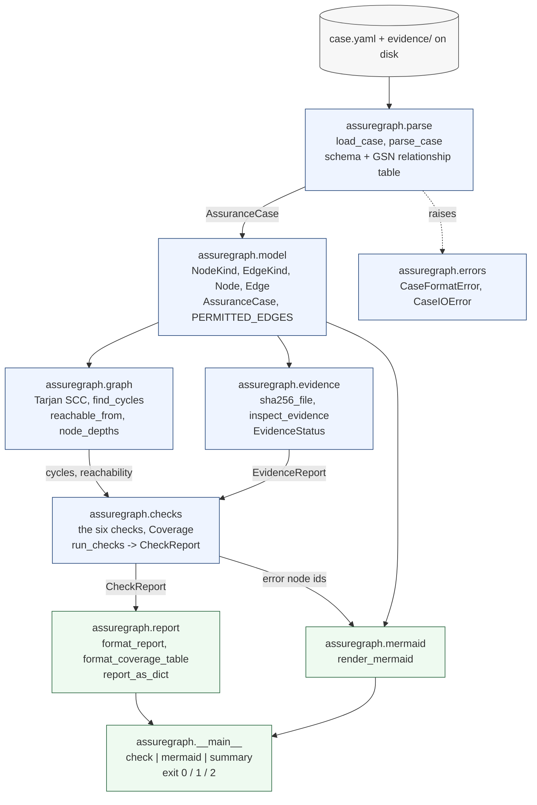
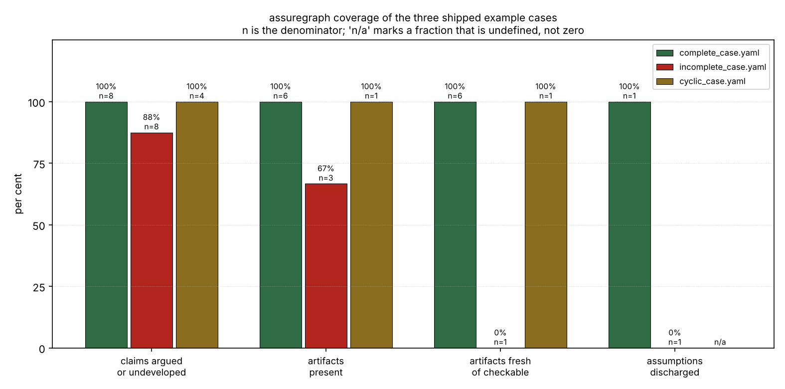
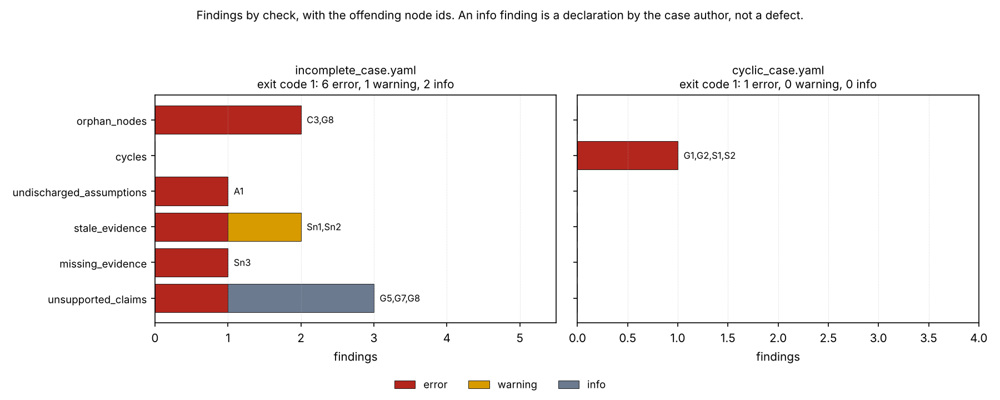
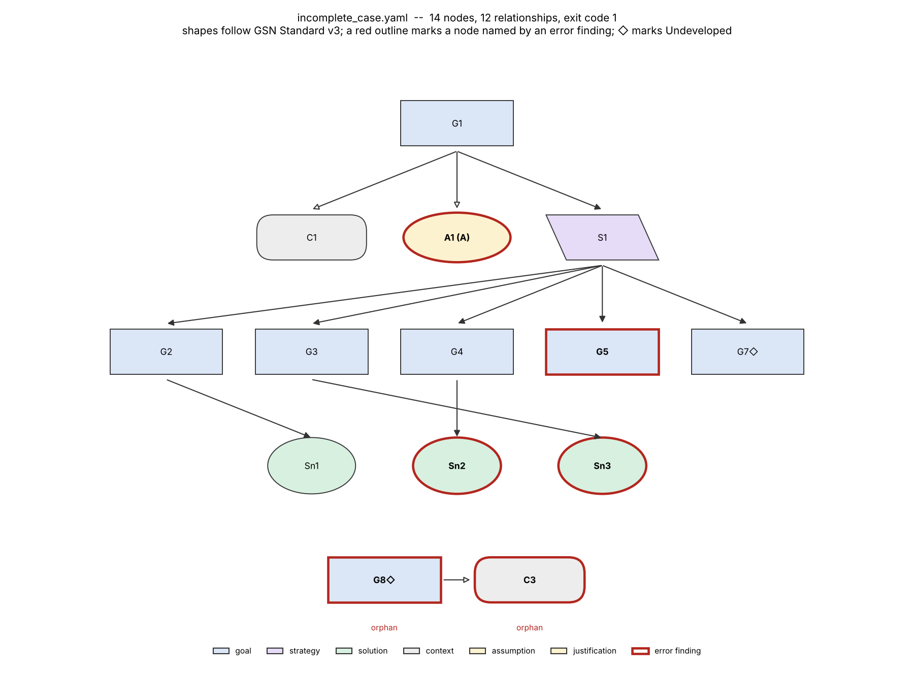
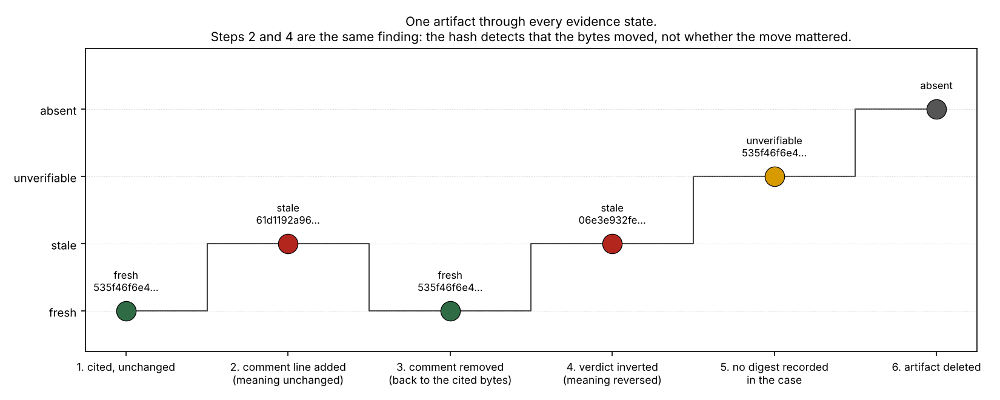

# AssureGraph

An assurance case as a machine-checkable evidence graph.


**Status: TESTING** · Class: medium · Validation level 2 (research grade) ·
No AI, by design · Apache-2.0 · © 2026 OPTIMA Organisation

> ## Scope, before anything else
>
> **A well-formed assurance case is not a safe system.**
>
> AssureGraph checks the **structure** of an assurance case and the **freshness**
> of the artifacts it cites. It evaluates **no argument's soundness**. It cannot
> tell a good argument from a bad one, relevant evidence from irrelevant
> evidence, or a test report that passed from one that failed.
>
> It is **not a DO-178C or ARP4754A compliance tool**. It produces nothing that
> supports a certification argument. A clean exit code from it means the case is
> fully drawn and its cited files are the files that were cited — nothing more.
>
> This software is research-grade. It is **not flight-qualified, not certified,
> and not approved for operational aerospace use.**

## The problem

You have an assurance case in a slide deck, a requirements document and three
people's heads, and somebody has just asked which claims in it have nothing
behind them any more. The evidence is a pile of test reports and analysis notes
on a shared drive, several of which have been regenerated since the claim that
cites them was written, and nobody knows which. Reading the case to find the
gaps is a day's work that has to be redone every time anything changes.

## What this does

- **Parses a GSN case from YAML and rejects a malformed one with an actionable
  message.** 51 schema rejection paths and 3 I/O rejection paths are exercised;
  **51/51** raise `CaseFormatError`, **51/51** name the offending YAML key path,
  and **0** malformed documents are accepted
  (`validation/validate_parser_rejections.py`).
- **Computes six checks and names the offending nodes.** Unsupported claims,
  evidence absent from disk, evidence staleness by content hash, undischarged
  assumptions, cycles, orphan nodes. On the shipped incomplete case: **6 error,
  1 warning and 2 info findings** over **9** distinct reports, exit code
  **1**; on the shipped complete case **0** findings, exit code **0**
  (`validation/validate_known_answers.py`).
- **Measures its own staleness check rather than asserting it.** 20 edits that
  invert an artifact's meaning and 20 that preserve it are **both** reported
  stale **20/20**; the discrimination between material and immaterial change is
  **0.000** (`validation/validate_staleness.py`). That is the honest limit of a
  content hash and it is published, not buried.
- **Holds the graph identities the checks rest on.** Over 400 random cases:
  **0** false-positive cycles, **0** false negatives on 372 planted cycles,
  **0** bad witness walks, and adding 1–5 orphans changes the unsupported-claim
  finding set in **0** of 400 cases (`validation/validate_graph_identities.py`).
- **Renders the case as Mermaid so it is reviewable in a pull request**, with
  one declaration line per node and per edge on all three shipped cases
  (**18/18, 14/14, 5/5**) and byte-identical reruns
  (`validation/validate_mermaid.py`).
- **Exits nonzero on an incomplete case, as a tested contract.** **22** real
  `python -m assuregraph` subprocesses, **22/22** matching the documented exit
  codes (`validation/validate_cli.py`).

## No AI, in this one, on purpose

There is no model in this package and none is planned.

The judgement AssureGraph deliberately does not make — *is this argument
sound?* — is exactly the judgement that must not be automated. A learned model
asked that question would return a confident-sounding verdict with no accountable
author, on a document whose entire purpose is to record who claimed what and on
what evidence. The checks here are the ones a machine can do without pretending:
counting, reachability, and comparing a digest with a digest. Everything past
that is left to the person whose name is on the review.

This is a design decision. It is not a missing feature and it is not a roadmap
item.

## Who it is for

- Anyone maintaining an assurance case who wants the list of claims with no
  evidence behind them computed rather than re-read.
- Anyone who has been bitten by an analysis report that was regenerated after the
  case cited it, and wants the next one caught by a continuous-integration job.
- Anyone who wants a case reviewable as a diff: YAML in, Mermaid out, both in
  the repository.
- Anyone who wants the coverage percentage to come with its denominator.

## Who it is not for

- Anyone who needs a GSN editor. This has no graphical editor and will not get
  one; see the alternatives below.
- Anyone who needs the full notation: Modular GSN (away goals, modules,
  contracts), Argument Patterns, Confidence arguments, Dialectic arguments and
  Argument Claim Points are **not implemented**. This covers Core GSN only.
- **Anyone who needs certification or compliance support.** This tool has no
  relationship to DO-178C, ARP4754A or any other standard in that family, and
  using its output as if it had would be a misuse.
- Anyone who wants to know whether their argument is any good. That is the one
  question this tool refuses.

## Alternatives, honestly

| Alternative | What it does better | When to use this instead |
|---|---|---|
| **ASCE** (Adelard) — commercial, the most widely adopted commercial assurance-case tool; version 5.1 released October 2022; claims GSN Standard v3 support, with Modular GSN as a separately licensed plugin | Everything to do with authoring: a real editor, the full notation, modular arguments, review workflow, document generation, and a vendor to call. Its notation coverage is far beyond this package's Core-GSN subset. | You want the gap analysis as a command that exits nonzero in CI, on a YAML file that lives in the same repository as the evidence, with the evidence hashed. Use ASCE to build and present the case. |
| **AdvoCATE** (NASA Ames; Denney and Pai, "Tool support for assurance case development", *Automated Software Engineering*, DOI 10.1007/s10515-017-0230-5) — an Eclipse application supporting Core GSN plus the Modular and Pattern extensions; availability is by arrangement with its authors | Formal foundations, pattern instantiation, hierarchical abstraction, argument queries and views, and verification of argument properties — a research programme this package does not attempt. | You want something installable with `pip`, readable as text, and runnable in a build. AdvoCATE is the better tool for argument structure; it is not a thing you drop into a GitHub Action. |
| **gsn2x** (`jonasthewolf/gsn2x`, MIT, written in Rust) — **the closest alternative**: it also reads GSN from YAML, and renders SVG | A real renderer with a layout engine, producing SVG rather than Mermaid; supports GSN Standard v3 with full Core GSN and partial Modular support; a different and in places richer YAML dialect. | You want the checks rather than the picture: evidence hashed against disk, a coverage table with denominators, and a nonzero exit. If you only want a diagram from YAML, use gsn2x — it does that better. |
| **Astah System Safety**, **NOR-STA** (Argevide), **Socrates** (Critical Systems Labs), **SafeTbox**, **D-Case Editor** | Each is a maintained editor with its own notation coverage; several are collaborative and web-based. | Same answer as ASCE: use them to author, use this to check. |
| **graphviz** (PyPI 0.21) | Graph layout, properly. Dozens of engines and attributes against this package's one Mermaid flowchart. | You want GSN semantics — which shape means Goal, which arrow means `SupportedBy`, which node has no support — rather than a layout library you must teach GSN to. |
| **PyPI `gsn` 0.2.0** | **Nothing — it is not a GSN tool.** It is a client for the Global Sensor Networks API (EPFL, GPLv3). The name collision is a trap worth naming. The wheel was downloaded and its metadata read on 2026-10-08 to confirm this. | Always. |

**Searched and not found on PyPI on 2026-10-08:** `pygsn`, `gsn-tools`,
`assurance-case`, `sacm` — all returned "No matching distribution found".
`advocate` on PyPI exists but is an SSRF-protection library, unrelated to the
NASA tool of the same name. The honest summary: **there is no established
Goal Structuring Notation package on PyPI**, and the strongest open competitor
is a Rust binary.

## Install and first run

```bash
git clone https://github.com/OmAcharya-avtr/assuregraph.git
cd assuregraph
python -m venv .venv && source .venv/bin/activate
pip install -e ".[test]"
python -m pytest tests/ -q
python -m assuregraph check examples/cases/complete_case.yaml
python -m assuregraph check examples/cases/incomplete_case.yaml; echo "exit $?"
python examples/coverage_summary.py
```

Expected output of the test run:

```
248 passed in 1.93s
```

Expected tail of `check examples/cases/complete_case.yaml`, verbatim
(exit code 0):

```
Verdict

0 error, 0 warning, 0 info finding(s). strict=false.
Structural verdict: COMPLETE. Exit code 0.

COMPLETE means the case is fully drawn and its cited files are the files that were cited. It is not a statement about any system, and it is not evidence that the evidence is adequate.
```

Expected tail of `check examples/cases/incomplete_case.yaml`, verbatim
(**exit code 1**):

```
Verdict

6 error, 1 warning, 2 info finding(s). strict=false.
Structural verdict: INCOMPLETE. Exit code 1.

COMPLETE means the case is fully drawn and its cited files are the files that were cited. It is not a statement about any system, and it is not evidence that the evidence is adequate.
```

## A worked example

```python
from assuregraph import format_coverage_table, load_case, render_mermaid, run_checks

case = load_case("examples/cases/incomplete_case.yaml")
report = run_checks(case)

print(f"nodes / edges : {len(case.nodes)} / {len(case.edges)}")
print(f"top goals     : {', '.join(case.resolved_top_goals())}")
print(f"complete      : {report.is_complete}    exit code: {report.exit_code}")
print()

for finding in report.findings:
    print(f"  {finding.severity.value:<8} {finding.check:<26} {','.join(finding.node_ids)}")
print()

for item in report.evidence:
    recorded = (item.recorded_sha256 or "none")[:12]
    actual = (item.actual_sha256 or "none")[:12]
    print(
        f"  {item.node_id:<4} {item.status.value:<13} recorded {recorded:<13} "
        f"found {actual:<13} {item.cited_path}"
    )
print()

print(format_coverage_table(report.coverage).rstrip("\n"))
print()
print(render_mermaid(case, report=report, max_label_chars=44).splitlines()[1])
```

Its actual output. This is `validation/worked_example.py` with `emit`
replaced by `print`, and the block below is
`validation/worked_example_output.txt` pasted verbatim:

```
nodes / edges : 14 / 12
top goals     : G1
complete      : False    exit code: 1

  error    unsupported_claims         G5
  info     unsupported_claims         G7
  info     unsupported_claims         G8
  error    missing_evidence           Sn3
  warning  stale_evidence             Sn1
  error    stale_evidence             Sn2
  error    undischarged_assumptions   A1
  error    orphan_nodes               G8
  error    orphan_nodes               C3

  Sn1  unverifiable  recorded none          found 2ff22a380510  evidence/unit_test_report.txt
  Sn2  stale         recorded dd4f8ed887d4  found dd4f8ed887d4  evidence/threshold_derivation.md
  Sn3  absent        recorded ec6f5d72d6ae  found none          evidence/detection_latency_study_v2.txt

Node and edge counts

prefix  GSN element    count
------  -------------  -----
G       goal           7
S       strategy       1
Sn      solution       3
C       context        2
A       assumption     1
J       justification  0

GSN relationship  count
----------------  -----
supported_by      9
in_context_of     3

Coverage, with denominators

metric                                 count  fraction
-------------------------------------  -----  -------------------------
claims argued or declared undeveloped  7/8    87.5 % (8 in denominator)
cited artifacts present on disk        2/3    66.7 % (3 in denominator)
artifacts fresh, of those checkable    0/1    0.0 % (1 in denominator)
assumptions marked discharged          0/1    0.0 % (1 in denominator)

Unverifiable artifacts (no recorded sha256): 1. These are excluded from the freshness denominator; they are not fresh.
Orphan nodes: 2. Cyclic regions: 0.
Top goals used for reachability: G1.

    n_G1["G1: The pitch residual monitor raises an alert…"]
```

## The case format

```yaml
name: "Illustrative: pitch residual monitor detection latency (SYNTHETIC)"
top_goals: [G1]
nodes:
  - id: G1
    type: goal                 # goal | strategy | solution | context | assumption | justification
    statement: "The monitor raises an alert within 5 samples of a 0.05 rad step bias."
  - id: A1
    type: assumption
    statement: "The simulator noise model is within a factor of two of the bench sensor."
    discharged: true
    discharged_by: Sn4
  - id: G7
    type: goal
    statement: "Clock jitter does not move the first crossing by more than one sample."
    undeveloped: true          # the GSN Undeveloped decorator: a declaration, not a defect
  - id: Sn1
    type: solution
    statement: "Unit test report."
    evidence:
      path: evidence/unit_test_report.txt
      sha256: "2ff22a3805107da6de0ab2a8b2b36fb32fbf07e7b0515150a78d9d5287c1b974"
      recorded: "2026-10-08"
edges:
  - {from: G1, to: A1, type: in_context_of}
  - {from: G1, to: Sn1, type: supported_by}
```

Naming follows the **GSN Community Standard Version 3** (SCSC-141C, SCSC
Assurance Case Working Group, May 2021): the six Core GSN element types, the two
relationship types, and the *Undeveloped* decorator. Two rules from the notation
are enforced at parse time rather than reported as findings, because a document
that breaks them is not a GSN case: only a Goal or a Strategy may be the source
of a relationship, and `SupportedBy` may terminate only on a Goal, Strategy or
Solution while `InContextOf` may terminate only on a Context, Assumption or
Justification.

## Architecture



## Screenshots



Every bar carries its denominator as `n=`. The missing bar on the right is the
point: the cyclic case has no Assumptions, so "assumptions discharged" is
undefined and is drawn as `n/a` rather than as 0 % or 100 %.



The grey segment in `unsupported_claims` is two goals declared `undeveloped` —
an author's declaration, not a defect — and it is deliberately not the same
colour as the red that means a claim nobody argued for.



Red outlines mark nodes named by an error finding; `◇` marks the *Undeveloped*
decorator; the two nodes at the bottom are unreachable from the declared top
goal and are labelled `orphan`. The same graph is in
`screenshots/incomplete_case.mmd` as Mermaid.



Steps 2 and 4 are the whole argument about this check. A comment line added and
a verdict inverted produce the same `stale` finding. Step 3 shows the check has
no memory: revert the change and it reads `fresh` again.

## Validation evidence

Full detail in [`validation/VALIDATION.md`](validation/VALIDATION.md). The rows
that undercut this package are in the table on purpose.

| Check | Reference / method | Result | Tolerance |
|---|---|---|---|
| Schema rejection paths | 51 malformed documents, one per path | 51/51 rejected, 51/51 named the YAML key path, 0 wrongly accepted | exact |
| I/O rejection paths | missing file, directory, unparsable YAML | 3/3 `CaseIOError` | exact |
| Known answers, three shipped cases | expectations hand-written from the YAML before running | finding sets match 3/3; exit codes 0, 1, 1 as expected | exact |
| **Staleness: material change detected** | 20 synthetic meaning-inverting edits | **20/20 = 1.000** | exact |
| **Staleness: immaterial change also detected** | 20 synthetic meaning-preserving edits | **20/20 = 1.000** | exact |
| **Staleness: discrimination between the two** | difference of the two rates | **0.000 — the check cannot tell them apart** | exact |
| Staleness: artifact changed then reverted | state after the revert | **`fresh` — the check holds no history** | exact |
| Artifact present with no recorded digest | — | `unverifiable`, never counted as fresh | exact |
| A DAG never reports a cycle | 400 random DAGs, mean 10.57 nodes | 0 false positives, rate 0.000000 | exact |
| A planted cycle is always found | 372 graphs with a back-edge added | 0 false negatives; 0 witness walks that were not real walks | exact |
| Orphans do not disturb the claim check | 400 cases, 1–5 orphans added to each | 0 cases changed; orphan count moved by exactly the number added in 400/400 | exact |
| CLI exit-code contract | 22 real subprocesses | 22/22 match | exact |
| Mermaid completeness and determinism | three shipped cases | one line per node and per edge, 3/3; byte-identical reruns, 3/3 | exact |
| Mermaid syntax, external renderer | **7-node excerpt only**, checked once on 2026-10-08, not re-runnable here | `valid: true`, flowchart, 7 labels rendered | — |
| Run cost, 30 000-node stress case | two shared contended cores | parse 3.048 s, `run_checks` 0.337 s, Mermaid 0.168 s, 0 findings | ±20 % run to run |
| Scaling, 150 → 30 000 nodes | per-node cost of `run_checks` across a 200× size range | 7.59 to 11.25 µs/node; 10× the nodes cost 14.8× the wall clock from 3 000 to 30 000 — **consistent with** linearity, not a proof of it | — |
| SHA-256 throughput | 32 MiB artifact | 1 179 MiB/s; digest agrees with `hashlib.sha256` of the whole file | ±20 % run to run |
| Test suite | `python -m pytest tests/ -q` | 248 passed, 0 failed, 0 skipped, 0 xfail, 1.93 s | — |

## API reference

| Function | Returns | Notes |
|---|---|---|
| `load_case(path)` | `AssuranceCase` | Reads and validates YAML. Relative evidence paths resolve against the file's directory. Raises `CaseIOError` or `CaseFormatError`. |
| `parse_case(document, *, base_dir, name_hint)` | `AssuranceCase` | Validates an already-loaded document. |
| `run_checks(case, *, strict=False)` | `CheckReport` | All six checks; hashes each artifact exactly once. `strict` promotes warnings to blocking. |
| `check_unsupported_claims(case)` | `list[Finding]` | Goals and Strategies with no `SupportedBy` child. `undeveloped: true` demotes the finding to `INFO`. |
| `check_missing_evidence(case, reports=None)` | `list[Finding]` | Cited artifacts absent or not a readable regular file. |
| `check_stale_evidence(case, reports=None)` | `list[Finding]` | Digest mismatch is `ERROR`; no recorded digest is `WARNING`. |
| `check_undischarged_assumptions(case)` | `list[Finding]` | Assumptions without `discharged: true`. |
| `check_cycles(case)` | `list[Finding]` | One witness closed walk per cyclic region. |
| `check_orphan_nodes(case)` | `list[Finding]` | Nodes unreachable from the top goals. |
| `CheckReport.exit_code` | `int` | 0 when complete, 1 otherwise. What the CLI returns. |
| `Coverage.claim_support_fraction` | `float \| None` | Denominator: Goals + Strategies. `None` when that is 0. |
| `Coverage.evidence_present_fraction` | `float \| None` | Denominator: Solutions. |
| `Coverage.evidence_fresh_fraction` | `float \| None` | Denominator: fresh + stale, **excluding** unverifiable. |
| `Coverage.assumption_discharged_fraction` | `float \| None` | Denominator: Assumptions. |
| `sha256_file(path, *, chunk_bytes=1048576)` | `str` | 64 lowercase hex characters. Streams in 1 MiB blocks. |
| `inspect_evidence(case, node)` | `EvidenceReport` | One of `fresh`, `stale`, `unverifiable`, `absent`, `unreadable`. |
| `find_cycles(case, kinds=None)` | `list[list[str]]` | One closed walk per strongly connected component of size > 1. |
| `reachable_from(case, roots, kinds=None)` | `set[str]` | Forward breadth-first search. |
| `node_depths(case, roots=None, kinds=None)` | `dict[str, int]` | Hops from the roots. Unreachable nodes are absent. |
| `render_mermaid(case, *, report=None, direction="TD", max_label_chars=70, fence=False)` | `str` | Mermaid flowchart source. `report` styles error nodes. |
| `format_report(report, *, markdown=False, width=96)` | `str` | Header, scope statement, findings, coverage, verdict. A token longer than `width` — a digest, a path — is never split. |
| `format_coverage_table(coverage, *, markdown=False)` | `str` | Counts and the four fractions, each with its denominator. |
| `report_as_dict(report)` | `dict` | JSON-serialisable; what `--json` writes and what CI should consume. |

No function in the library prints. `assuregraph.__main__` is the only module
that writes to a stream.

## Limitations

Real ones, in rough order of how much they would cost you to discover.

1. **Content-hash staleness detects that an artifact changed, not whether the
   change matters.** Measured: 20/20 meaning-inverting edits and 20/20
   meaning-preserving edits are both reported stale; discrimination **0.000**.
   Treat a `stale` finding as "a human must look at this", never as "this
   evidence is invalid".
2. **Structural completeness says nothing about whether the evidence is
   adequate.** A case can pass all six checks with every Solution citing an
   empty file whose digest was recorded from that empty file. The `COMPLETE`
   verdict is printed with that sentence attached for exactly this reason.
3. **The staleness check has no memory.** It reads current bytes only, so an
   artifact that was changed and changed back is indistinguishable from one
   never touched. Measured in `validation/validate_staleness.py`.
4. **`discharged: true` is an unverified assertion by the case author.** The
   tool checks that the assertion exists and that `discharged_by`, if present,
   names a node of the case. It cannot check that the named node discharges
   anything.
5. **Orphan detection is only as good as the declared `top_goals`.** When a case
   declares none, every Goal with no incoming `SupportedBy` edge is inferred to
   be a root — so a disconnected fragment is read as a second top goal rather
   than as an orphan, and nothing is reported. Declare `top_goals` explicitly or
   the check is close to vacuous. This is pinned by a test that asserts the weak
   behaviour, not hidden.
6. **One witness cycle is reported per cyclic region, not every cycle.**
   Enumerating all elementary cycles is exponential in the worst case
   (Johnson 1975). The number of cyclic regions is exact; the number of distinct
   cycles is not reported at all.
7. **Core GSN only.** Modular GSN (modules, away goals, contracts), Argument
   Patterns, Confidence arguments, Dialectic arguments and Argument Claim Points
   are not implemented. ASCE and AdvoCATE cover them; this does not.
8. **The Mermaid rendering is not GSN-exact.** Mermaid has no ellipse, no
   decorator and no hollow arrowhead, so Assumption becomes a hexagon marked
   `[A]`, Justification an asymmetric shape marked `[J]`, *Undeveloped* becomes
   the text `(undeveloped)` in the label, and `InContextOf` is drawn `--o`. The
   full substitution table is in `assuregraph.mermaid`'s docstring and in
   `validation/VALIDATION.md` section 6.
9. **The Mermaid output has been syntax-checked only as a seven-node excerpt**,
   once, against an external renderer on 2026-10-08. No Mermaid implementation
   exists in the build container, so the repository cannot re-verify this.
10. **Parsing dominates the run cost, not checking.** At 30 000 nodes the YAML
    load plus schema validation takes 3.05 s against 0.34 s for all six checks
    including hashing 10 000 artifacts. Speed depends on whether PyYAML was built
    against libyaml; the measured figures used `CSafeLoader`.
11. **The scaling evidence is five sizes on one contended machine.** The per-node
    cost of `run_checks` stays between 7.6 and 11.3 µs/node from 150 to 30 000
    nodes, which is consistent with the documented O(V+E) and does not prove it.
12. **Every example case and evidence artifact in this repository is
    synthetic**, says so in its first line, and is a measurement of nothing.
13. **Declared runtime dependency: `pyyaml`.** Batch 06's standing instruction
    names `numpy`, `scipy`, `scikit-learn` and `joblib` as the declared runtime
    dependencies for the batch. This product needs none of them and does need a
    YAML parser, so it declares `pyyaml` instead and declares nothing else. This
    deviation is recorded here rather than worked around.
14. **No concurrency.** Artifacts are hashed serially. On a case with thousands
    of large artifacts, I/O will dominate and nothing here parallelises it.

## Reproducing every number

From the repository root, with `pip install -e ".[dev]"`:

```bash
ruff check src/ tests/ examples/ validation/
python -m pytest tests/ -q

python validation/validate_parser_rejections.py
python validation/validate_known_answers.py
python validation/validate_staleness.py
python validation/validate_graph_identities.py
python validation/validate_cli.py
python validation/validate_mermaid.py
python validation/validate_scale.py
python validation/worked_example.py

MPLBACKEND=Agg python examples/coverage_summary.py
MPLBACKEND=Agg python examples/findings_by_check.py
MPLBACKEND=Agg python examples/render_case_graph.py
MPLBACKEND=Agg python examples/staleness_demo.py
```

Each validation script writes its raw stdout to
`validation/<script>_output.txt` and exits nonzero if any check in it fails.
Each example writes its figure to `screenshots/` and its raw output to
`validation/example_<name>_output.txt`. Ten of the twelve committed output files
are byte-identical across re-runs; `validate_scale_output.txt` and
`validate_staleness_output.txt` are not, because they report wall-clock timings
on purpose and those move by 10–20 % run to run.
`validate_graph_identities.py` is seeded (`SEED = 20261008`) and reproduces
exactly.

## Licence, citation, credits

Apache-2.0. © 2026 OPTIMA Organisation. See [LICENSE](LICENSE).

Cite as `CITATION.cff`, or:

> OPTIMA Organisation (2026). *assuregraph: an assurance case as a
> machine-checkable evidence graph*. Version 0.1.0.

Notation reference: Goal Structuring Notation Community Standard, Version 3
(SCSC-141C), SCSC Assurance Case Working Group, May 2021. Hash function:
SHA-256, FIPS 180-4, NIST, August 2015. Component algorithm: R. E. Tarjan,
"Depth-first search and linear graph algorithms", *SIAM Journal on Computing*
1(2), 1972.

### Credits

This is under reserved rights obtained by OPTIMA Organisation.
