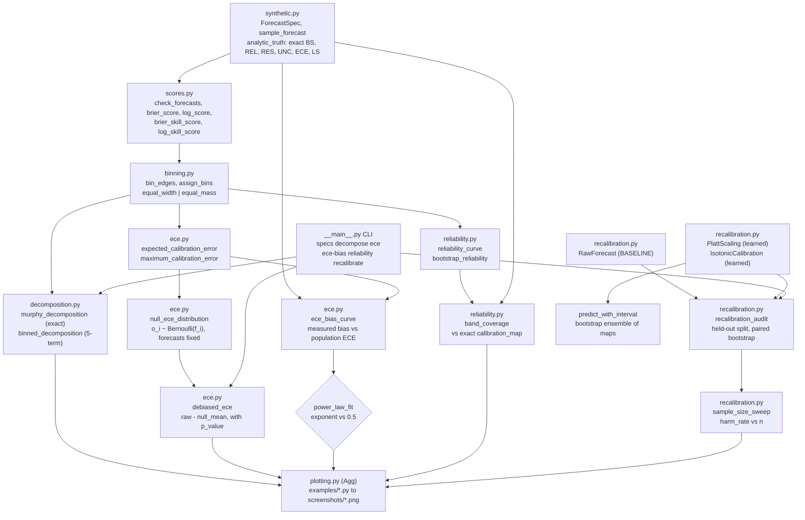
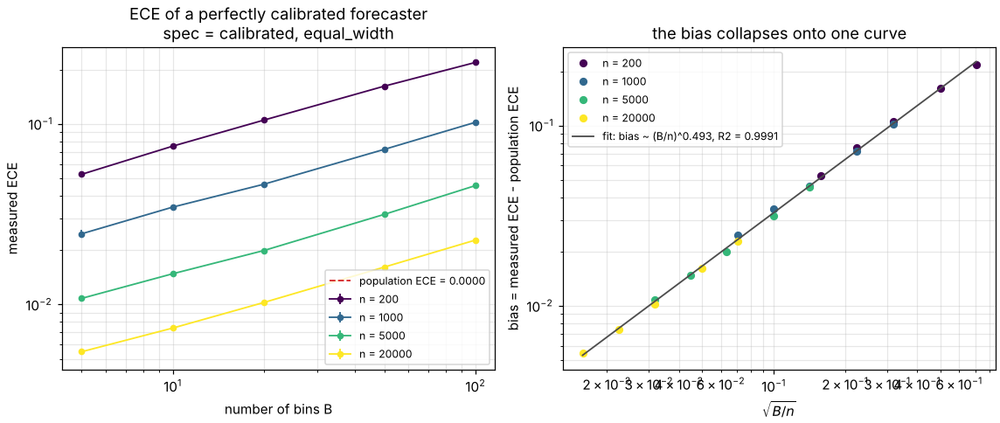
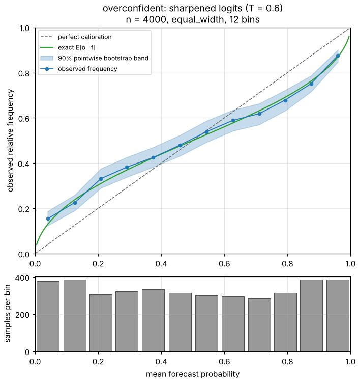
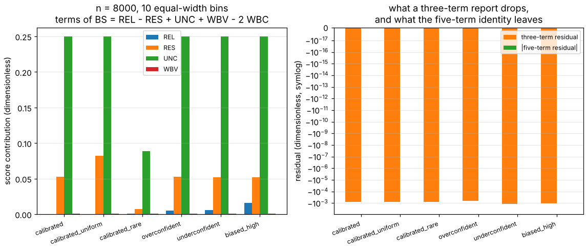
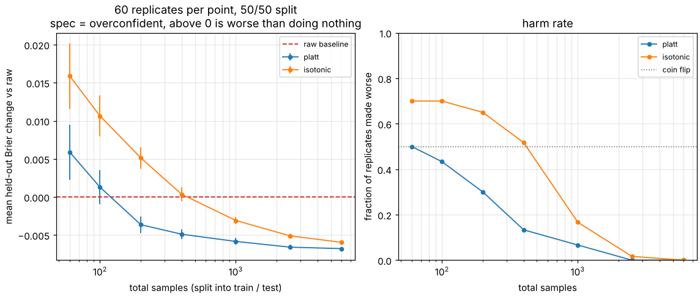
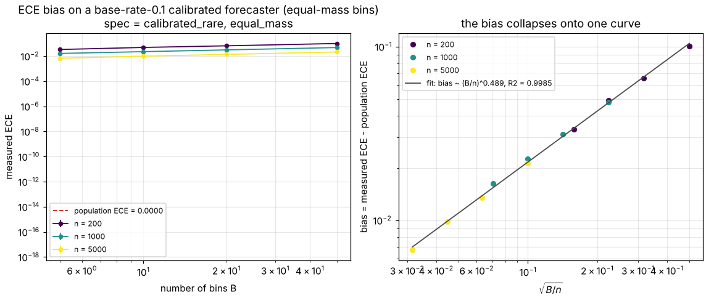

# calibaudit

Audit of a binary probabilistic forecast: decompose the score, measure the
metric's own bias, then recalibrate and check whether it helped.


**Status: TESTING** · Class: compact · Validation level 2 · AI: yes (Platt
scaling and isotonic regression, both benchmarked against the raw forecast) ·
Apache-2.0 · © 2026 OPTIMA Organisation

This software is research-grade. It is **not flight-qualified, not certified,
and not approved for operational aerospace use.** It evaluates a forecast
against the outcomes you hand it. It says nothing about any forecast, system
or vehicle it was not given, and nothing about data drawn from a different
distribution than the sample it scored.

## What this does that `netcal` and `sklearn.calibration` do not

`netcal` 1.4.0 computes the expected calibration error, and more calibration
metrics besides; `sklearn.calibration` gives you the reliability curve and
both recalibration maps. The overlap with this package is large and the
alternatives table below says so first. What neither provides is the
accounting: **`netcal` ships no Brier score at all, and therefore no Murphy
decomposition** (verified by a case-insensitive search for `brier` across
every `.py` file in the published wheel: absent — `validation/validate_alternatives.py`),
**no bootstrap**, and **no estimate of how much of its own ECE is binning
bias**. `sklearn` has `brier_score_loss` and `calibration_curve` but no ECE
and no decomposition. This package adds four things to that gap, each with a
number behind it: an **exact five-term Brier identity** that holds for any
binning rather than the usual three-term approximation, with the dropped part
reported instead of discarded; the **measured bias of the ECE estimator**
against forecasts whose population ECE is zero in closed form, which reaches
**0.217391** at 100 bins and 200 samples where the true value is exactly 0;
**bootstrap reliability bands with their coverage measured** rather than
assumed (**0.8381** pointwise against a nominal 0.90, and **0.0000** to **0.3750**
simultaneously); and a **held-out recalibration audit** that reports the
sample sizes at which Platt scaling and isotonic regression make the score
worse — **isotonic harms 71.3 % of replicates at 60 samples** and still harms
**100 % of them at 15 000 samples on a forecast that was already calibrated**.
If you want the ECE number itself, or any of netcal's other metrics, or a
recalibrated estimator object, use `netcal` or `sklearn`.

## The problem

You have a model that emits probabilities and a record of what actually
happened, and the Brier score came out at 0.21 — which tells you nothing,
because you do not know how much of that is the forecast being badly
calibrated and how much is the event simply being uncertain. So you compute
an expected calibration error instead, pick ten bins because everyone picks
ten bins, and get 0.03. The number is not zero and you have no way to tell
whether that is miscalibration or the estimator's own binning noise, which on
a perfectly calibrated forecast of 1000 cases with ten bins averages
**0.032111**.

## What this does

- **Decomposes the Brier score exactly.** `BS = REL - RES + UNC` for a
  forecast with finitely many values (Murphy 1973), property-tested to
  machine precision: **worst residual 1.276756e-15 over 72 cases**. For
  binned continuous forecasts the three-term form is not an identity, so this
  package reports the exact five-term one,
  `BS = REL - RES + UNC + WBV - 2 WBC`: **worst residual 8.604228e-16 over
  480 cases** and **2.220446e-16 over 600 adversarial random cases**. What a
  three-term report drops reaches **6.6367 % of the Brier score** at two bins
  (`validation/validate_decomposition_identity.py`).
- **Measures the ECE estimator's bias instead of only reporting the ECE.** On
  forecasts whose population ECE is exactly zero, the measured bias follows
  `bias ≈ 0.32 sqrt(B/n)`: fitted exponent **0.496599** against the
  theoretical **0.5**, with **R² = 0.999282** over a 5 × 4 grid of bin counts
  and sample sizes, 120 replicates per cell. Exponents across six
  spec-strategy combinations: **0.480494 to 0.508607**
  (`validation/validate_ece_bias.py`).
- **Subtracts that bias, and measures when the subtraction fails.** A
  parametric-bootstrap correction improved the error in **9 of 9 calibrated
  configurations** by a median factor of **10.34x**, and made it worse in
  **9 of 9 miscalibrated configurations**, by up to **57.9x**. Read the
  returned `p_value` before quoting the corrected number; the limitation is
  stated in full below.
- **Puts bootstrap bands on the reliability diagram and measures their
  coverage.** Against the exact calibration curve of a synthetic forecaster:
  pointwise coverage **0.7842 to 0.8942** (mean **0.8381**) for a nominal
  0.90, and simultaneous coverage **0.0000 to 0.3750** over 12
  configurations. The worst single bin reached **0.3000**
  (`validation/validate_reliability_bands.py`).
- **Audits recalibration on a held-out split against the raw forecast.**
  Platt scaling's mean held-out Brier change turns negative from **200 total
  samples** on an overconfident forecaster; isotonic regression needs
  **1000**, matching Niculescu-Mizil and Caruana (2005). On a forecaster that
  is already calibrated, neither ever helps at any swept size
  (`validation/validate_recalibration.py`).

## Who it's for

- Someone who has to explain, to a reviewer, which part of a bad probability
  score is miscalibration and which part is the irreducible uncertainty of the
  event.
- Someone about to quote an ECE in a report and wanting to know what that
  number does on a forecast that is known to be perfect.
- Someone deciding whether to recalibrate a model on a few hundred held-out
  cases, who wants the measured harm rate rather than a tutorial's assurance.

## Who it's not for

- Anyone who needs a calibration **framework**. Use `netcal`: it has
  temperature scaling, beta calibration, histogram binning, BBQ, ENIR,
  near-isotonic regression, a regression-calibration family and object
  detection support, none of which is here.
- Anyone recalibrating a **classifier** rather than a vector of probabilities.
  Use `sklearn.calibration.CalibratedClassifierCV` with
  `sklearn.frozen.FrozenEstimator`; this package fits maps on forecast values
  and returns arrays, not estimators.
- Anyone working on **multi-class, regression, quantile or interval**
  forecasts. Binary only, everywhere, with no planned exception.
- Anyone who needs the **continuous ranked probability score**, ensemble
  scores, or threshold decompositions. `properscoring` has those; this does
  not.
- Anyone wanting a certification artifact. This is Level 2: it is validated
  against closed-form population values of synthetic forecasters, and against
  nothing physical.

## Alternatives, honestly

Every version and capability below was verified in this container on
2026-10-10 by fetching the project's PyPI metadata and unpacking the wheel it
actually publishes. The commands, the keyword searches and the module
inventories are in `validation/alternatives_snapshot.json`;
`validation/validate_alternatives.py` re-checks every claim in this table
against that snapshot and prints the result.

| Alternative | What it does better | When to use this instead |
|---|---|---|
| **`netcal` 1.4.0** (Küppers et al., Ruhr West University of Applied Sciences and e:fs TechHub; Apache-2.0; uploaded 2026-04-16; 15 releases) | A calibration framework rather than an audit. Metrics `ECE`, `ACE`, `MCE`, `MMCE` plus seven regression-calibration metrics; recalibration by `LogisticCalibration`, `TemperatureScaling`, `BetaCalibration`, `HistogramBinning`, `BBQ`, `ENIR`, `NearIsotonicRegression`; Gaussian-process regression calibration; reliability diagrams for confidence, quantile and regression settings; object-detection support. **It computes the same plug-in ECE this package computes.** | You need the Brier score decomposed, or the ECE's binning bias quantified, or bootstrap bands, none of which netcal ships: no file under `netcal/` mentions `brier`, `murphy`, `resolution` or `bootstrap`. You also cannot install it here — it requires `torch>=2.3`, `pyro-ppl`, `gpytorch` and `tensorboard`, against this package's `numpy`, `scipy`, `scikit-learn`. |
| **`sklearn.calibration` + `sklearn.metrics`** (scikit-learn 1.9.1, the version this package depends on and tests against) | `CalibratedClassifierCV` recalibrates a real estimator inside a pipeline with cross-validation, which this package cannot do. `calibration_curve` and `CalibrationDisplay` give the reliability curve; `brier_score_loss`, `d2_brier_score` and `log_loss` give the scores. Mature, maintained, already installed. | You need the decomposition (sklearn has none), an ECE (sklearn has none), bootstrap bands, or the held-out harm rate. This package's equal-width reliability curve **reproduces `calibration_curve(strategy="uniform")` to within 1e-12** and its isotonic map is **bit-identical** to `IsotonicRegression`, by design: where sklearn already does it, this wraps rather than reimplements. |
| **`properscoring` 0.1** (The Climate Corporation; Apache; one release, uploaded 2015-11-12) | The continuous ranked probability score — `crps_ensemble`, `crps_quadrature`, `crps_gaussian` — and the CRPS threshold decomposition, for ensemble and continuous forecasts. None of that is here. | You are scoring binary forecasts and want calibration analysis. `properscoring` has `brier_score` and nothing else relevant: no ECE, no reliability or resolution term, no recalibration. It has had no release in a decade, so treat it as unmaintained. Its `threshold_decomposition` is the CRPS partition, **not** Murphy's reliability/resolution/uncertainty partition. |

**If you want a calibration toolkit, install `netcal`. If you are
recalibrating a scikit-learn classifier, use `CalibratedClassifierCV` with
`FrozenEstimator`.** What this package adds is the error analysis of the
measurement itself.

None of the three is a runtime dependency. `netcal` and `properscoring` are
citations, not imports; `scikit-learn` is a dependency and is used for
isotonic regression.

## Install and first run

```bash
git clone https://github.com/OmAcharya-avtr/calibaudit.git
cd calibaudit
python -m venv .venv && source .venv/bin/activate
pip install -e ".[test]"
python -m pytest tests/ -q
python examples/ece_bias_curve.py
```

Expected output of the test run. Measured from `--junitxml`:
**405 tests, 0 failures, 0 errors, 0 skipped**. The wall-clock figure moves
by 10-40 % between runs on two contended cores; the count does not. The block
below is the verbatim stdout of the run committed as
`validation/outputs/pytest_output.txt`:

```
........................................................................ [ 17%]
........................................................................ [ 35%]
........................................................................ [ 53%]
........................................................................ [ 71%]
........................................................................ [ 88%]
.............................................                            [100%]
405 passed in 145.87s (0:02:25)
```

Expected output of the first example (it also writes
`screenshots/ece_bias_curve.png`):

```
wrote /path/to/calibaudit/screenshots/ece_bias_curve.png
 bins       n   true_ECE   mean_ECE       sem       bias  bias/sqrt(B/n)   debiased   deb_bias
----------------------------------------------------------------------------------------------
    5     200   0.000000   0.052574  0.002282   0.052574        0.332509        nan       +nan
   10     200   0.000000   0.075285  0.002561   0.075285        0.336686        nan       +nan
   20     200   0.000000   0.104919  0.002507   0.104919        0.331784        nan       +nan
   50     200   0.000000   0.161741  0.002040   0.161741        0.323482        nan       +nan
  100     200   0.000000   0.218850  0.002379   0.218850        0.309501        nan       +nan
```

The example's full table covers four sample sizes and ends with the fitted
power law; the first five rows are shown here, and the whole transcript is in
`validation/outputs/validate_cli_output.txt`. The `nan` columns are the
debiased estimate, which this example does not compute because it costs
another 200 ECE evaluations per replicate. **`true_ECE` is 0.000000 because it
is exactly zero: this forecaster is perfectly calibrated and every number in
the `mean_ECE` column is the estimator's own bias.**

The example uses 60 replicates per cell, so its cell means differ in the third
decimal from the 120-replicate figures quoted elsewhere in this README, which
come from `validation/validate_ece_bias.py`. The `sem` column is how much.

## A worked example

`validation/worked_example.py`, run verbatim:

```python
import numpy as np
from scipy.special import expit, logit
from calibaudit import (PlattScaling, binned_decomposition, bootstrap_reliability,
                        debiased_ece, expected_calibration_error,
                        murphy_decomposition, recalibration_audit)

rng = np.random.default_rng(2026)
truth = rng.beta(2.0, 2.0, size=1200)                   # latent P(event)
outcome = (rng.random(1200) < truth).astype(float)      # the event, 0 or 1
sharp = expit(logit(truth) * 1.4)                       # overconfident forecaster
forecast = np.round(np.clip(sharp, 0.025, 0.975) * 20.0) / 20.0   # 0.05 steps

exact = murphy_decomposition(forecast, outcome)
print(exact.report())
binned = binned_decomposition(forecast, outcome, n_bins=10, strategy="equal_width")
print(f"three-term residual, 10 equal bins  : {binned.three_term_residual:+.3e}")
print(debiased_ece(forecast, outcome, n_bins=10, strategy="equal_width",
                   n_replicates=500, seed=1).report())
audit = recalibration_audit(forecast, outcome, test_fraction=0.5, n_bins=10,
                            strategy="equal_width", n_bootstrap=1000, seed=3)
print(audit.table())
platt = PlattScaling(n_bootstrap=200, seed=4).fit(forecast, outcome)
point, lo, hi = platt.predict_with_interval([0.1, 0.5, 0.9], level=0.9)
```

Its actual output:

```
Brier decomposition (exact, n = 1200)
  base rate                 : 0.473333333333
  bins requested / occupied : 0 / 21
  BS  (direct)              : 0.208443750000
  REL reliability           : 0.007663316625
  RES resolution            : 0.048508455514
  UNC uncertainty           : 0.249288888889
  WBV within-bin variance   : 0.000000000000
  WBC within-bin covariance : 0.000000000000
  REL - RES + UNC           : 0.208443750000
  + WBV - 2 WBC             : 0.208443750000
  identity residual         : +0.000e+00
  three-term residual       : +0.000e+00

three-term residual, exact grouping : +0.000e+00
three-term residual, 10 equal bins  : -8.197e-04

raw ECE, 10 bins : 0.069458
ECE audit (equal_width, n = 1200, bins = 10, replicates = 500)
  raw ECE                   : 0.069458333
  null mean (binning bias)  : 0.029174500
  null std                  : 0.007262479
  null 5-95 pct             : [0.018037500, 0.042045833]
  debiased ECE              : +0.040283833
  p-value (calibrated null) : 0.0020

bins flagged miscalibrated at 90 % pointwise: 5 of 10

held-out audit, 600 train / 600 test
    method  learned      brier       log       ECE       MCE     dBrier      ci_lo      ci_hi            verdict
----------------------------------------------------------------------------------------------------------------
       raw    False   0.207283  0.600896  0.071500  0.100000  +0.000000  +0.000000  +0.000000           baseline
     platt     True   0.208777  0.603016  0.050742  0.151458  +0.001494  -0.006423  +0.009283  indistinguishable
  isotonic     True   0.206148  0.597109  0.044808  0.138701  -0.001136  -0.006842  +0.004581  indistinguishable

fitted Platt map: a = 0.559941, b = -0.146845  (exact inverse would be a = 0.714286, b = 0)
  f = 0.1 -> 0.2015  90 % interval on the map [0.1529, 0.2779]
  f = 0.5 -> 0.4634  90 % interval on the map [0.4401, 0.4844]
  f = 0.9 -> 0.7472  90 % interval on the map [0.6558, 0.8105]

same data, forecasts hard-thresholded to exactly 0 or 1:
  log score of the raw forecast : 11.110120  (clipped at 1e-15, so this is finite only by convention)
  Platt fit on it               : a = 0.027358, b = -0.153106
  the slope collapses because logit(0) is clipped to -27.6 and dominates the fit
```

Three things in that output are the point of the package. The raw ECE of
0.069458 has an estimated binning bias of 0.029174, so **42 % of the number
is the metric rather than the forecast** — though the p-value of 0.0020 says
the rest is real. **Platt scaling cut the ECE from 0.071500 to 0.050742 while
making the Brier score slightly worse**, which is recalibration moving the
error rather than removing it. And at 1200 samples neither recalibrator is
distinguishable from doing nothing: both paired intervals straddle zero.

## Architecture



## Screenshots



The red dashed line is the population ECE, which is exactly zero: every point
above it is the estimator reporting miscalibration that does not exist. On the
right the same points collapse onto one straight line in `sqrt(B/n)`, which is
what makes the bias predictable enough to subtract.



The green curve is the exact `E[o | f]` of the synthetic forecaster, so the
band's job is to cover it. Notice that the shaded band is nowhere near the
dashed diagonal in the outer bins and almost touches it in the middle: a
sharpened-logit forecaster is well calibrated near 0.5 and badly calibrated at
the extremes, which a single ECE number averages away.



Left: uncertainty dominates every bar, which is why a raw Brier score is
uninformative — the three calibrated specs differ from the three
miscalibrated ones only in the small reliability term. Right: the orange bar
is what a three-term report drops and the green bar is the five-term
residual, on a symmetric log axis spanning seventeen decades. The green bars
are at floating-point zero; the orange ones are not.



Left: above the red line, recalibration is worse than doing nothing. Both
learned maps start there. Right: the harm rate, which is the number a
practitioner needs — isotonic regression is worse than the raw forecast in
71.3 % of replicates at 60 samples and is still above a coin flip at 400.



The same bias measurement on a base-rate-0.1 forecaster with equal-mass bins.
Equal-width binning leaves most bins empty on a rare-event forecast, so the
two strategies give different numbers for the same data; the script prints the
ratio cell by cell.

## Validation evidence

Full tables, derivations and raw output in
[validation/VALIDATION.md](validation/VALIDATION.md). Raw stdout of every
script is committed under `validation/outputs/`.

| Check | Reference / method | Result | Tolerance |
|---|---|---|---|
| Exact Murphy identity `BS = REL - RES + UNC` | Murphy 1973, J. Appl. Meteorol. 12(4) 595–600 | 72 cases, worst residual **1.110223e-16** | 1e-14 |
| Five-term identity `BS = REL - RES + UNC + WBV - 2 WBC` | elementary algebra, derived in `decomposition.py` | 480 cases over 10 bin counts × 2 strategies, worst **1.720846e-15** | 1e-14 |
| Same, on adversarial random inputs | all-0/1 forecasts, tied forecasts, near-constant forecasts | 600 cases, worst **6.106227e-16** | 1e-14 |
| Hypothesis property test of the five-term identity | 250 examples per strategy, arbitrary forecasts and bin counts | passes | 1e-13 |
| **What a three-term report drops** | same sample, 2 to 200 bins | up to **6.6367 % of the Brier score**, at 2 bins | — |
| `UNC` against the Beta closed form | `obar(1-obar)`, `obar = a/(a+b)` | n = 200 000, worst difference **1.400306e-04** | 5e-3 |
| `RES` against `Var(p)` of the latent Beta | `ab/((a+b)²(a+b+1))` | worst difference **2.369132e-04** | 1e-2 |
| Log score of the calibrated Beta(2,2) spec | hand integral `7/12 = 0.5833333…` | quadrature **0.583333333333047** | 1e-10 |
| Log score of the calibrated uniform spec | hand integral `1/2` | quadrature **0.49999999999999983** | 1e-10 |
| Brier score against `sklearn.metrics.brier_score_loss` | scikit-learn 1.9.1 | 6 specs at n = 20 000, worst difference **0.000e+00** | 1e-14 |
| Log score against `sklearn.metrics.log_loss` | scikit-learn 1.9.1 | worst difference **0.000e+00** | 1e-12 |
| Reliability curve against `sklearn.calibration.calibration_curve` | `strategy="uniform"`, 12 configurations | bin counts identical in every case, worst `|d observed|` and `|d mean forecast|` both **0.000e+00** | 1e-12 |
| Isotonic map against `sklearn.isotonic.IsotonicRegression` | same arguments, 1001-point grid | worst difference **0.000000e+00** | exact |
| Platt fit against `LogisticRegression(C=1e8)` on `logit(f)` | scikit-learn 1.9.1 | worst `|da|` **4.991e-09**, `|db|` **6.858e-09** | 1e-3 |
| Platt recovers the exact inverse distortion | analytic inverse of each spec's logistic map | at n = 200 000, worst `|da|` **0.02287**, `|db|` **0.00727** | 0.03 |
| **ECE of a perfectly calibrated forecaster is not zero** | population ECE exactly 0 | **0.054061** at B = 5, n = 200 rising to **0.217391** at B = 100, n = 200 | — |
| **ECE bias follows `sqrt(B/n)`** | theoretical exponent 0.5, stated in advance | fitted **0.496599**, R² **0.999282**; six combinations give **0.480494–0.508607** | exponent in [0.40, 0.60], R² ≥ 0.95 |
| **FAILED: "ECE bias is always upward"** | population ECE from `scipy.integrate.quad` | **4 of 12 miscalibrated cells have NEGATIVE bias**, all at n = 20 000; most negative **-0.000357** | the expectation was wrong, not the measurement |
| Refined: bias upward at every small-sample cell, downward possible at large n | same 12 cells | all cells at n = 1000 positive; 4 negative at n = 20 000 | — |
| **FAILED: "debiasing reduces the bias in most configurations"** | population ECE, 18 configurations | **9 of 18 improved**; the 9 wins are exactly the calibrated specs and the 9 losses exactly the miscalibrated ones, worst **57.9x** worse | the expectation was wrong |
| Refined: debiasing helps on calibrated, hurts on miscalibrated | split by `spec.is_calibrated` | **9 of 9** and **9 of 9** | — |
| Debiased ECE goes negative and is not clipped | an ECE cannot be negative | **100 of 360** individual estimates negative | documented, not hidden |
| **FAILED: "pointwise band coverage is within 0.10 of 0.90"** | exact `E[o|f]` of each spec | range **0.7842–0.8942**, mean **0.8381**; the floor is below 0.80 | the expectation was wrong |
| Refined: coverage is systematically below nominal, never above | 12 configurations | all below 0.90, mean shortfall **0.0619**, worst **0.7842** | shortfall in [0.02, 0.12] |
| **Simultaneous band coverage is not the stated level** | same bands, counted per replicate | **0.0000 to 0.3750** against a nominal pointwise 0.90 | gap > 0.20 in every configuration |
| **Worst single bin's coverage** | per-bin resolution, 20 equal-width bins, n = 2000 | **0.3000**, in the top bin | < 0.60 |
| **HONEST NEGATIVE: recalibration never helps an already-calibrated forecast** | raw forecast on the same held-out samples, 8 sample sizes, 80 replicates each | Platt **+0.011345** at n = 60 falling to **+0.000048** at n = 15 000, always positive; isotonic **+0.022335** to **+0.000520**, harm rate **1.000** at n = 15 000 | positive at every swept size |
| **HONEST NEGATIVE: both learned maps harm the score on small samples** | overconfident spec, n = 60 | Platt **+0.005822**, harm rate **0.512**; isotonic **+0.016848**, harm rate **0.713** | — |
| Crossing points | mean held-out Brier change turning negative | Platt at **n = 200**, isotonic at **n = 1000** | isotonic ≥ Platt (Niculescu-Mizil and Caruana 2005) |
| Brier and log scores disagree about isotonic | same held-out split, two proper scoring rules | **2 of 5** sample sizes disagree in sign | ≥ 1 |
| Isotonic emits exact 0 and 1 on held-out data | pool-adjacent-violators returns the block mean | **24 of 200** held-out predictions exactly 0 or 1, **4** of them wrong | > 0 |
| `netcal` 1.4.0 exists and ships no Brier score | PyPI metadata plus keyword search of the published wheel | `brier`, `murphy`, `resolution`, `bootstrap` all **absent**; `ECE`, `ACE`, `MCE` all **present** | — |
| `properscoring` 0.1 exists and has no calibration analysis | PyPI metadata plus the wheel | one release, **2015-11-12**; no ECE, no reliability or resolution term | — |
| PyPI name `calibaudit` is free | HTTP status of `https://pypi.org/pypi/calibaudit/json` | **404** | 404 |
| `CalibratedClassifierCV(cv="prefit")` raises on scikit-learn 1.9.1 | `sklearn.utils._param_validation` | `InvalidParameterError`, message committed verbatim | — |

## API reference

<details>
<summary><code>calibaudit.scores</code> — scoring rules, all dimensionless</summary>

| Function | Returns | Notes |
|---|---|---|
| `check_forecasts(forecasts, outcomes, *, min_samples=1)` | `(ndarray, ndarray)` | the shared validator; raises `ValueError` on shape, range, finiteness or non-binary outcomes |
| `brier_score(forecasts, outcomes)` | float in [0, 1] | `mean((f - o)²)`, Brier 1950 |
| `log_score(forecasts, outcomes, *, clip=1e-15)` | float ≥ 0, nats | `-mean(o log f + (1-o) log(1-f))`, unbounded above |
| `skill_score(score, reference_score)` | float | `1 - score/reference`; raises if the reference is 0 |
| `brier_skill_score(forecasts, outcomes, reference)` | float | the reference is an **array**, not a scalar |
| `log_skill_score(forecasts, outcomes, reference, *, clip=1e-15)` | float | as above |
| `constant_forecast(value, n_samples)` | ndarray | a constant reference forecast |
| `base_rate_forecast(outcomes)` | ndarray | the climatological reference; in-sample by construction |

</details>

<details>
<summary><code>calibaudit.binning</code> and <code>calibaudit.decomposition</code></summary>

| Function | Returns | Notes |
|---|---|---|
| `bin_edges(forecasts, *, n_bins=10, strategy="equal_width")` | ndarray `(n_bins+1,)` | `equal_width` ignores the forecasts; `equal_mass` puts edges at sample quantiles |
| `assign_bins(forecasts, *, n_bins=10, strategy="equal_width")` | `(labels, edges)` | labels in `[0, n_bins-1]`; empty bins keep their index |
| `murphy_decomposition(forecasts, outcomes)` | `BrierDecomposition` | groups by **bit-identical** forecast value; `WBV = WBC = 0.0` exactly |
| `binned_decomposition(forecasts, outcomes, *, n_bins=10, strategy="equal_width")` | `BrierDecomposition` | the exact five-term form |

`BrierDecomposition` carries `brier`, `base_rate`, `reliability`,
`resolution`, `uncertainty`, `within_bin_variance`,
`within_bin_covariance`, `n_samples`, `strategy`, `n_bins_requested`,
`n_bins_occupied`, the per-bin arrays `bin_counts`, `bin_mean_forecast`,
`bin_observed_frequency`, `bin_edges`, and the properties `three_term_sum`,
`five_term_sum`, `identity_residual` (zero to machine precision, always),
`three_term_residual` (what a three-term report drops),
`brier_skill_vs_climatology` and `report()`.

</details>

<details>
<summary><code>calibaudit.ece</code> — the metric and its own bias</summary>

| Function | Returns | Notes |
|---|---|---|
| `calibration_gaps(f, o, *, n_bins=10, strategy="equal_width")` | `(weights, gaps)` | per occupied bin; `gaps` are signed `fbar_k - obar_k` |
| `expected_calibration_error(...)` | float in [0, 1] | the plug-in estimator, the same one `netcal.metrics.ECE` computes |
| `maximum_calibration_error(...)` | float in [0, 1] | largest absolute gap, dominated by the emptiest bin |
| `null_ece_distribution(forecasts, *, n_bins=10, strategy="equal_mass", n_replicates=400, seed=0)` | ndarray | the estimator's own noise under the calibrated null |
| `debiased_ece(f, o, ...)` | `DebiasedECE` | `raw`, `null_mean` (the bias), `null_std`, `null_q05`, `null_q95`, `debiased`, `p_value`, `report()` |
| `ece_bias_curve(spec, *, n_bins_grid, n_samples_grid, strategy, n_replicates, seed, debias_replicates=0)` | `ECEBiasCurve` | `rows`, `table()`, `power_law_fit() -> (slope, intercept, r2)` |

</details>

<details>
<summary><code>calibaudit.reliability</code> — diagrams and band coverage</summary>

| Function | Returns | Notes |
|---|---|---|
| `reliability_curve(f, o, *, n_bins=10, strategy="equal_width")` | `ReliabilityCurve` | no bands |
| `bootstrap_reliability(f, o, *, n_bins=10, strategy="equal_width", n_bootstrap=1000, level=0.9, seed=0)` | `ReliabilityCurve` | pointwise percentile bands; **bin edges are fixed from the original sample** and reused for every replicate |
| `band_coverage(spec, *, n_samples, n_bins=10, strategy="equal_width", level=0.9, n_bootstrap=200, n_replicates=100, seed=0)` | `BandCoverage` | `pointwise_coverage`, `simultaneous_coverage`, `per_bin_coverage`, `report()` |

`ReliabilityCurve` carries `bin_index`, `mean_forecast`,
`observed_frequency`, `counts`, `edges`, `lower`, `upper`, `level`,
`n_bootstrap`, `n_occupied`, `table()` and `diagonal_excluded()`.

</details>

<details>
<summary><code>calibaudit.recalibration</code> — the baseline and the two learned maps</summary>

| Object | Notes |
|---|---|
| `RawForecast()` | **the baseline.** Identity map, `is_learned = False` |
| `PlattScaling(*, target_smoothing=False, n_bootstrap=0, seed=0)` | `sigmoid(a logit(f) + b)` by maximum likelihood (L-BFGS-B, analytic gradient). Exposes `a_`, `b_`, `optimizer_message_` |
| `IsotonicCalibration(*, n_bootstrap=0, seed=0)` | wraps `sklearn.isotonic.IsotonicRegression(y_min=0, y_max=1, increasing=True, out_of_bounds="clip")`. Exposes `n_steps` |
| `.fit(f, o)` / `.predict(f)` | fit on the training split, predict on any forecasts |
| `.predict_with_interval(f, *, level=0.9)` | `(point, lower, upper)` from the bootstrap ensemble — **the uncertainty output**. Raises if `n_bootstrap = 0` |
| `get_method(name, *, n_bootstrap=0, seed=0)` | `"raw"`, `"platt"` or `"isotonic"` |
| `recalibration_audit(f, o, *, methods=("raw","platt","isotonic"), test_fraction=0.5, n_bins=10, strategy="equal_mass", n_bootstrap=400, level=0.9, seed=0, ensemble_size=0)` | `RecalibrationAudit` with one `MethodResult` per method, baseline first. `"raw"` is mandatory |
| `sample_size_sweep(spec, *, n_samples_grid, methods, n_replicates=60, test_fraction=0.5, n_bins=10, strategy="equal_mass", seed=0)` | `SampleSizeSweep` with `harm_rate` per cell and `crossover(method)` |

`MethodResult` carries `brier`, `log_score`, `ece`, `mce`,
`brier_skill_vs_raw`, `delta_brier`, `delta_brier_ci`,
`delta_brier_worse_fraction`, `verdict` (`"baseline"`, `"improved"`,
`"worse"`, `"indistinguishable"`), `n_ensemble` and `helped`.

</details>

<details>
<summary><code>calibaudit.synthetic</code> — forecasts with closed-form truth</summary>

| Function | Returns | Notes |
|---|---|---|
| `spec_names()`, `get_spec(name)` | `list[str]`, `ForecastSpec` | six shipped specs, three of them exactly calibrated |
| `distortion(spec, p)`, `calibration_map(spec, f)` | ndarray | `g(p)` and its exact inverse `g⁻¹(f) = E[o|f]` |
| `sample_forecast(spec, n_samples, *, seed)` | `ForecastSample` | deterministic in `(spec, n_samples, seed)`; a size change invalidates every number |
| `analytic_truth(spec)` | `AnalyticTruth` | `base_rate`, `uncertainty`, `resolution` in closed form; `reliability`, `ece`, `log_score` by `scipy.integrate.quad` with its `*_abserr` carried alongside |

| Spec | Latent | Distortion | Population ECE |
|---|---|---|---|
| `calibrated` | Beta(2,2) | identity | 0 exactly |
| `calibrated_uniform` | Beta(1,1) | identity | 0 exactly |
| `calibrated_rare` | Beta(1,9) | identity | 0 exactly |
| `overconfident` | Beta(2,2) | `T = 0.6` in the logit | 0.075204 |
| `underconfident` | Beta(2,2) | `T = 1.6` in the logit | 0.059354 |
| `biased_high` | Beta(2,2) | logit `+0.6` | 0.117979 |

</details>

<details>
<summary>CLI — <code>python -m calibaudit</code></summary>

```
python -m calibaudit specs [--json]
python -m calibaudit decompose [--spec NAME] [-n N] [--bins B]
       [--strategy equal_width|equal_mass] [--round-digits D] [--seed S] [--json]
python -m calibaudit ece [--spec NAME] [-n N] [--bins B] [--strategy S]
       [--replicates R] [--seed S] [--json]
python -m calibaudit ece-bias [--spec NAME] [--bins-grid B ...]
       [--samples-grid N ...] [--strategy S] [--replicates R]
       [--debias-replicates R] [--seed S] [--json]
python -m calibaudit reliability [--spec NAME] [-n N] [--bins B] [--strategy S]
       [--bootstrap K] [--level L] [--seed S] [--json]
python -m calibaudit recalibrate [--spec NAME] [-n N] [--bins B] [--strategy S]
       [--methods raw platt isotonic] [--test-fraction F] [--bootstrap K]
       [--level L] [--ensemble E] [--require-improvement] [--seed S] [--json]
```

Exit status is **0** on success, **1** on a usage or input error, **2** from
`argparse` for a malformed command line, and **2** from
`recalibrate --require-improvement` when no learned recalibrator improves the
held-out Brier score at the stated level, so a build can treat "the
recalibration did not help" as a failure. Verbatim transcripts of every
command quoted anywhere in this repository:
`validation/outputs/validate_cli_output.txt`.

</details>

## Limitations

1. **Binary forecasts only.** No multi-class, no regression, no quantiles, no
   intervals. There is no partial support to discover: every entry point
   raises on anything that is not a vector of probabilities and a vector of
   0/1 outcomes.
2. **Level 2, synthetic references only.** Every population value this package
   validates against comes from a Beta-latent generative model defined in
   `synthetic.py`. There is no measured aerospace forecast anywhere in this
   repository and the absence is a limitation of every number in it.
3. **The ECE debiasing is only trustworthy near the calibrated null.** Measured:
   it improved the error on **9 of 9** calibrated configurations and made it
   worse on **9 of 9** miscalibrated ones, by up to **57.9x**. The null is
   built by redrawing outcomes from the forecasts, which describes a
   *calibrated* forecaster, so on a miscalibrated one the subtraction removes
   real miscalibration along with the bias. Read `p_value` first: large means
   quote `debiased`, small means quote `raw` with the interval
   `[null_q05, null_q95]` beside it.
4. **The debiased value can be negative**, in **100 of 360** measured
   estimates. It is not clipped, because clipping would hide exactly the case
   that tells you the correction overshot.
5. **The bootstrap bands undercover, by a measured amount.** Pointwise
   coverage was below the nominal 0.90 in **all 12** configurations tested,
   mean **0.8381**, worst **0.7842**. The edge bins are much worse: **0.3000**
   in the top bin of a 20-bin equal-width diagram at n = 2000. A percentile
   bootstrap of a binomial proportion has no finite-sample coverage
   guarantee and is at its worst against the boundaries of [0, 1].
6. **The band level is pointwise, never simultaneous.** Measured simultaneous
   coverage ranged from **0.0000 to 0.3750** for a nominal pointwise 0.90.
   Reading a reliability diagram as if the band were simultaneous is the
   normal error and it is this large.
7. **`murphy_decomposition` groups by bit-identical floating-point value.** On
   a continuous forecast it produces one group per sample, which makes `REL`
   equal to the Brier score of a perfectly sharp forecast and `RES`
   meaningless. It is for genuinely discrete forecasts; use
   `binned_decomposition` otherwise.
8. **`equal_mass` bin edges depend on the sample**, so two samples from the
   same forecaster are binned differently and the two ECEs are not strictly
   comparable. Under heavy ties the occupied bin count falls below the
   requested one.
9. **Forecasts of exactly 0 or 1 break Platt scaling and dominate the log
   score.** Measured in `validation/worked_example.py`: hard-thresholding the
   same forecasts to 0/1 drove the fitted Platt slope from 0.559941 to
   0.027358 and the log score to 11.110120. `logit` is clipped at 1e-12, so
   such a forecast enters the fit as a ±27.6 outlier. Clip model outputs into
   the interior before recalibrating.
10. **Isotonic regression returns exact 0 and 1**, which the Brier score
    barely notices and the logarithmic score punishes heavily: **24 of 200**
    held-out predictions were extreme after a 200-sample fit, **4** of them
    wrong, and the two scores disagreed in sign about isotonic at **2 of 5**
    sample sizes.
11. **The recalibration split is a single seeded permutation, not
    cross-validation.** That is deliberate — it answers what one
    practitioner with one dataset gets — but it means the audit's own
    variance is part of the result, and the sweep's `n_replicates` is how
    that variance is measured.
12. **`base_rate_forecast` is computed from the same outcomes it is scored
    against**, so a skill score against it carries an in-sample advantage of
    order `1/n`. The docstring says so; the README says so here.
13. **Timings are software measurements on two contended cores**, not hardware
    characteristics. The test suite is 405 tests; three timed runs on this
    container gave 117 s, 136 s and 146 s, a 25 % spread from contention
    alone, which is why no single figure is quoted as the cost.
    Counts, residuals, biases, coverage rates and harm rates are deterministic
    in the recorded seeds and reproduce exactly; seconds do not.
14. **No numerical comparison against `netcal`.** It requires PyTorch, which
    is not installable in this container, so the alternatives table describes
    its published wheel contents and claims no measured agreement with it.

## Hardware requirements

Any machine that runs CPython 3.11+ with NumPy, SciPy and scikit-learn.
Everything in this repository was produced on **two shared, contended CPU
cores** with under 1 GiB of resident memory. There is no GPU path, no
compiled extension and no hardware-in-the-loop component. The slowest
committed script is `validation/validate_reliability_bands.py` at about 81 s;
nothing approaches a three-minute budget.

## Reproducing every number

```bash
python -m pytest tests/ -q --junitxml=junit.xml
ruff check src/ tests/ examples/ validation/
python validation/validate_environment.py
python validation/validate_alternatives.py
python validation/validate_decomposition_identity.py
python validation/validate_ece_bias.py
python validation/validate_reliability_bands.py
python validation/validate_recalibration.py
python validation/validate_sklearn_interop.py
python validation/worked_example.py
python validation/validate_cli.py
python validation/validate_examples.py
MPLBACKEND=Agg python examples/reliability_diagram.py
MPLBACKEND=Agg python examples/ece_bias_curve.py
MPLBACKEND=Agg python examples/decomposition_bars.py
MPLBACKEND=Agg python examples/recalibration_audit.py
MPLBACKEND=Agg python examples/binning_strategy.py
```

Every validation script exits 0 by design, including when a check fails: a
failing check is a finding, printed in a marked block and recorded in
`validation/outputs/`. Across the ten scripts the totals are **65 checks, 62
passed, 3 FAILED** — two in `validate_ece_bias.py` and one in
`validate_reliability_bands.py`, all three retained verbatim. See
`validation/_harness.py` for why a failing check does not fail the script, and
[validation/VALIDATION.md](validation/VALIDATION.md) section 9 for what each
failure means.

## AI model details

The learned components are `PlattScaling` and `IsotonicCalibration`. The
baseline is `RawForecast`, the identity map, implemented first and evaluated
on the same held-out samples. Both learned maps expose an uncertainty output
through `predict_with_interval`, which is a pointwise percentile interval over
a bootstrap ensemble of maps fitted at `fit` time. Full details, including the
dataset card, the training procedure, the metrics, the failure cases and the
exact reproduction commands, are in [MODEL_CARD.md](MODEL_CARD.md).

**This model is not certified for operational flight use.**

## Roadmap

No dates are promised. In rough order of usefulness: consistency bands under
the calibrated null (Bröcker and Smith 2007) alongside the bootstrap bands,
since the measured undercoverage above is an argument for them; the
Kumar, Liang and Ma (2019) debiased squared-ECE estimator, which has a
theoretical bias bound this package's parametric bootstrap does not;
cross-validated recalibration as an option beside the single split; and the
multi-class ECE, which is where most users of a calibration library actually
are.

## Safety statement

This software is research-grade. It is **not flight-qualified, not certified,
and not approved for operational aerospace use.** It computes verification
statistics for the forecast-outcome pairs it is given. Those statistics
describe that sample and the distribution it was drawn from, and nothing else.
A forecast that audits well here can still be arbitrarily wrong on data from a
different distribution, and this package cannot detect that.

## Licence

Apache-2.0. Copyright © 2026 OPTIMA Organisation. See [LICENSE](LICENSE).

## Credits

This is under reserved rights obtained by OPTIMA Organisation.

## Citation

```bibtex
@software{calibaudit2026,
  title   = {calibaudit: Brier decomposition, calibration-error bias and
             held-out recalibration audit for binary probabilistic forecasts},
  author  = {Acharya, Om},
  year    = {2026},
  version = {0.1.0},
  license = {Apache-2.0},
  url     = {https://github.com/OmAcharya-avtr/calibaudit}
}
```

See `CITATION.cff`. The theory this implements is due to the authors cited in
[validation/VALIDATION.md](validation/VALIDATION.md) section 10, not to this
package.
