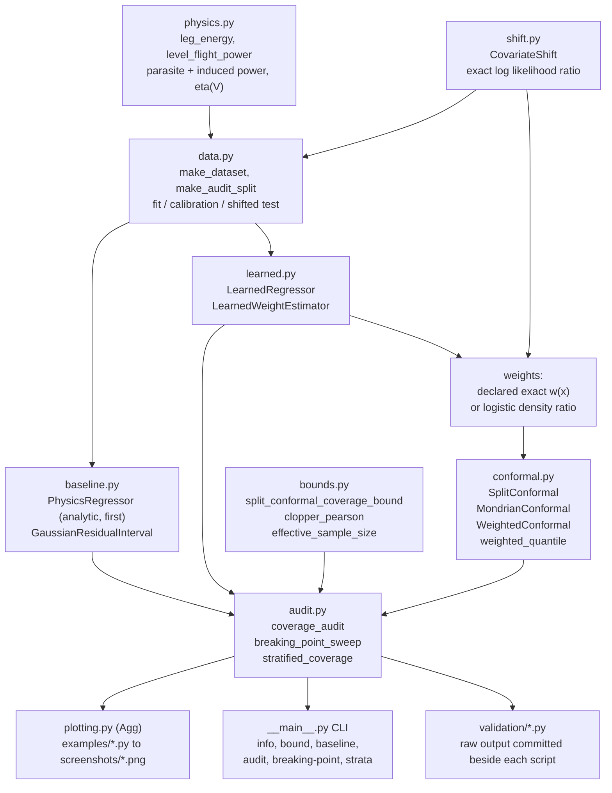
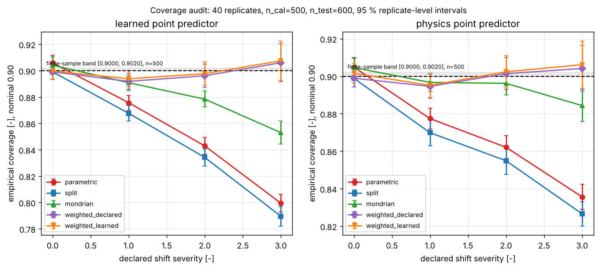
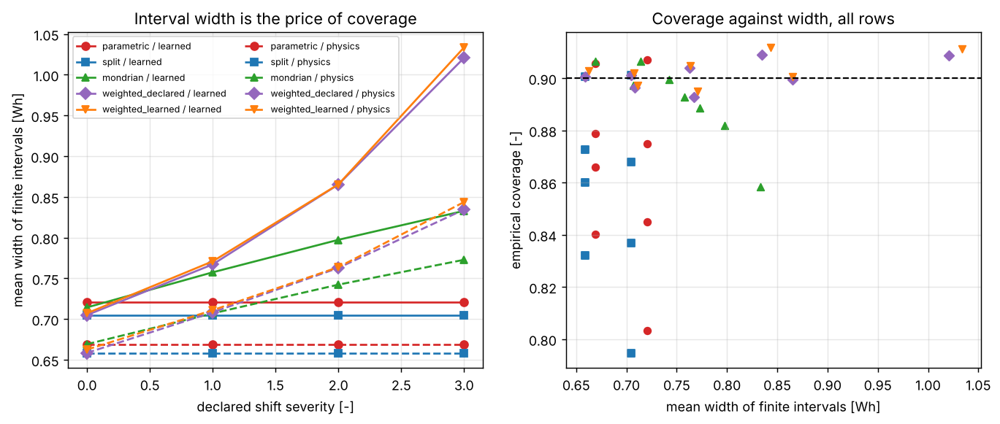
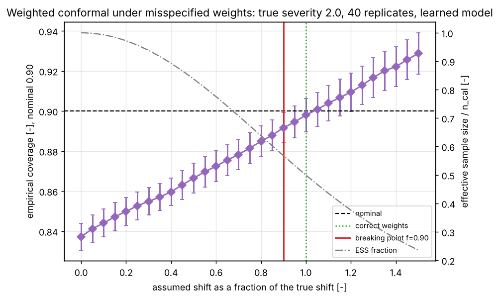
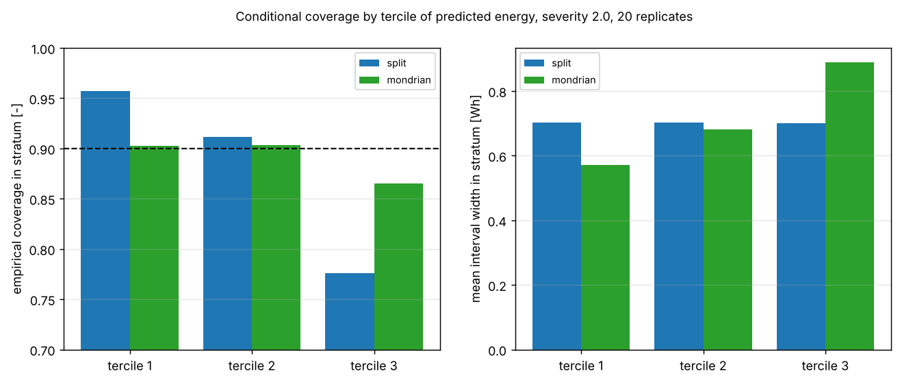
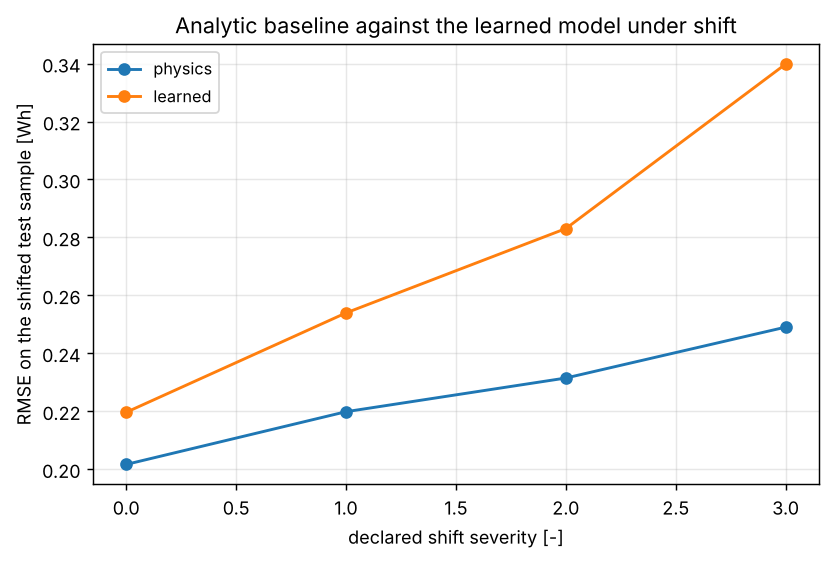
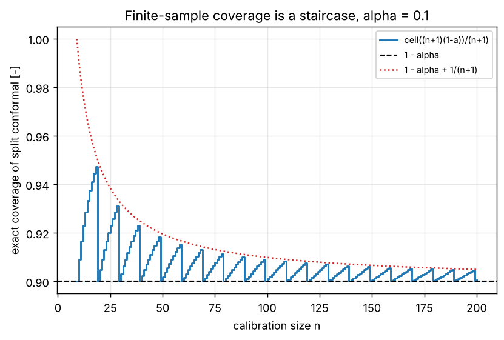

# conformalband

A coverage audit for conformal prediction intervals under a declared covariate shift.


**Status: TESTING** · Class: compact · Validation level 2 · AI: yes ·
Apache-2.0 · © 2026 OPTIMA Organisation

This software is research-grade. It is **not flight-qualified, not certified,
and not approved for operational aerospace use.** Every coverage guarantee it
reports is conditional on an assumption **you declare and it cannot check**:
exchangeability for split and Mondrian conformal, and a known likelihood ratio
for weighted conformal. Section "Where weighted conformal breaks" is the
measured cost of declaring the second one wrong.

**If you want conformal prediction intervals, use `MAPIE` or `crepes`.** They
are mature, maintained, scikit-learn compatible, and better at that job than
anything here. This package exists to produce one specific artefact those
libraries do not: a shift-severity coverage audit with the finite-sample bound
plotted alongside and the weight-misspecification breaking point measured. See
"Alternatives, honestly".

## The problem

You calibrated a prediction interval on last quarter's flight logs and the
aircraft is now flying heavier and into more wind than those logs contain. The
interval still prints the same number, the nominal level is still 90 per cent,
and nothing in your pipeline tells you that the actual coverage is now 79 per
cent. Weighted conformal prediction fixes that if you can state the likelihood
ratio between the two covariate distributions, which raises the only question
that matters in practice: how wrong can that statement be before the fix stops
working.

## What this does

- **Runs one coverage audit over five interval methods, two point predictors
  and four shift severities on identical data**, 40 rows, 72 000 test points
  each, with 95 per cent replicate-level intervals and the finite-sample
  split-conformal bound `451/501 = 0.900199600798` printed on every row
  (`validation/validate_coverage_audit.py`).
- **Measures where weighted conformal breaks.** Sweeping 31 assumed-shift
  fractions at three true severities, the breaking fraction is **0.85 to
  0.90**: understating the declared shift by 10 to 15 per cent puts the whole
  95 per cent coverage interval below nominal
  (`validation/validate_breaking_point.py`).
- **Reports the price of coverage in watt-hours, not adjectives.** Holding 0.90
  coverage at severity 3 costs a width of **1.07147 Wh against 0.69997 Wh**
  unweighted, and an effective calibration sample of **116.1 of 500**, with
  0.583 per cent of test points getting a genuinely unbounded interval
  (reported as `inf`, never truncated).
- **Separates marginal from conditional coverage.** With **no shift at all**,
  marginal split conformal covers **0.95972** in the lowest tercile of
  predicted energy and **0.81920** in the highest. Mondrian conformal cuts that
  spread from 0.14053 to **0.00561** by making the top-tercile interval 1.53
  times wider than the bottom one
  (`validation/validate_conditional_coverage.py`).
- **Benchmarks the learned model against the analytic one and publishes the
  loss.** The four-coefficient physics regressor beats a 200-stage gradient
  boosting ensemble at every severity: RMSE ratio **1.100527** in distribution
  rising to **1.354209** at severity 3
  (`validation/validate_baseline_vs_learned.py`).

## What this does that `MAPIE` and `crepes` do not

Not a new conformal primitive: split conformal, Mondrian conformal and the
weighted quantile are all textbook, and `MAPIE` 1.5.0 and `crepes` 0.9.1
implement the first two better than this does. What neither of them ships is
**the measured audit**: a single run that puts the parametric baseline, split,
Mondrian and weighted conformal on identical data across a declared shift of
increasing severity, prints each method's coverage with a replicate-level
confidence interval and the finite-sample bound beside it, and then sweeps the
likelihood-ratio weights away from the truth to locate the fraction at which
the weighted guarantee stops holding. Neither `MAPIE` 1.5.0 nor `crepes` 0.9.1
implements likelihood-ratio weighted conformal for covariate shift at all
(checked by unpacking both wheels; `MAPIE` has exchangeability *tests* and
conditional coverage *metrics*, `crepes` has Mondrian binning and
difficulty-normalised scores, and neither has the Tibshirani et al. 2019
weighted construction), so the audit this package performs cannot be assembled
from either one without writing that method yourself. **`puncc` 0.9.3 can**: its
`BaseCalibrator` takes an arbitrary `weight_func` of `X` into the weighted
quantile, so the honest statement is that `puncc` gives you the method and this
package gives you the experiment, on synthetic data, with the breaking point
published. If you already have `puncc`, what you are getting here is the audit
design and the numbers, not a capability.

## Who it's for

- Someone who has to tell a reviewer what their conformal interval's coverage
  actually is off-distribution, with a number and a confidence interval.
- Someone deciding whether to declare a covariate shift and weight for it, who
  wants to know what an imperfect declaration costs before committing to one.
- Someone teaching the gap between marginal and conditional coverage, who wants
  a worked, plotted, hand-checkable example where both are measured.

## Who it's not for

- Anyone who needs conformal prediction in production. Use `MAPIE` or
  `crepes`. This package's conformal implementations are deliberately narrow:
  absolute-residual scores only, symmetric intervals only, regression only.
- Anyone who needs conformalised quantile regression, cross-conformal,
  jackknife+, CV+, EnbPI, conformal predictive systems, classification sets,
  or online or time-series conformal prediction. None of those is here, and all
  of them are in at least one of the alternatives.
- Anyone who wants an estimate of a shift they have not declared. The learned
  weight estimator here is a logistic density ratio on two named columns; it is
  a demonstration, not a drift detector.
- Anyone who needs real flight data. Everything here is synthetic from a
  committed generator. See `DATASET_CARD.md`.
- Anyone wanting a certification artefact. This is Level 2 with no physical
  validation of any kind.

## Alternatives, honestly

Checked 2026-10-10 against the version-pinned PyPI JSON endpoint and then by
downloading and unpacking the wheel; method and raw results in
[validation/VALIDATION.md](validation/VALIDATION.md) section 11. Existence is
not equivalence, so the middle column is read from the unpacked source.

| Alternative | What it does better | When to use this instead |
|---|---|---|
| **`MAPIE` 1.5.0** (BSD-3-Clause; numpy, scikit-learn, scipy) — **recommended for general use** | A maintained, scikit-learn-compatible conformal library: `SplitConformalRegressor`, `CrossConformalRegressor`, `JackknifeAfterBootstrapRegressor`, `ConformalizedQuantileRegressor`, `TimeSeriesRegressor`, `ConditionalSplitConformalRegressor`, classification counterparts, a conformity-score framework, coverage and conditional-coverage metrics including `worst_slab_coverage`, and a whole `exchangeability_testing` package with permutation and martingale tests. Everything about conformal prediction, better. | You want the shift-severity coverage audit and the weight-misspecification breaking point as the output. `MAPIE` 1.5.0 ships no Mondrian class and no likelihood-ratio weighted conformal, so the weighted arm of this audit is not available from it. |
| **`crepes` 0.9.1** (BSD; numpy, pandas, scipy) — **recommended for general use** | Conformal regressors, classifiers and **conformal predictive systems** (full predictive distributions and CRPS, which this package does not have at all), Mondrian conformal throughout via a `bins` argument, a `MondrianCategorizer`, a `DifficultyEstimator` for difficulty-normalised scores, online and semi-online p-values, and `crepes.martingales` for exchangeability testing. Its Mondrian support is more general than the fixed tercile taxonomy here. | Same as above. `crepes` 0.9.1 has no likelihood-ratio weighted conformal for covariate shift, so the one method whose breaking point this package publishes is not in it. |
| **`puncc` 0.9.3** (deel-ai) | `SplitCP`, `LocallyAdaptiveCP`, `CQR`, `CVPlus`, `EnbPI`, `AdaptiveEnbPI`, `LeverageWeightedCP`, and — the relevant part — a `BaseCalibrator` whose `weight_func` takes an arbitrary function of `X` into the weighted quantile. **This is weighted conformal with user-declared weights, so `puncc` has the method this package's headline result is about.** | You want the measured audit rather than the method: the severity sweep, the replicate-level intervals, the effective-sample-size accounting and the published breaking point. If you have `puncc`, take the experiment design from here and run it with `puncc`. |

**None of these is a runtime dependency.** They are citations, not imports, and
`validation/validate_environment.py` asserts that none of them is installed in
the container every number here was measured in.

## Install and first run

```bash
git clone https://github.com/OmAcharya-avtr/conformalband.git
cd conformalband
python -m venv .venv && source .venv/bin/activate
pip install -e ".[test]"
python -m pytest tests/ -q
python examples/coverage_bound.py
```

Expected output of the test run (the count is fixed; the time moved between
61.14 s and 88.95 s over three runs on two contended cores, so do not expect
the seconds to match):

```
........................................................................ [ 16%]
........................................................................ [ 32%]
........................................................................ [ 49%]
........................................................................ [ 65%]
........................................................................ [ 81%]
........................................................................ [ 98%]
........                                                                 [100%]
440 passed in 61.14s (0:01:01)
```

Raw output of the run this block was copied from: `validation/pytest_output.txt`.

Expected output of the first example, which needs no data and no model and is
exact arithmetic (it also writes `screenshots/coverage_bound.png`):

```
     n  rank k          exact   1-alpha          upper           gap
--------------------------------------------------------------------
     9       9 0.900000000000    0.9000 1.000000000000 0.000000000000
    19      18 0.900000000000    0.9000 0.950000000000 0.000000000000
    20      19 0.904761904762    0.9000 0.947619047619 0.004761904762
    49      45 0.900000000000    0.9000 0.920000000000 0.000000000000
    99      90 0.900000000000    0.9000 0.910000000000 0.000000000000
   100      91 0.900990099010    0.9000 0.909900990099 0.000990099010
   200     181 0.900497512438    0.9000 0.904975124378 0.000497512438
   500     451 0.900199600798    0.9000 0.901996007984 0.000199600798
  1000     901 0.900099900100    0.9000 0.900999000999 0.000099900100

The exact value is k/(n+1) with k = ceil((n+1)(1-alpha)); it equals 1-alpha only when (n+1)(1-alpha) is an integer, and otherwise over-covers by less than 1/(n+1).
wrote screenshots/coverage_bound.png
```

## A worked example

`validation/worked_example.py`, run verbatim:

```python
import numpy as np

from conformalband import (
    GaussianResidualInterval, PhysicsRegressor, SplitConformal, WeightedConformal,
    effective_sample_size, make_audit_split, split_conformal_coverage_bound,
)

ALPHA = 0.1
data = make_audit_split(seed=57001, n_calibration=500, n_test=1000, severity=2.0)
shift = data.shift

model = PhysicsRegressor().fit(data.fit.features, data.fit.energy)   # the baseline, first
pred_cal = model.predict(data.calibration.features)
pred_test = model.predict(data.test.features)

parametric = GaussianResidualInterval(ALPHA, n_parameters=PhysicsRegressor.n_parameters)
parametric.fit(data.calibration.energy, pred_cal)
conformal = SplitConformal(ALPHA).calibrate(data.calibration.energy, pred_cal)

w_cal = shift.likelihood_ratio(data.calibration.mass, data.calibration.headwind)
w_test = shift.likelihood_ratio(data.test.mass, data.test.headwind)
weighted = WeightedConformal(ALPHA).calibrate(data.calibration.energy, pred_cal, w_cal)

print(shift.describe())
bound = split_conformal_coverage_bound(conformal.n_calibration, ALPHA)
print(f"finite-sample bound: rank {bound.rank}, exact {bound.exact:.12f}")
print(f"sigma_hat {parametric.sigma:.6f} Wh, conformal quantile {conformal.quantile:.6f} Wh")
print(f"weight sum {weighted.weight_sum:.4f}, ESS {effective_sample_size(w_cal):.2f} of 500")
for name, interval in (("parametric", parametric.interval(pred_test)),
                       ("split", conformal.interval(pred_test)),
                       ("weighted", weighted.interval(pred_test, w_test))):
    finite = np.isfinite(interval.width)
    print(f"{name:12s} {interval.covers(data.test.energy).mean():9.5f} "
          f"{np.mean(interval.width[finite]):9.5f} {np.mean(~finite):9.5f}")
```

Its actual output:

```
severity 2.000: mass 6.000 -> 6.360 kg (sd 0.600), headwind 0.000 -> 1.200 m/s (sd 2.000), Mahalanobis 0.8485
finite-sample bound: rank 451, exact 0.900199600798
sigma_hat 0.198718 Wh, conformal quantile 0.308981 Wh
weight sum 527.5357, ESS 241.05 of 500
method        coverage  width_Wh  infinite
------------------------------------------
parametric     0.84100   0.65372   0.00000
split          0.81500   0.61796   0.00000
weighted       0.89600   0.75626   0.00000
```

One replicate, so these are single draws, not the audited figures. Read the
audit table for the pooled numbers. The shape is already visible: the
parametric baseline and split conformal both miss nominal by several points,
and the weighted interval recovers it by being 22 per cent wider.

## Architecture



## Screenshots



Coverage against declared shift severity, one panel per point predictor, with
the finite-sample band shaded. Notice that the red baseline and the blue split
conformal curve fall away together, the green Mondrian curve falls more slowly,
and only the two weighted curves stay flat on the nominal line.



Left: width against severity. The parametric and split bands are flat lines,
because neither of them knows anything changed. Right: coverage against width
for all forty rows; the only points at nominal coverage are the widest ones.



Coverage against the assumed shift as a fraction of the true one, with the
effective-sample-size fraction on the right axis. The red line is the breaking
point. Notice that the curve is smooth: there is no cliff, so a reader cannot
tell from the output alone that their weights are slightly wrong.



Left: per-tercile coverage. The marginal band is far above nominal in the first
tercile and far below in the third; the Mondrian bars are level. Right: the
widths that bought it, 0.575 Wh against 0.881 Wh across the terciles.



Root mean squared error against severity. The analytic baseline is the lower
line at every point, and the gap widens to the right. This is the honest
negative, plotted.



The finite-sample coverage of split conformal is a staircase in the calibration
size, not a smooth curve, and it touches `1 - alpha` exactly only when
`(n+1)(1-alpha)` is an integer.

## Validation evidence

Full tables, hand derivations and raw output in
[validation/VALIDATION.md](validation/VALIDATION.md). **The rows that went
against this package are marked and are the ones worth reading.**

| Check | Reference / method | Result | Tolerance |
|---|---|---|---|
| Finite-sample bound against hand arithmetic | `k/(n+1)`, `k = ceil((n+1)(1-alpha))` | 6 cases exact, including `18/19 = 0.947368421053` at `n = 18` | 1e-15 |
| Exact coverage of split conformal, Monte Carlo | 400 000 replicates, uniform / lognormal / half-Cauchy scores | 12 rows, worst error **+0.000752** against `k/(n+1)` | 4e-3 (8 s.e.) |
| The discriminating separation | `18/19 - 18/20 = 0.047368421` | measured **+0.047365000** | 8e-3 |
| Declared likelihood ratio against the Gaussian densities | `pdf/pdf` on 400 000 draws | worst relative error **5.329e-15**; `E[w] = 1.001410` and `E[w^2] = 5.062352` against `exp(M^2) = 5.053090` at severity 3 | 1e-12 rel |
| Level-flight power and leg energy | hand arithmetic in `validate_known_answers.py` section 5 | **215.001704789323 W** and **2.986134788741 Wh** | 1e-12 rel |
| Degenerate equivalences | weighted with unit weights, Mondrian with one bin, weighted at severity 0 | all three **exactly equal** to split conformal, 0.691266925435076 | exact |
| Kish effective sample size | `(sum w)^2 / sum w^2` | 37 equal weights give **37.000000000000**; `[1, 3]` gives **1.600000000000** | 1e-12 |
| Weighted conformal holds under the declared shift | 120 replicates, 72 000 test points per row | coverage **0.89868 / 0.89746 / 0.89968 / 0.91201** at severities 0–3, learned predictor | nominal 0.90 |
| **Parametric baseline is WIDER than conformal, not tighter** | the product specification predicted the opposite | ratio **1.019319** (physics) and **1.034104** (learned); independent single-fit check **1.024586** and **1.041085** | — |
| **Mechanism of that result, measured** | excess kurtosis and `q90(|e|)/(1.6449 sd)` on 200 000 points | kurtosis **+1.64873** and **+9.00989**; ratio **0.983569** and **0.968426**, both below 1 | — |
| **Analytic baseline beats the learned model everywhere** | same held-out data, 40 replicates | RMSE ratio learned/physics **1.100527 → 1.354209** over severities 0 to 3 | — |
| **Split conformal loses 7 to 11 points of coverage under shift** | 120 replicates | **0.82926** (physics) and **0.79047** (learned) at severity 3 against nominal 0.90 | — |
| **Parametric baseline loses more** | same | **0.83750** and **0.80228** at severity 3 | — |
| **Mondrian does not restore marginal coverage** | same | **0.88468** and **0.85129** at severity 3 | — |
| **Marginal coverage hides a conditional failure with no shift at all** | terciles of predicted energy, 30 replicates | split covers **0.95972** in tercile 1 and **0.81920** in tercile 3; Mondrian spread **0.00561** against **0.14053** | — |
| **Weighted conformal breaking point** | 31 assumed fractions x 3 true severities x 120 replicates | **0.85 / 0.90 / 0.85**; with no weighting, coverage **0.87324 / 0.83653 / 0.79054** | grid 0.05 |
| **Effective sample size collapse** | Kish ESS of the declared weights | **500.0 → 418.5 → 248.3 → 116.1**; replicate coverage s.d. **0.01726 → 0.04241**; 0.583 % of intervals unbounded | — |
| **17 of 40 audit rows demonstrably below nominal** | 95 % replicate-level intervals entirely under 0.90 | 17, against about 2 expected from chance over 40 rows | — |
| **Floating-point artefact in the bound, found by Hypothesis** | `n = 1249, alpha = 0.18` | `exact = 0.82` and `lower = 1 - 0.18 = 0.8200000000000001`: `exact < lower` by one ulp, equal in exact arithmetic | documented, 1e-12 |
| **No citation verified against a publisher page** | egress reached `pypi.org` only | `doi.org`, `arxiv.org`, `arc.aiaa.org`, `jmlr.org` all `connect_rejected` | — |

## API reference

<details>
<summary><code>conformalband.conformal</code> — the three variants</summary>

| Member | Returns | Notes |
|---|---|---|
| `SplitConformal(alpha=0.1)` | — | `alpha` in (0, 1) |
| `.calibrate(y_true, y_pred)` | `self` | absolute-residual scores [Wh]; refuses `n` too small for `alpha` |
| `.quantile` | float [Wh] | the half-width `q` |
| `.interval(y_pred)` | `Interval` | `yhat ± q` |
| `.coverage_bound` | `CoverageBound` | the finite-sample bound for this `n` and `alpha` |
| `MondrianConformal(alpha=0.1)` | — | class-conditional |
| `.calibrate(y_true, y_pred, bins)` | `self` | one quantile per integer bin; refuses a bin too small for `alpha` |
| `.quantiles`, `.counts` | dicts | per bin |
| `.coverage_bounds()` | dict | per bin |
| `.interval(y_pred, bins)` | `Interval` | raises `KeyError` on an unseen bin rather than pooling |
| `WeightedConformal(alpha=0.1)` | — | likelihood-ratio weights |
| `.calibrate(y_true, y_pred, weights)` | `self` | weights must be finite, non-negative, not all zero |
| `.quantiles(test_weights)` | ndarray [Wh] | `inf` where the test weight takes more than `alpha` of the mass |
| `.interval(y_pred, test_weights)` | `Interval` | per-point half-width |
| `.effective_sample_size`, `.weight_sum` | floats | Kish ESS and `sum w` |
| `weighted_quantile(values, weights, level, *, tail_weight=0.0)` | float | the primitive; `tail_weight` is the mass at `+inf` |
| `conformal_rank(n, alpha)` | int | `ceil((n+1)(1-alpha))` with the floating-point guard |
| `absolute_residual_score(y_true, y_pred)` | ndarray | `abs(y - yhat)` |
| `tercile_edges(values)`, `assign_bins(values, edges)` | ndarray | bins are half-open upward |
| `Interval(lower, point, upper)` | — | `.width` [Wh], `.covers(y_true)` [bool] |
| `ConformalizedRegressor(predictor, calibrator)` | — | `.predict`, `.predict_interval` |

</details>

<details>
<summary><code>conformalband.bounds</code>, <code>conformalband.shift</code></summary>

| Function | Returns | Notes |
|---|---|---|
| `split_conformal_coverage_bound(n, alpha)` | `CoverageBound` | `.rank`, `.exact`, `.lower`, `.upper`, `.conservatism`; raises when `n` is too small |
| `clopper_pearson(successes, trials, confidence=0.95)` | (float, float) | exact binomial interval |
| `effective_sample_size(weights)` | float | Kish, in `[1, len(weights)]` |
| `CovariateShift(severity=0.0, mass_sd=0.6, headwind_sd=2.0)` | — | the declared shift |
| `.mass_mean` [kg], `.headwind_mean` [m/s], `.mass_delta`, `.headwind_delta` | floats | test-time means and displacements |
| `.mahalanobis` | float | `sqrt(sum (delta_j/sigma_j)^2)` |
| `.likelihood_ratio(mass, headwind)`, `.log_likelihood_ratio(...)` | ndarray | exact closed form |
| `.scaled(fraction)` | `CovariateShift` | the misspecified weight model |
| `.describe()` | str | one line |

</details>

<details>
<summary><code>conformalband.physics</code>, <code>.data</code>, <code>.baseline</code>, <code>.learned</code></summary>

| Function | Returns | Units |
|---|---|---|
| `propulsive_efficiency(airspeed, airframe=DEFAULT_AIRFRAME)` | ndarray | dimensionless, in (0, 1] |
| `level_flight_power(airspeed, mass, air_density, airframe, *, constant_efficiency=False)` | ndarray | W |
| `leg_energy(airspeed, mass, air_density, headwind, distance, airframe, *, constant_efficiency=False)` | ndarray | Wh |
| `Airframe(...)` | — | `wing_area` m², `wingspan` m, `cd0`, `oswald`, `eta_prop`, `avionics_power` W, `design_airspeed` m/s, `eta_curvature` |
| `make_dataset(n, *, seed=None, rng=None, severity=0.0, shift=None, noise_fraction=0.06)` | `Dataset` | features, `energy` Wh, `truth` Wh |
| `make_audit_split(*, seed, n_fit=1500, n_calibration=500, n_test=1000, severity=0.0)` | `AuditSplit` | `.fit`, `.calibration`, `.test` |
| `PhysicsRegressor(airframe=DEFAULT_AIRFRAME)` | — | `.fit`, `.predict`, `.parameters`, `.parameter_table()`, `n_parameters = 4` |
| `GaussianResidualInterval(alpha=0.1, *, n_parameters=0, use_t=False)` | — | `.fit(y_true, y_pred)`, `.sigma` Wh, `.half_width` Wh, `.interval(y_pred)` |
| `LearnedRegressor(*, n_estimators=200, max_depth=3, learning_rate=0.05, random_state=0)` | — | `.fit`, `.predict`, `.feature_importances` |
| `LearnedWeightEstimator(*, columns=(1, 3), regularisation=1.0, clip=100.0)` | — | `.fit(cal_features, test_features)`, `.weights(features)`, `.auc`, `.clipped_fraction` |

</details>

<details>
<summary><code>conformalband.audit</code> and the CLI</summary>

| Function | Returns |
|---|---|
| `coverage_audit(*, alpha=0.1, replicates=40, n_fit=1500, n_calibration=500, n_test=1000, seed=57001, severities=(0,1,2,3), models=("physics","learned"), methods=METHODS)` | `AuditResult` with `.rows`, `.select(model=, method=)`, `.table()` |
| `breaking_point_sweep(*, true_severity=2.0, fractions=None, ..., model="learned")` | `BreakingPointResult` with `.rows`, `.breaking_fraction`, `.last_holding_fraction`, `.table()` |
| `stratified_coverage(*, severity=0.0, ..., model="learned")` | `{method: {bin: (coverage, width, nominal, n)}}` |

`CoverageRow` carries `coverage`, the replicate-level `ci_low`/`ci_high`, the
deliberately-too-narrow `cp_low`/`cp_high`, `per_replicate_sd`,
`replicate_se`, `mean_width`, `median_width`, `infinite_fraction`, `ess`,
`ess_fraction`, the three `bound_*` columns, and the `covers_nominal` /
`below_nominal` predicates.

```
python -m conformalband info [--json]
python -m conformalband bound --n N --alpha A [--json]
python -m conformalband baseline [--severity S] [--seed N] [--json]
python -m conformalband audit [--replicates N] [--severities S ...] [--models ...]
       [--methods ...] [--fail-on-undercoverage] [--json]
python -m conformalband breaking-point [--true-severity S] [--replicates N]
       [--model physics|learned] [--json]
python -m conformalband strata [--severity S] [--replicates N] [--json]
```

Exit **0** on success, **2** on a refused request (for example
`bound --n 5 --alpha 0.1`, where no finite order statistic attains the level)
or, with `--fail-on-undercoverage`, when a row is measured demonstrably below
nominal. Both non-zero paths are asserted in `tests/test_cli.py` and
re-executed by `validation/validate_cli.py`; raw transcripts in
`validation/validate_cli_output.txt`.

</details>

## Limitations

1. **No physical validation. Level 2.** The airframe is illustrative
   (`S = 0.30 m²`, `b = 1.20 m`, `C_D0 = 0.035`, `e = 0.85`, `eta_0 = 0.62`,
   12 W avionics, design airspeed 20 m/s) and is not a measurement of any
   vehicle. Every coverage number describes this synthetic problem only.
2. **The parametric baseline is wider than conformal here, and that is a
   property of this data, not a general result.** The observation noise is
   multiplicative, so the residual is a scale mixture of normals with excess
   kurtosis +1.65 (physics) and +9.01 (learned). On genuinely homoscedastic
   Gaussian residuals the two would agree in expectation. Do not read the
   measured ratio as advice.
3. **The analytic baseline wins because the generator is the analytic model
   plus one missing quadratic term.** A reader should not conclude that physics
   models beat gradient boosting in general; they conclude that a nearly
   correctly specified four-parameter model beats a nonparametric one on 1500
   samples, which is the textbook result.
4. **The breaking point is resolved to a 0.05-wide bracket**, the sweep grid
   spacing. It is also a function of the replicate count: with 20 replicates
   instead of 120 the measured breaking fraction moves, because the criterion
   is a statistical test and more replicates detect smaller violations. The
   published 0.85 to 0.90 is specific to 120 replicates of 600 test points at
   95 per cent confidence, and the README says so because it would otherwise
   read as a property of the method.
5. **Seventeen of forty audit rows are flagged at 95 per cent confidence over
   forty comparisons.** About two would be flagged by chance. No Bonferroni or
   false-discovery correction is applied; the raw count and the expected false
   positive count are both printed, and a single borderline row should not be
   read as a finding.
6. **The pooled Clopper-Pearson interval in the output is too narrow** by a
   factor of two to three, because test points inside a replicate share a
   calibration quantile. It is printed only so the size of the error is
   visible. Read `ci_low`/`ci_high`, never `cp_low`/`cp_high`.
7. **Absolute-residual scores and symmetric intervals only.** No
   locally-normalised score, no conformalised quantile regression, no
   asymmetric interval, no classification.
8. **The Mondrian taxonomy is three terciles of the calibration prediction,
   and it is a weak conditioner.** It reduces the conditional coverage spread
   but does not restore marginal coverage under shift (0.85129 at severity 3),
   because a prediction tercile is not the covariate that moved. Test terciles
   are also unequally populated under shift (3 824 / 7 633 / 18 543 at severity
   2).
9. **The learned weight estimator is correctly specified for this shift by
   construction.** The declared shift is a Gaussian mean shift in two named
   coordinates, so the log likelihood ratio is exactly linear in them and
   logistic regression is the right model. The measured agreement between
   learned and declared weights, within 0.0015 of coverage, will not transfer
   to a shift of unknown form.
10. **Weights are clipped to `[1/100, 100]`.** The clipped fraction is
    reported, but clipping is a bias the theory does not account for.
11. **Compute budget.** Two contended cores. `validate_breaking_point.py` is
    the slowest script at 202 to 237 s; the test suite ran in 60.1 s, 88.9 s
    and 61.1 s on three runs of the same command. Timings move up to about
    48 per cent between runs, so quote the ratios and the counts.
12. **No citation in this repository was verified against a publisher page in
    this session**, because the container's egress proxy reached `pypi.org`
    only. The PyPI checks in the alternatives table were performed and are
    recorded; the academic references are pointers to look up.
13. **No comparison against `MAPIE`, `crepes` or `puncc` output.** None is
    installed here, by design, so the alternatives table describes their
    unpacked source and claims no measured numerical agreement with them.

## Hardware requirements

Any machine that runs CPython 3.11+ with NumPy, SciPy and scikit-learn.
Everything in this repository was produced on **two shared, contended CPU
cores** with under 1 GiB of resident memory. There is no GPU path, no compiled
extension, no PyTorch and no hardware-in-the-loop component.

## Reproducing every number

See [validation/VALIDATION.md](validation/VALIDATION.md) section 13 for the
full list with seeds. In short, from the repository root:

```bash
python -m pytest tests/ -q --junit-xml=junit.xml
ruff check src/ tests/ examples/ validation/
python validation/validate_environment.py
python validation/validate_known_answers.py
python validation/validate_baseline_vs_learned.py
python validation/validate_conditional_coverage.py
python validation/validate_coverage_audit.py
python validation/validate_breaking_point.py
python validation/validate_cli.py
python validation/worked_example.py
MPLBACKEND=Agg python examples/coverage_bound.py
MPLBACKEND=Agg python examples/mondrian_strata.py
MPLBACKEND=Agg python examples/baseline_vs_learned.py
MPLBACKEND=Agg python examples/coverage_audit.py
MPLBACKEND=Agg python examples/interval_width.py
MPLBACKEND=Agg python examples/weight_breaking_point.py
```

Every validation script exits 0 by design, including the ones whose finding is
a failure: the failure is printed as a `FINDING` line, committed in the raw
output, and the measured value is asserted against the expectation documented
beside the assertion.

## Roadmap

No dates are promised. In rough order of usefulness: a locally-normalised
conformity score so the Mondrian arm can be compared against difficulty
estimation rather than only against a marginal band; a finer bisection on the
breaking point instead of a 0.05 grid; a label-shift arm, which the current
weighted construction cannot cover; and a run of the same audit through `puncc`
so this package's numbers can be checked against an independent implementation
of the weighted quantile.

## Safety statement

This software is research-grade. It is **not flight-qualified, not certified,
and not approved for operational aerospace use.** It measures the coverage of
prediction intervals on synthetic data generated by its own model, under a
covariate shift it declared itself. A 90 per cent interval is wrong one case in
ten by construction, and under an undeclared shift it is wrong far more often.
Using any interval from this package as an energy reserve, a margin, or an
input to a safety case is a decision this package does not support and provides
no evidence for.

## Licence

Apache-2.0. Copyright © 2026 OPTIMA Organisation. See [LICENSE](LICENSE).

## Credits

This is under reserved rights obtained by OPTIMA Organisation.

## Citation

```bibtex
@software{conformalband2026,
  title  = {conformalband: a coverage audit for conformal prediction intervals
            under declared covariate shift},
  author = {Acharya, Om},
  year   = {2026},
  version = {0.1.0},
  license = {Apache-2.0},
  url    = {https://github.com/OmAcharya-avtr/conformalband}
}
```

See `CITATION.cff`. The methods this implements are due to the authors cited in
[validation/VALIDATION.md](validation/VALIDATION.md) section 12, not to this
package.
