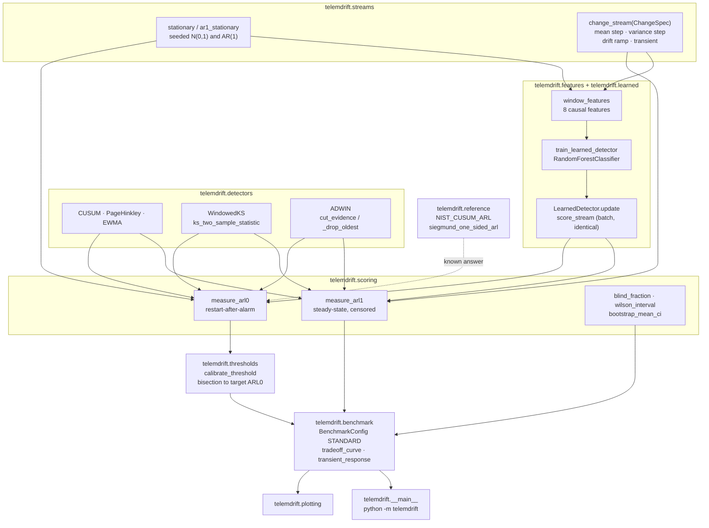
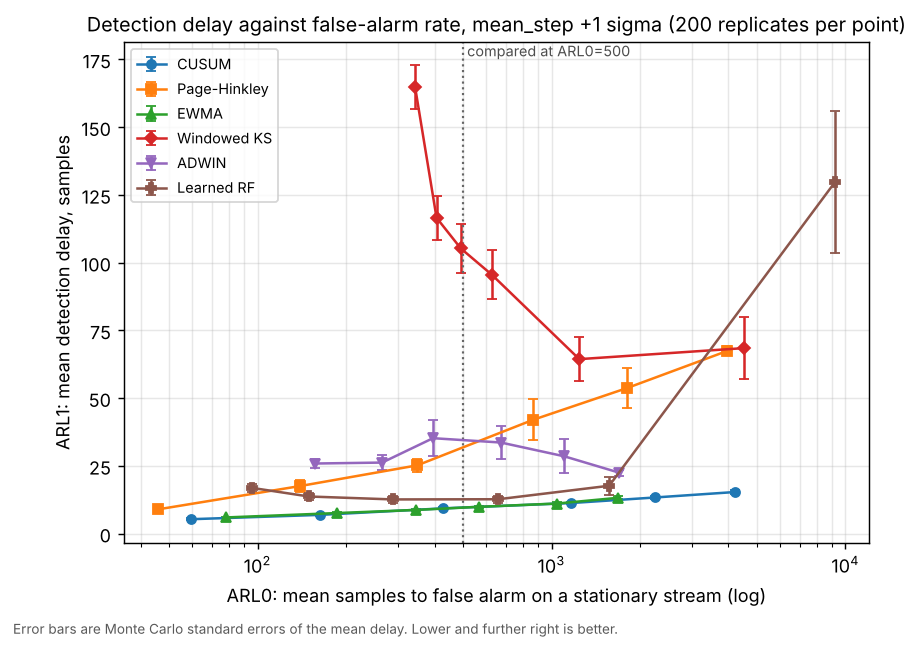
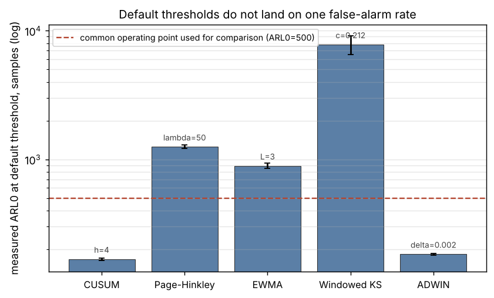
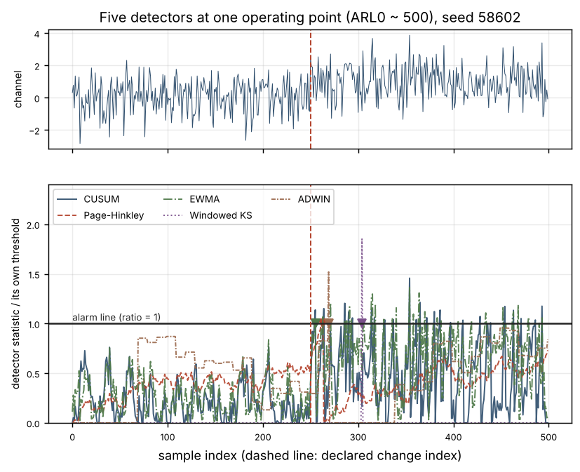
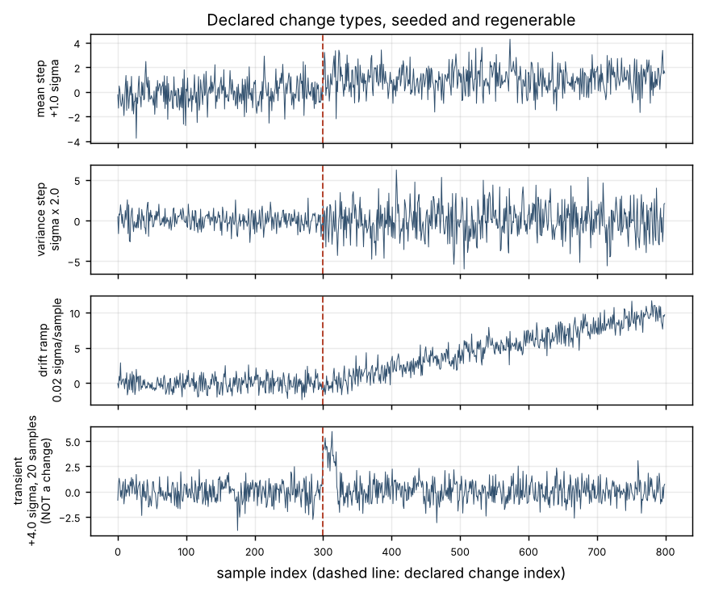
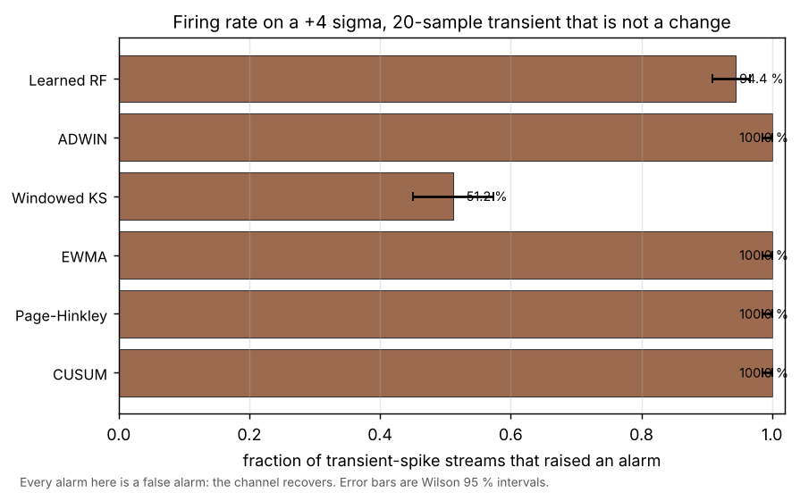
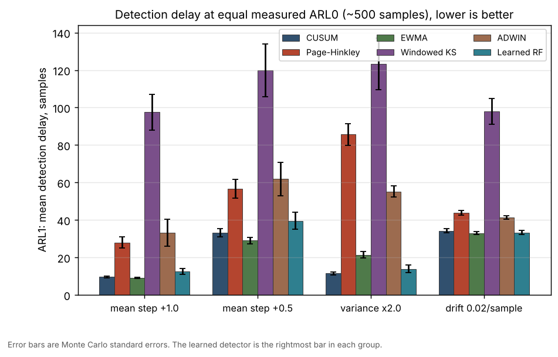

# telemdrift

Streaming change detection on one telemetry channel, scored on detection delay
against false-alarm rate.


Test count read from junit XML, not from a pytest stdout line, because a
configuration that collects nothing exits 0 and prints a success line.
[`validation/outputs/validate_tests.txt`](validation/outputs/validate_tests.txt)
quotes the XML's own `testsuite` element verbatim: **302 collected, 302 passed,
0 failed, 0 errored, 0 skipped**.

## The problem

A spacecraft housekeeping channel drifts and you want to know how many samples
after the drift starts you will notice. Every library gives you a detector with
a default threshold, and those defaults encode five different false-alarm rates:
measured here over 400 000 stationary samples each, the shipped defaults of
CUSUM, Page-Hinkley, EWMA, a windowed KS test and ADWIN land at mean times to
false alarm of 168, 1253, 892, 7819 and 184 samples -- a spread of 46.6x. Any
comparison made at those thresholds compares operating points, not detectors,
and that is the usual error this package exists to make visible.

## What this does

- Implements five analytic detectors -- **CUSUM** (Page 1954), **Page-Hinkley**,
  **EWMA** (Roberts 1959), a **windowed two-sample Kolmogorov-Smirnov test**, and
  an **ADWIN**-style adaptive window built from its published cut rule -- each
  with one calibrated scalar and a stated threshold-setting procedure.
- Calibrates every detector to a **declared target ARL0** by bisection on seeded
  stationary streams, then reports the achieved ARL0 on **seeds not used for
  fitting**. At a 500-sample target the five land between 468 and 581 samples,
  a residual spread of 1.24x against 46.6x at their defaults.
- Measures **ARL1 (detection delay) with a Monte Carlo standard error on every
  figure**, over 300 seeded replicates per detector per change type, with
  right-censoring reported rather than absorbed.
- Produces the **delay-versus-false-alarm trade-off curve** over 36 measured
  (ARL0, ARL1) points, which is the only comparison that does not depend on how
  well the calibration landed.
- Scores the **four declared change types** -- mean step, variance step, drift
  ramp, and a transient excursion that is a **negative control** rather than a
  change -- and reports that **all six detectors fire on the transient**
  (attributable excess over a matched stationary baseline: 32.8 to 88.8
  percentage points).

## What this does that `river` and `ruptures` do not

`river` 0.26.1 ships ADWIN, KSWIN and Page-Hinkley as production streaming
detectors and this package does not try to replace them. What its `river.drift`
module does not contain -- verified by unpacking the 0.26.1 wheel and reading
`river/drift/__init__.py` and `river/metrics/` -- is any ARL0 or ARL1 metric, any
procedure for moving a detector's threshold until its measured false-alarm rate
hits a declared target, and therefore any way to compare two of its detectors at
the same operating point; `river.metrics` is entirely supervised-learning
metrics. `ruptures` 1.1.10 is offline: it is handed the whole signal and returns
change points, so detection *delay* is not a quantity it can report, and its
metrics are localisation-accuracy measures (Hausdorff, Rand index, annotation
error). The gap this fills is narrow and it is a measurement gap, not an
algorithm gap: **equal-ARL0 calibration and the delay-versus-false-alarm curve
built from it.** Every detector here is a textbook recursion that `river`
implements better for production use.

## Who it's for

- Someone choosing between streaming change detectors for a telemetry channel
  who needs them compared at one false-alarm rate rather than at five.
- Someone who has to answer "how many samples until we notice, and how often
  will it cry wolf" with a number and an error bar.
- Someone writing the detection-delay section of a test report and wanting the
  measurement method to be inspectable.

## Who it's not for

- **Anyone running a detector in production.** Use `river`. This is a benchmark
  harness: it has no incremental state management, no serialisation, no pipeline
  integration, and the learned detector's online path costs about 7.6 ms per
  sample with this scikit-learn API.
- Anyone with multivariate telemetry. Everything here is univariate by design.
- Anyone wanting offline change-point *location* on a recorded pass. Use
  `ruptures`.
- Anyone who needs a detector that ignores transient excursions. None of the six
  here does; see Validation evidence.
- Anyone who can take an i.i.d. assumption on their channel for granted. See
  Limitations, first entry.

## Alternatives, honestly

Every package below was verified on PyPI on 2026-10-10 by fetching
`https://pypi.org/pypi/<name>/json` and reading the returned version, and for
`river` and `ruptures` by downloading the wheel with `pip download --no-deps`
and listing its modules. Versions and claims come from those files, not from
memory. Nothing below is a runtime dependency of this package.

| Alternative | Version verified | What it does better | When to use this instead |
|---|---|---|---|
| [`river`](https://pypi.org/project/river/) | 0.26.1 | **Use this for production streaming.** A maintained online-learning framework; `river.drift` ships ADWIN, KSWIN, PageHinkley and five binary-input detectors (DDM, EDDM, FHDDM, HDDM-A, HDDM-W), with incremental estimators, pipelines and serialisation. | Only when you need ARL0/ARL1 scoring and equal-operating-point comparison. `river.metrics` has no run-length metric and `river.drift` has no threshold-to-target-ARL0 procedure, so this is additive to it, not a replacement. |
| [`ruptures`](https://pypi.org/project/ruptures/) | 1.1.10 | Offline change-point detection done properly: Pelt, Binseg, BottomUp, Dynp, KernelCPD, Window, with nine cost functions and localisation metrics. | When the stream is live and the quantity you care about is *delay*. `ruptures` sees the whole signal, so it has no delay to report. |
| [`scipy.stats`](https://pypi.org/project/scipy/) | 1.18.1 (installed) | The reference implementation of the two-sample KS test and its exact p-value. | This package's KS statistic is checked against `scipy.stats.ks_2samp` to machine precision and is about 24x cheaper per evaluation because it skips the p-value. Note `scipy.stats.kstest(x, "norm", args=(loc, scale))` raises `TypeError` on this SciPy; the two-sample call does not. |
| [`scikit-multiflow`](https://pypi.org/project/scikit-multiflow/) | present on PyPI (HTTP 200); contents **not** inspected | Historically the streaming-detector package `river` grew out of. | Not assessed. This row exists to record that the name was checked and the package was not read, rather than to describe software this session did not open. |
| [`changefinder`](https://pypi.org/project/changefinder/) | present on PyPI (HTTP 200); contents **not** inspected | SDAR-based online change-point scoring. | Not assessed, same reason. |

A sibling product in this portfolio, P053 TwinInvalidate, also implements a
variance CUSUM for digital-twin residuals. It is a separate repository and
nothing here imports from it.

## Install and first run

```bash
git clone https://github.com/OmAcharya-avtr/telemdrift.git
cd telemdrift
python -m venv .venv && source .venv/bin/activate
pip install -e ".[test]"
python -m pytest tests/ -q
python examples/change_types.py
```

`python -m pytest tests/ -q` prints, re-run for this README
([`validation/outputs/validate_cli.txt`](validation/outputs/validate_cli.txt)
section 4):

```
302 passed, 1 warning in 124.40s (0:02:04)
```

The warning is `scipy.stats.ks_2samp` reporting that it fell back from its exact
to its asymptotic p-value on a tiny Hypothesis-generated sample. It comes from
SciPy, it concerns a p-value this package does not use, and it is left visible
rather than filtered.

`python examples/change_types.py` prints
([`validation/outputs/validate_cli.txt`](validation/outputs/validate_cli.txt)
section 3):

```
mean_step      magnitude=1      seed=58501 change_index=300 length=800 pre_mean=-0.0732 post_mean=+1.0410 pre_sd=0.9997 post_sd=0.9972
variance_step  magnitude=2      seed=58502 change_index=300 length=800 pre_mean=+0.0563 post_mean=-0.0153 pre_sd=0.9603 post_sd=1.9874
drift_ramp     magnitude=0.02   seed=58503 change_index=300 length=800 pre_mean=-0.0802 post_mean=+4.9773 pre_sd=0.9769 post_sd=3.1058
transient      magnitude=4      seed=58504 change_index=300 length=800 pre_mean=-0.0391 post_mean=+0.1861 pre_sd=0.9644 post_sd=1.2295
wrote screenshots/change_types.png
```

Check the version with `python -m telemdrift --version`, which prints
`telemdrift 0.1.0`.

## A worked example

The full script is
[`validation/worked_example.py`](validation/worked_example.py) and its output is
committed at
[`validation/outputs/worked_example.txt`](validation/outputs/worked_example.txt).

```python
from telemdrift import (
    CUSUM, STANDARD, ChangeSpec, analytic_factory, calibrate_threshold,
    change_stream, measure_arl0, measure_arl1, stationary,
)

# A telemetry channel, standardised, with a +1 sigma mean step at sample 1000.
spec = ChangeSpec("mean_step", 1.0)
stream, change_at = change_stream(1_000, 1_500, spec, seed=58_601)

# A CUSUM at its textbook default. What false-alarm rate is that, actually?
at_default = measure_arl0(
    lambda: CUSUM(h=CUSUM.default_threshold()),
    lambda length, seed: stationary(length, seed),
    STANDARD.eval_seeds, STANDARD.eval_length,
)

# Not the one we wanted. Calibrate to a declared target instead, and report the
# result on seeds that were not used for fitting.
cal = calibrate_threshold(
    name="CUSUM",
    factory_from_threshold=lambda h: CUSUM(h=h),
    default_threshold=CUSUM.default_threshold(),
    stream_fn=lambda length, seed: stationary(length, seed),
    target_arl0=STANDARD.target_arl0,
    calibration_seeds=STANDARD.cal_seeds, evaluation_seeds=STANDARD.eval_seeds,
    calibration_length=STANDARD.cal_length, evaluation_length=STANDARD.eval_length,
)

# Now the delay is a number that means something.
arl1 = measure_arl1(
    analytic_factory("cusum", cal.threshold),
    lambda pre, post, seed: change_stream(pre, post, spec, seed),
    STANDARD.arl1_seeds(0), STANDARD.pre_length, STANDARD.arl1_budget,
)
```

Actual output:

```
  # 1. A telemetry channel, standardised, with a mean step at sample 1000.
  stream length 2500, change at 1000, pre-change mean -0.0051, post-change mean +1.0025

  # 2. A CUSUM at its textbook default. What false-alarm rate is that?
  h = 4  ->  ARL0 = 167.9 +/- 3.4 samples (2.0 % rel. SEM, n=2373 runs, 400000 samples, censored tail 0.39 %)

  # 3. Not the one we wanted. Calibrate it to a declared target instead.
  target ARL0 500 samples
  h = 5.1399
  fitted   ARL0 498.7 samples
  held-out ARL0 = 581.1 +/- 22.7 samples (3.9 % rel. SEM, n=679 runs, 400000 samples, censored tail 1.35 %)
  target error +16.2 % (on seeds not used for fitting)

  # 4. Now the delay is a number that means something.
  ARL1 = 9.4 +/- 0.3 samples (n=300, pre-change false alarm in 87.7 % of replicates, un-armed at change 0.0 %, censored at 1500 0.0 %)
  median delay 8 samples, 90th percentile 17 samples

  # 5. And the transient that must NOT count as a detection.
  transient +4.0 sigma for 20 samples: ARL1 = 0.9 +/- 0.0 samples (n=300, pre-change false alarm in 84.0 % of replicates, un-armed at change 0.0 %, censored at 1500 0.0 %)
  Every alarm there is a false alarm. CUSUM does not distinguish a
  transient from a change, and neither does any other detector in this
  package (validate_transient.py).
```

Read step 3 carefully. The threshold was fitted to land at 500 and the held-out
measurement says 581 +/- 23. That 16 % gap is the honest precision of a
calibration done on 180 000 stationary samples on two cores, and it is why the
trade-off curve rather than the equal-ARL0 table is the headline figure.

## Architecture



## Screenshots



The headline figure, from
[`validation/validate_tradeoff.py`](validation/validate_tradeoff.py). Notice
that the Windowed KS curve runs *downward* over most of its range: making it
more sensitive makes it slower. Notice also that the two cheapest detectors,
CUSUM and EWMA, sit on top of each other at the bottom and that the learned
detector's curve is above them everywhere it overlaps.



Measured ARL0 at each detector's own default threshold, log scale, from
`examples/default_threshold_spread.py`. The dashed line is the common operating
point used for every comparison in this repository. No two defaults are on it.



One episode, all five analytic detectors at the same measured ARL0, each
statistic divided by its own threshold so 1.0 is the alarm line for all of them.
The seed was chosen by a stated deterministic rule to have no pre-change false
alarms, because a typical episode has one or two per detector and would be
unreadable; the rule and the rejected seeds are printed by the example.



The four declared change types. The bottom panel is the transient negative
control: the channel recovers, so there is nothing to detect and every alarm on
it is a false alarm.



Firing rate on a +4 sigma, 20-sample transient, from
[`validation/validate_transient.py`](validation/validate_transient.py). Four
detectors fire on 100 % of them. The windowed KS test's 51 % is not
discrimination: it is un-armed for 65.9 % of a stationary stream.



Detection delay by change type at equal measured ARL0, from
`examples/learned_vs_analytic.py`. The learned detector is the rightmost bar in
each group and it is never the shortest.

## Validation evidence

Full evidence with every table and its provenance:
**[validation/VALIDATION.md](validation/VALIDATION.md)**.

Validation level 2. Every number below was produced by a script in
`validation/`, executed in this container on 2026-10-10, with its raw stdout
committed under `validation/outputs/`. The checks that failed, and the
comparisons the baseline won, are in the tables on purpose.

### Known answers against a published reference

| Check | Reference | Result | Tolerance |
|---|---|---|---|
| Two-sided CUSUM ARL0, `k=0.5`, `h=4` | NIST/SEMATECH e-Handbook 6.3.2.3.1 one-sided 336, halved for two charts = **168** | **164.6 +/- 2.5** samples over 4366 run lengths, -2.0 % | 10 % (4 to 7 SEM) |
| Two-sided CUSUM ARL0, `k=0.5`, `h=5` | handbook one-sided 930, halved = **465** | **458.5 +/- 11.8** over 1560 run lengths, -1.4 % | 10 % |
| Sign of the deviation | censored-tail exclusion biases ARL0 downward | measured below the reference at both `h` | directional |
| Siegmund closed form against the handbook | `(exp(-2Db)+2Db-1)/(2D^2)`, `b=h+1.166` | 338.06 against 336 (0.62 %), 938.22 against 930 (0.88 %) | 1 % |
| Zero-state CUSUM ARL1 at a 1 sigma shift, `h=4` | handbook **8.38** | **8.22 +/- 0.19** over 600 replicates, -1.8 % | 15 % |
| Zero-state CUSUM ARL1 at a 1 sigma shift, `h=5` | handbook **10.4** | **10.49 +/- 0.23**, +0.9 % | 15 % |
| Windowed KS statistic | `scipy.stats.ks_2samp` | 500 random pairs, worst absolute difference **0.000e+00** | 1e-12 |
| ADWIN `eps_cut` | Bifet and Gavalda tech report s.4.1.1, hand-computed `sqrt(0.05 ln 1600)` | **0.60736146** both ways | 1e-7 |

Raw output:
[`validate_known_answers.txt`](validation/outputs/validate_known_answers.txt).

### Operating points

| Check | Result | Raw output |
|---|---|---|
| Spread of the five shipped default thresholds | **46.6x** (168 to 7819 samples ARL0) | [`validate_arl_calibration.txt`](validation/outputs/validate_arl_calibration.txt) s.1 |
| Spread after calibration to a 500-sample target | **1.24x** (468 to 581 samples) | same, s.2 |
| Worst held-out calibration error | **+16.2 %** (CUSUM); mean absolute 7.0 % | same, s.2 |
| Run-length coefficient of variation | 0.45 to 1.06; medians 374 to 427 against means 468 to 581 | same, s.3 |
| Windowed KS un-armed fraction | **65.9 %** of a stationary stream | same, s.4 |
| KS asymptotic p-value against measured ARL0 | understates by **7.9x** at the default threshold and **16.6x** at the calibrated one | same, s.5 |

### Delay by change type, at equal measured ARL0

300 seeded replicates each, steady-state convention, censored at 1500 samples.
Lower is better except in the transient column, where every alarm is a false
alarm. Raw output:
[`validate_change_types.txt`](validation/outputs/validate_change_types.txt).

| Detector | held-out ARL0 | mean step +1.0 | mean step +0.5 | variance x2.0 | drift 0.02/sample | transient +4.0 |
|---|---|---|---|---|---|---|
| CUSUM | 581 | **9.4 +/- 0.3** | 38.0 +/- 2.0 | **12.5 +/- 0.7** | 35.7 +/- 0.7 | 0.9 |
| Page-Hinkley | 486 | 30.4 +/- 2.6 | 63.9 +/- 4.7 | 90.9 +/- 4.8 | 44.1 +/- 0.9 | 5.1 |
| EWMA | 527 | **9.2 +/- 0.3** | **31.4 +/- 1.4** | 21.2 +/- 1.2 | **33.2 +/- 0.6** | 1.2 |
| Windowed KS | 468 | 102.1 +/- 6.4 | >= 125.6 +/- 9.7 | >= 126.7 +/- 8.7 | 104.9 +/- 5.0 | 106.9 |
| ADWIN | 520 | 30.3 +/- 4.0 | 56.9 +/- 5.9 | 58.3 +/- 2.5 | 40.9 +/- 0.7 | 13.2 |
| **Learned RF** | 543 | 17.4 +/- 2.8 | 45.5 +/- 3.5 | 16.5 +/- 1.6 | 34.0 +/- 0.8 | >= 43.2 |

`>=` marks a right-censored mean, which is a lower bound.

### The learned detector loses at equal ARL0

This is the result the mission asks for and it is a loss. Raw output:
[`validate_change_types.txt`](validation/outputs/validate_change_types.txt) s.6.

| Change | Best analytic | Learned | Loss | Ratio | Significance |
|---|---|---|---|---|---|
| mean step +1.0 | EWMA 9.2 | 17.4 | +8.2 samples | 1.88x | +2.9 sigma |
| mean step +0.5 | EWMA 31.4 | 45.5 | +14.1 samples | 1.45x | +3.7 sigma |
| variance x2.0 | CUSUM 12.5 | 16.5 | +3.9 samples | 1.31x | +2.2 sigma |
| drift 0.02/sample | EWMA 33.2 | 34.0 | +0.8 samples | 1.02x | +0.8 sigma |

Loses on three of four change types at more than two combined standard errors,
ties on the fourth, wins on none. The structural reason is in MODEL_CARD.md: on
a Gaussian i.i.d. stream with a mean shift, the CUSUM statistic is the
sequential likelihood ratio and EWMA is close to it, so there is no information
in a 50-sample window that a sufficient statistic is not already using. The
learned detector pays for the window twice -- once in delay, because it cannot
respond faster than its window fills, and once in cost.

The learned detector is also measured to **overfit at the window level**: train
ROC-AUC 0.941 against held-out 0.823, a gap of +0.118 against a pre-declared
expectation of under 0.05. The split is by seed, so this is capacity, not
leakage. It was not retuned, per the portfolio's honest-negative policy. Raw
output: [`validate_learned.txt`](validation/outputs/validate_learned.txt) s.2.

### Every detector's behaviour on the transient

A +4 sigma excursion lasting 20 samples, after which the channel recovers. There
is no change. The baseline column is the same measurement on a stationary stream
with the same seeds, so the excess is what the transient caused. 250 replicates.
Raw output:
[`validate_transient.txt`](validation/outputs/validate_transient.txt).

| Detector | fires on transient | Wilson 95 % CI | matched baseline | attributable excess |
|---|---|---|---|---|
| CUSUM | 100.0 % | [98.5, 100.0] | 11.2 % | **+88.8 pp** |
| Page-Hinkley | 100.0 % | [98.5, 100.0] | 14.4 % | **+85.6 pp** |
| EWMA | 100.0 % | [98.5, 100.0] | 14.0 % | **+86.0 pp** |
| Windowed KS | 51.2 % | [45.0, 57.3] | 18.4 % | **+32.8 pp** |
| ADWIN | 100.0 % | [98.5, 100.0] | 13.2 % | **+86.8 pp** |
| Learned RF | 94.4 % | [90.8, 96.6] | 13.2 % | **+81.2 pp** |

**All six fire.** Retraining the learned detector with transients as explicit
negatives and recalibrating to the same ARL0 moved its firing rate by only
-3.6 percentage points (94.4 % to 90.8 %). That is the one thing a learned
detector can do that an analytic one cannot, and measured, it buys very little.

### Checks that failed

| Check | Expectation declared before measuring | Measured | Where |
|---|---|---|---|
| Learned-model generalisation | train-to-held-out ROC-AUC gap under 0.05 | **+0.1183** | [`validate_learned.txt`](validation/outputs/validate_learned.txt) s.2 |

One check of the 112 validation checks fails. It is reported, its measured value is
asserted against a documented band (0.08 to 0.16, measured 0.118) so it cannot
drift silently, and the model was not retuned to make it pass.

### Validation scripts and their exit status

Every script exits 0, which the release gate requires. A failing *check* is
printed prominently, counted, written into the committed output and listed in
that file's summary; it does not change the exit status.

| Script | Wall clock | Checks passed | Checks failed |
|---|---|---|---|
| `validate_environment.py` | 1.9 s | 6 | 0 |
| `validate_known_answers.py` | 2.0 s | 18 | 0 |
| `validate_arl_calibration.py` | 57.3 s | 11 | 0 |
| `validate_tradeoff.py` | 66.8 s | 14 | 0 |
| `validate_change_types.py` | 116.0 s | 8 | 0 |
| `validate_transient.py` | 182.5 s | 3 | 0 |
| `validate_robustness.py` | 81.4 s | 9 | 0 |
| `validate_cost.py` | 125.5 s | 5 | 0 |
| `validate_learned.py` | 87.8 s | 9 | **1** |
| `worked_example.py` | 3.4 s | 4 | 0 |
| `validate_cli.py` | 198.1 s | 19 | 0 |
| `validate_tests.py` | 127.0 s | 5 | 0 |

`validation/_harness.py` is shared plumbing, not a validation script; run
directly it prints one line and exits 0.

Wall-clock figures move 10-40 % between runs on two contended cores.

## Command-line interface

```
$ python -m telemdrift --help
usage: python -m telemdrift [-h] [--version]
                            {detectors,defaults,calibrate,arl,tradeoff,transient,trace} ...

Streaming change-detection benchmark for a univariate telemetry channel, scored on detection delay
against false-alarm rate. A benchmark harness, not a streaming framework: use river for production
streaming. Research-grade; not flight-qualified, not certified, not approved for operational
aerospace use.

positional arguments:
  {detectors,defaults,calibrate,arl,tradeoff,transient,trace}
    detectors           list detectors and their calibrated scalar
    defaults            measure ARL0 at each default threshold
    calibrate           calibrate analytic detectors to a target ARL0
    arl                 ARL0 and ARL1 at equal ARL0 for one change type
    tradeoff            delay-versus-false-alarm curve for one detector
    transient           firing rate on the transient negative control
    trace               alarm-ratio traces for one seeded episode

options:
  -h, --help            show this help message and exit
  --version             show program's version number and exit

Exit status 2 means a finding (failed bracketing, or a censored ARL1 that is only a lower bound),
not an error.
```

Exit status 0 is success, 2 is a finding the caller should not ignore, and
anything else is an error. Every subcommand that calibrates takes
`--budget {full,quick}`; `quick` is more than an order of magnitude smaller,
says so in its own output, and is not where any number in this README came from.

```
$ python -m telemdrift detectors
detector       scalar  default      note
-------------- ------- ------------ ----------------------------------------
cusum          h       4            Two-sided tabular CUSUM on standardised observations (Page 1954).
page_hinkley   lambda  50           Two-sided Page-Hinkley test with a running mean (Page 1954, Hinkley 1971).
ewma           L       3            Two-sided EWMA control chart with exact time-varying limits (Roberts 1959).
ks             c       0.211981     Sliding-window two-sample KS test against a fixed reference window.
adwin          delta   0.002        ADWIN-style adaptive window, cut rule implemented as published.
learned        p*      0.5          Random-forest score on eight windowed features.

Default thresholds are shipped in order to be measured, not used:
run `python -m telemdrift defaults` to see how far apart they are.
```

```
$ python -m telemdrift defaults
Measured ARL0 at each detector's own default threshold (8 seeds x 50000 samples).
budget=full: calibration 6x30000, held-out 8x50000 samples.

detector        default      ARL0        SEM      rel.SEM   runs
--------------- ------------ ----------- -------- --------- -----
CUSUM           4                  167.9      3.4     2.05%  2373
Page-Hinkley    50                1253.4     37.9     3.02%   313
EWMA            3                  891.8     41.9     4.70%   442
Windowed KS     0.211981          7819.4   1280.7    16.38%    33
ADWIN           0.002              183.6      2.8     1.54%  2174

Spread between the widest and narrowest default: 46.6x.
Any detector comparison made at these thresholds compares operating points, not detectors.
```

Every command quoted in this document, including the ones not shown here, is
re-run verbatim by
[`validation/validate_cli.py`](validation/validate_cli.py) and its output is
committed at
[`validation/outputs/validate_cli.txt`](validation/outputs/validate_cli.txt).

## API reference

<details>
<summary>Public surface, one line each, with units</summary>

**`telemdrift.streams`**

- `stationary(length, seed, sigma=1.0) -> ndarray` -- i.i.d. `N(0, sigma^2)`, dimensionless (pre-change sigma units).
- `ar1_stationary(length, seed, phi=0.8, sigma=1.0) -> ndarray` -- AR(1) with the same marginal, `abs(phi) < 1`.
- `ChangeSpec(kind, magnitude, duration=20)` -- `kind` in `CHANGE_TYPES`; magnitude in pre-change sigma (a sigma multiplier for `variance_step`, sigma per sample for `drift_ramp`).
- `change_stream(pre_length, post_length, spec, seed) -> (ndarray, int)` -- stream and the index of the first post-change sample.
- `transient_spike(pre_length, post_length, amplitude, duration, seed) -> (ndarray, int)`.

**`telemdrift.detectors`**

- `CUSUM(h, k=0.5, mu0=0.0, sigma0=1.0)` -- `h` and `k` in standard deviations; calibrated scalar `h`.
- `PageHinkley(lambda_, delta=0.005)` -- `lambda_` in the statistic's own units (not scale-free); calibrated scalar `lambda_`.
- `EWMA(L, r=0.1, mu0=0.0, sigma0=1.0)` -- `L` in standard deviations of the smoothed statistic; calibrated scalar `L`.
- `WindowedKS(c, n_ref=200, n_det=100, stride=5)` -- `c` is a KS statistic in [0, 1]; warm-up `n_ref + n_det` samples.
- `ADWIN(delta, max_buckets=5, min_sub=30, check_every=10, shrink_on_detect=False)` -- `delta` dimensionless, **not** a false-alarm rate.
- `Detector.update(x) -> bool`, `.reset()`, `.alarm_ratio() -> float` (alarm iff > 1), `.is_armed() -> bool`, `.default_threshold()`.
- `ks_two_sample_statistic(reference_sorted, window) -> float` -- in [0, 1].
- `alarm_ratio_trace(detector, stream, reset_on_alarm=True) -> (ndarray, ndarray)` -- ratios and alarm indices.
- `first_alarm_at_or_after(alarms, index) -> int` -- `-1` when there is none.

**`telemdrift.scoring`**

- `measure_arl0(factory, stream_fn, seeds, stream_length) -> ARL0Result` -- `.arl0`, `.sem`, `.relative_sem`, `.n_runs`, `.censored_fraction`, all in samples.
- `measure_arl1(factory, stream_fn, seeds, pre_length, budget) -> ARL1Result` -- `.arl1`, `.sem`, `.censored_rate`, `.blind_at_change_rate`, `.is_lower_bound`.
- `blind_fraction(detector, stream) -> float` -- fraction of samples on which no alarm was possible.
- `bootstrap_mean_ci(values, level=0.95, n_boot=2000, seed=0) -> (float, float)`.
- `wilson_interval(successes, trials, z=1.96) -> (float, float)` -- exact at both endpoints.

**`telemdrift.thresholds`**

- `calibrate_threshold(...) -> CalibrationResult` -- `.threshold`, `.calibration_arl0`, `.achieved`, `.target_error`, `.bracketing_failed`.

**`telemdrift.benchmark`**

- `STANDARD: BenchmarkConfig` -- the one configuration every figure in this repository used.
- `calibrate_all_analytic(config, target_arl0=None) -> dict[str, CalibrationResult]`.
- `tradeoff_curve(key, thresholds, spec, config, model=None, replicates=200) -> list[TradeoffPoint]`.
- `transient_response(key, threshold, amplitude, duration, ...) -> dict` -- includes the matched baseline and the excess.
- `measure_change_response(key, threshold, spec, config, ...) -> ARL1Result`.
- `blind_fraction_table(thresholds, config, ...) -> dict[str, float]`.
- `default_threshold_operating_points(config, keys) -> dict[str, ARL0Result]`.

**`telemdrift.features` and `telemdrift.learned`**

- `window_features(stream, window=50) -> ndarray` of shape `(n - window + 1, 8)`; `FEATURE_NAMES` names the columns.
- `build_training_set(seeds, ..., include_transients=False) -> TrainingSet`.
- `train_learned_detector(training, n_estimators=120, max_depth=8, random_state=58000) -> RandomForestClassifier`.
- `LearnedDetector(model, p_threshold, window=50)` -- `.last_score` is the confidence output, **uncalibrated**.
- `score_stream(model, stream, window=50) -> ndarray` -- causal, identical to the online path.

**`telemdrift.reference`**

- `NIST_CUSUM_ARL` -- the handbook's one-sided table.
- `siegmund_one_sided_arl(h, k=0.5, delta=0.0) -> float`, `siegmund_two_sided_arl0(h, k=0.5) -> float`, `nist_two_sided_arl0(h) -> float`.
- `ks_asymptotic_tail_probability(c, n_ref, n_det) -> float`.

</details>

## Limitations

1. **Every threshold here is calibrated on an i.i.d. Gaussian stream, and real
   telemetry is not i.i.d.** On an AR(1) stream with lag-one autocorrelation 0.9
   and an *identical marginal distribution*, the measured ARL0 at the same
   thresholds falls by 28.8x (CUSUM), 34.5x (EWMA), 5.9x (ADWIN), 5.5x
   (Page-Hinkley) and 1.5x (windowed KS). A threshold taken from this package
   and applied to a real channel without recalibrating on that channel's own
   quiet data will false-alarm far more often than its nominal rate. Raw output:
   [`validate_robustness.txt`](validation/outputs/validate_robustness.txt) s.1.
2. **The equal-ARL0 comparison is only approximately equal.** The five analytic
   detectors land between 468 and 581 samples against a 500-sample target, a
   1.24x residual. Tighter calibration needs more stationary samples than two
   cores afford. The trade-off curve does not depend on this and is the figure
   to read when the residual matters.
3. **The windowed KS test's trade-off curve is non-monotone.** Its shortest
   measured delay (64.4 samples) is at ARL0 = 1243, not at its tightest
   threshold (164.8 samples at ARL0 = 343). ADWIN and the learned detector show
   the same effect more weakly. The mechanism is warm-up: a detector that
   false-alarms more often spends more of its life un-armed. Anyone tuning a
   windowed detector by making it more sensitive should measure rather than
   assume.
4. **ADWIN's `delta` is not a false-alarm rate.** Measured ARL0 at `delta = 1e-2`
   is 156 samples and at `delta = 1e-6` is 385 samples -- ten orders of magnitude
   of `delta` buy a factor of 13.5, because `eps_cut` grows as
   `sqrt(log(1/delta))`. `min_sub` ships at 30 rather than 5 because at 5 the
   bracket search from the shipped default cannot reach the delta the target
   needs. Declared before any delay was measured.
5. **The ADWIN cut rule has two published forms.** The author-hosted technical
   report this session could read states `m = 2/(1/n0 + 1/n1)`; the SDM 2007
   paper is widely quoted with `m = 1/(1/n0 + 1/n1)`, which makes `eps_cut`
   larger by `sqrt(2)`. The verified form is implemented. Because `delta` is
   calibrated to a measured ARL0, a constant factor on `eps_cut` is absorbed
   exactly and no number here depends on the choice. The SIAM-hosted PDF is
   `robots`-disallowed and `doi.org` is blocked by this container's egress
   proxy, so the primary source could not be read directly.
6. **Page-Hinkley's `lambda` does not transfer between channels.** CUSUM and
   EWMA standardise against a declared `mu0` and `sigma0`; Page-Hinkley
   subtracts a running mean and never divides by a scale, so its threshold is in
   the channel's own units. Pinned as a deliberate negative property in
   `tests/test_properties.py`.
7. **Page-Hinkley, the windowed KS test and ADWIN cannot detect a mean step
   started cold.** Measured zero-state delays run to the 1500-sample censoring
   budget for all three, against 10.1 and 7.7 samples for CUSUM and EWMA. They
   are self-referential: with no pre-change history, a step is indistinguishable
   from a stationary stream at a different level. This matters after a reboot or
   a mode change.
8. **No detector here rejects a transient**, and the learned detector trained
   explicitly on transients still fires on 90.8 % of them.
9. **The learned detector's confidence output is not calibrated.** The worst gap
   between mean predicted score and observed frequency over the populated bins
   is 0.522. It is used only as a monotone ordering whose threshold is set by
   measured ARL0, which needs no calibration.
10. **Compute budget.** Two cores (`os.cpu_count() == 2`,
    `len(os.sched_getaffinity(0)) == 2`), 7.8 GiB. The whole validation suite is
    about 18 minutes of wall clock standalone; the slowest single script is
    `validate_transient.py` at 183 s. Every ARL figure carries its Monte Carlo
    standard error because at these budgets the relative error is 2 to 5 % and
    quoting four significant figures would be a lie about precision.
11. **Wall-clock figures in this container move 10-40 % between runs.** No
    single-run microsecond figure is quoted in prose anywhere; costs are ratios
    or measured ranges.
12. **Floating point, not mathematics.** The KS statistic is rank-based and so
    is exactly invariant under a common increasing map in real arithmetic. In
    floating point it is not: `0.5 * 2.22e-16 + 1.0` rounds to `1.0`, turning two
    distinct samples into a tie. The property test uses a lattice of
    well-separated values for this reason, and the limitation is real for a
    channel quantised near its noise floor.
13. **Synthetic data only.** No real spacecraft telemetry was used anywhere in
    this repository. Nothing here has been tested against a real channel.

## Reproducing every number

From the repository root, with `pip install -e ".[test]"` done:

```bash
# The authoritative test count, from junit XML.
python validation/validate_tests.py

# Environment and configuration record.
python validation/validate_environment.py

# Known answers against the NIST handbook and Siegmund's formula.
python validation/validate_known_answers.py

# Operating points: defaults, calibration, blindness, ARL1 conventions.
python validation/validate_arl_calibration.py

# The headline trade-off curve (writes screenshots/tradeoff_validation.png).
python validation/validate_tradeoff.py

# Delay by change type at equal ARL0, including the learned detector's loss.
python validation/validate_change_types.py

# The transient negative control (writes screenshots/transient_validation.png).
python validation/validate_transient.py

# Autocorrelation and the ADWIN structural findings.
python validation/validate_robustness.py

# Per-sample cost as ratios and ranges.
python validation/validate_cost.py

# The learned detector's own numbers, as MODEL_CARD.md reports them.
python validation/validate_learned.py

# The worked example above.
python validation/worked_example.py

# Every command quoted in this README, re-run verbatim.
python validation/validate_cli.py

# The five figures.
python examples/change_types.py
python examples/default_threshold_spread.py
python examples/detector_traces.py
python examples/tradeoff_curve.py
python examples/transient_false_alarms.py
python examples/learned_vs_analytic.py
```

Each validation script rewrites its own file under `validation/outputs/`, so a
changed number shows up as a changed file.

## Hardware requirements

None beyond a CPU. Measured on two cores and 7.8 GiB. No GPU, no accelerator, no
hardware-in-the-loop. PyTorch is not available in this environment and is not
used; the learned component is scikit-learn.

## Safety statement

This software is research-grade. It is **not flight-qualified, not certified,
and not approved for operational aerospace use.** It measures the detection
delay and false-alarm rate of six detectors on synthetic streams it generated
itself, under an independence assumption that real telemetry violates, and it
says nothing about any channel it has not been given. An alarm from any detector
here means the statistic crossed a threshold; it does not mean a spacecraft is
unwell, and the same alarm is raised by a transient that resolves itself.

## Licence

Apache-2.0. Copyright (c) 2026 OPTIMA Organisation. See [LICENSE](LICENSE).

## Credits

This is under reserved rights obtained by OPTIMA Organisation.

## Citation

```bibtex
@software{telemdrift2026,
  title   = {telemdrift: streaming change detection on a univariate telemetry
             channel, scored on detection delay against false-alarm rate},
  author  = {Acharya, Om},
  year    = {2026},
  version = {0.1.0},
  license = {Apache-2.0},
  url     = {https://github.com/OmAcharya-avtr/telemdrift}
}
```

See `CITATION.cff`. The detectors implemented here are due to the authors cited
in [validation/VALIDATION.md](validation/VALIDATION.md) section 12, not to this package.
