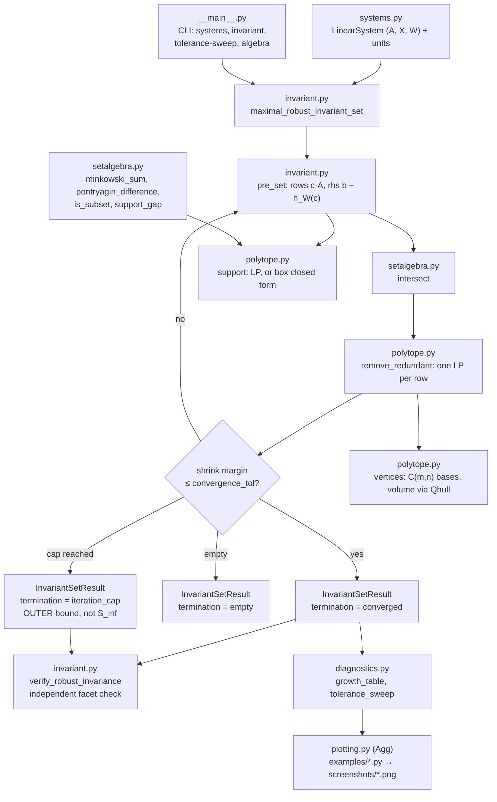
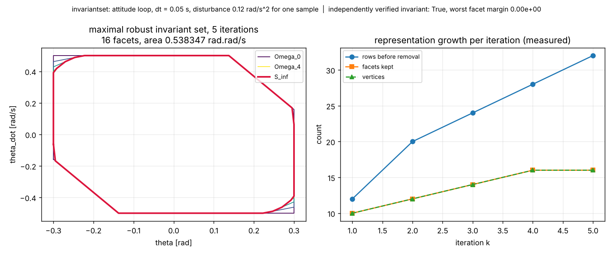
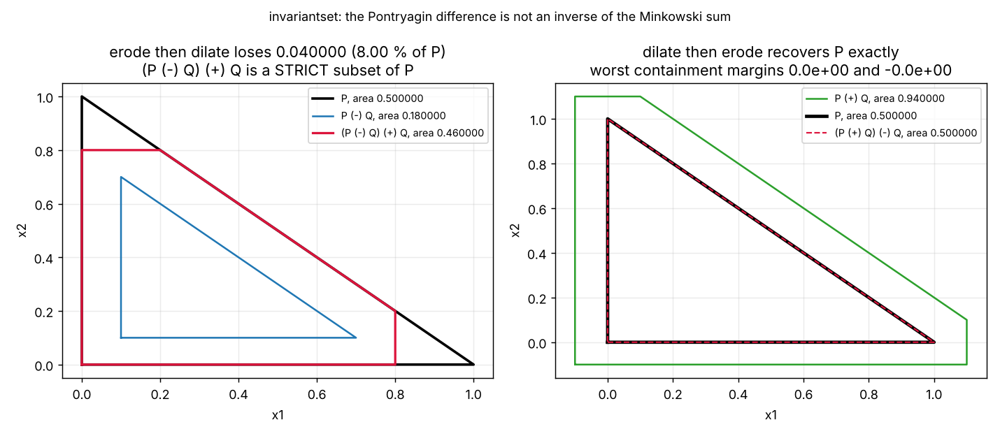
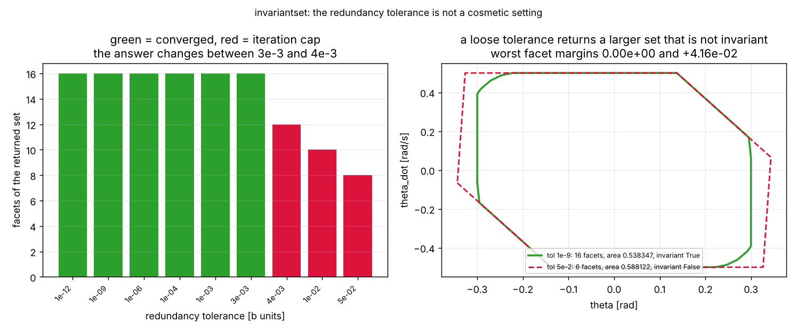
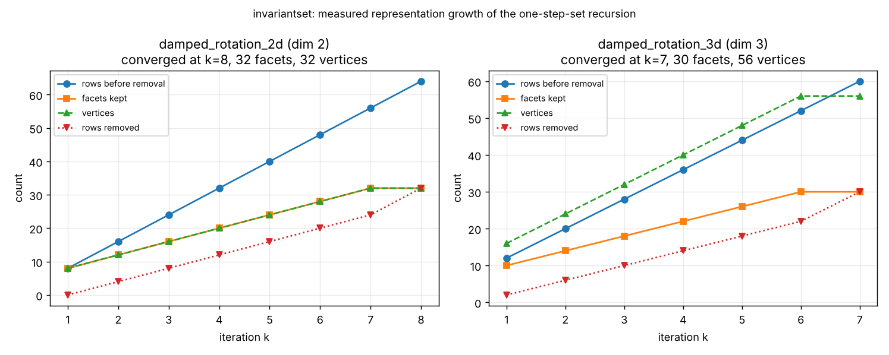
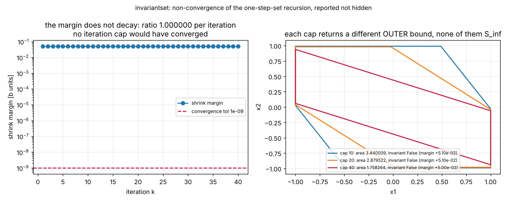

# invariantset

Maximal robust invariant sets for discrete-time linear systems with bounded disturbances.


**Status: TESTING** · Class: compact · Validation level 2 · AI: no ·
Apache-2.0 · © 2026 OPTIMA Organisation

This software is research-grade. It is **not flight-qualified, not certified,
and not approved for operational aerospace use.** It computes a set for the
matrix and disturbance bound you hand it, under a bound that **you declared
and it cannot check**, and it proves nothing about any plant it was not given.

**It computes the MAXIMAL robust invariant set, not the minimal one.** If you
came here for `F_inf = sum_i A^i W` (Raković et al. 2005), this is a different
object and you want a different tool. See "Which set is this" below.

## The problem

You have a discrete-time linear loop, a box of states you are allowed to be
in, and a disturbance bound you are willing to defend in a review. The
question is which initial states you can hold inside that box forever against
every admissible disturbance sequence, and the answer is a polytope you have
to compute rather than assume. The recursion that computes it is four lines
long, and every way it goes wrong — a facet count that grows every iteration,
a loop that never terminates, a redundancy tolerance one digit too large that
silently returns a larger set which is not invariant — is a numerical problem,
not an algebraic one.

## What this does

- **Computes the maximal robust invariant set by the one-step-set recursion**,
  with a declared convergence criterion and an iteration cap. On the shipped
  attitude loop: **5 iterations, 16 facets, 16 vertices, area 0.538347284806
  rad·rad/s, 98.886752 % of the declared constraint set, worst facet margin
  0.000000e+00** (`validation/validate_known_answers.py`).
- **Reports non-convergence instead of returning the last iterate.** On
  `slow_pair` the shrink margin stays between **5.100000e-02 and
  2.730605e-02 over 80 iterations** with a per-iteration ratio of up to
  **1.000000000**: it cannot converge, the result says `iteration_cap`, and
  the CLI exits 2 (`validation/validate_growth_and_stall.py`).
- **Measures where a tolerance changes the answer, because it does.** On the
  attitude loop, `redundancy_tol <= 3e-3` converges to the 16-facet set and
  `4e-3` never converges at all. Bisection puts the threshold at
  **3.6319877e-03**, bracketing the final shrink margin **3.631987773647e-03**
  to ten figures (`validation/validate_tolerance_sensitivity.py`).
- **Verifies every computed set independently**, facet by facet, by support
  function, with no sampling. A loose redundancy tolerance of 5e-2 returns a
  set **9.2459 % larger** than `S_inf` that fails this check by
  **+4.158156e-02**.
- **Gets the set algebra asymmetry right.** `(P ⊖ Q) ⊕ Q ⊆ P` holds; the
  equality everyone assumes does not. Measured on a triangle: areas
  **0.5 → 0.18 → 0.46, an 8.000000 % deficit**. The identity that *is* an
  equality is `(P ⊕ Q) ⊖ Q = P` (`validation/validate_support_algebra.py`).

## Which set is this

| | maximal robust invariant set (this package) | minimal robust positively invariant set |
|---|---|---|
| definition | largest `S ⊆ X` with `A x + W ⊆ S` for all `x ∈ S` | `F_inf = sum_{i>=0} A^i W`, the smallest `S` with `A S ⊕ W ⊆ S` |
| depends on | `A`, `W` **and** the constraint set `X` | `A` and `W` only |
| shrinks when `W` grows | yes, to empty | no, it grows |
| 1-D with `λ=0.8, w=0.1, b=1` | **[-1, 1]**, half-width 1.0 | [-0.5, 0.5], half-width 0.5 |
| reference | Gilbert & Tan 1991; Kolmanovsky & Gilbert 1998 | Raković, Kerrigan, Kouramas & Mayne 2005 |

Both numbers in that last row are asserted in the same test
(`tests/test_known_answers.py`), because a sibling product in this portfolio
wrote its first known-answer test against the wrong one and had to redo it.

## Who it's for

- Someone computing a robust invariant set for a small linear loop in Python
  who wants the pathologies measured rather than hidden.
- Someone who has to write down, for a reviewer, what the tolerances in their
  invariant-set computation actually bought and cost.
- Someone teaching the Minkowski/Pontryagin asymmetry and wanting a worked,
  plotted, hand-checkable example.

## Who it's not for

- Anyone who needs a mature, general polytope library. Use `polytope` or MPT3.
- Anyone above roughly four dimensions, or with a hundred facets. The vertex
  enumeration here is brute force and the redundancy removal is one LP per row
  per iteration.
- Anyone who needs controlled-invariant sets, parametric MPC, zonotopes,
  ellipsoidal sets, reachability of nonlinear systems, or V-representation
  input. None of those is here.
- Anyone wanting a certification artifact. This is Level 2 and has no physical
  validation of any kind.

## Alternatives, honestly

| Alternative | What it does better | When to use this instead |
|---|---|---|
| **`pytope` 0.0.4** (Heirung; numpy, scipy, pycddlib, matplotlib) | V- and H-representation both, linear maps `M P`, Minkowski sum, Pontryagin difference, intersection, plotting, and an outer ε-approximation of the **minimal** RPI set reproducing Raković et al. 2005. Exact vertex enumeration through `cddlib`. Its own README says "Most of pytope is experimental, fragile, largely untested, and buggy." | You want the **maximal** set with a convergence criterion, an iteration cap, a non-convergence report and a measured tolerance sensitivity, and you cannot install a C extension (`pycddlib`). This package is pure NumPy/SciPy. |
| **`polytope` 0.2.5** (TuLiP control project; BSD-3; numpy, scipy, networkx) | A general polytope toolbox for any dimension with a long history, regions, partitions, and optional GLPK through `cvxopt`. Far more mature as a geometry library. | You want the invariant-set recursion itself, with the per-iteration growth table and the tolerance sweep as first-class output rather than something you build on top. |
| **MPT3** (Multi-Parametric Toolbox 3.0; Herceg, Kvasnica, Jones & Morari, ECC 2013, pp. 502–510; MATLAB) | The reference implementation in this field: invariant and reachable sets, parametric MPC, explicit controllers, fast LP/MPLP backends, years of use. Nothing here competes with it. | You do not have MATLAB, or you want a small dependency-light Python component whose numerical behaviour is documented with measurements. |

**If you need a polytope library, use `polytope`. If you need robust MPC, use
MPT3.** What this package adds is the accounting around one recursion: the
growth measured per iteration, the point at which the iteration stalls, and
the tolerance at which the answer changes — none of which the three above
report for you.

None of them is a runtime dependency here. They are citations, not imports.

## Install and first run

```bash
git clone https://github.com/OmAcharya-avtr/invariantset.git
cd invariantset
python -m venv .venv && source .venv/bin/activate
pip install -e ".[test]"
python -m pytest tests/ -q
python examples/maximal_invariant_set_2d.py
```

Expected output of the test run:

```
........................................................................ [ 36%]
........................................................................ [ 72%]
........................................................                 [100%]
200 passed in 57.83s
```

Expected output of the first example (it also writes
`screenshots/maximal_invariant_set_2d.png`):

```
wrote .../screenshots/maximal_invariant_set_2d.png
maximal robust invariant set
  termination        : converged
  iterations         : 5 (cap 50)
  convergence tol    : 1.000e-09
  redundancy tol     : 1.000e-09
  facets of S_inf    : 16
  k  raw  facets  vertices  shrink_margin
  1  12   10      10        3.100000e-02
  2  20   12      12        2.150272e-02
  3  24   14      14        1.250574e-02
  4  28   16      16        3.631988e-03
  5  32   16      16        0.000000e+00
```

## A worked example

`validation/worked_example.py`, run verbatim:

```python
import numpy as np
from invariantset import (Polytope, maximal_robust_invariant_set,
                         minkowski_sum, pontryagin_difference,
                         verify_robust_invariance)

dt = 0.05
A_plant = np.array([[1.0, dt], [0.0, 1.0]])      # ZOH double integrator
B = np.array([[0.5 * dt * dt], [dt]])            # [rad, rad/s] per rad/s^2
K = np.array([[8.0, 3.8]])                       # poles at 0.9 +/- 0.1j
A_cl = A_plant - B @ K

X = Polytope(                                    # |theta|<=0.30 rad,
    np.array([[1, 0], [-1, 0], [0, 1], [0, -1],  # |theta_dot|<=0.50 rad/s,
              [8.0, 3.8], [-8.0, -3.8]], float), # |u| = |K x| <= 3 rad/s^2
    np.array([0.30, 0.30, 0.50, 0.50, 3.0, 3.0]))
W = Polytope.from_box([0.0, 0.0],                # 0.12 rad/s^2 for one sample
                      [0.5 * dt * dt * 0.12, dt * 0.12])

result = maximal_robust_invariant_set(A_cl, X, W, max_iter=50)
print(result.report())
invariant, margin = verify_robust_invariance(A_cl, result.polytope, W)
eroded = pontryagin_difference(result.polytope, W)
reopened = minkowski_sum(eroded, W)
```

Its actual output:

```
maximal robust invariant set
  termination        : converged
  iterations         : 5 (cap 50)
  convergence tol    : 1.000e-09
  redundancy tol     : 1.000e-09
  facets of S_inf    : 16
  k  raw  facets  vertices  shrink_margin
  1  12   10      10        3.100000e-02
  2  20   12      12        2.150272e-02
  3  24   14      14        1.250574e-02
  4  28   16      16        3.631988e-03
  5  32   16      16        0.000000e+00
independently invariant (tol 1e-9): True
worst facet margin [rad or rad/s]: 0.000e+00
area of S_inf [rad.rad/s]        : 0.538347285
area of X     [rad.rad/s]        : 0.544407895
S_inf covers                     : 98.8868 % of X
area of S_inf (-) W              : 0.530850885
area of (S_inf (-) W) (+) W      : 0.538347285
the erode-dilate deficit         : -1.110e-16 (-0.0000 % of S_inf)
```

The last line is zero **on this set**, and that is not the general case: see
the Validation section and `examples/set_algebra_gap.py`, where the same
operation on a triangle loses 8 % of the area.

## Architecture



## Screenshots



The nested iterates contract onto `S_inf` in five steps; notice that the
kept-facet count on the right rises while the pre-removal row count rises
twice as fast, which is what redundancy removal is for.



Left: eroding and re-dilating the triangle returns a strictly smaller set, and
the clipped corners are the missing 8.00 %. Right: dilating and then eroding
returns the triangle exactly, margins 0.0e+00 and -0.0e+00. These are the two
halves of the asymmetry.



Green bars converged, red hit the iteration cap; the colour changes between
3e-3 and 4e-3. On the right, the set a 5e-2 tolerance returns is visibly
outside the correct one and fails the independent invariance check.



In 2-D the vertex and facet curves lie on top of each other; in 3-D the vertex
curve climbs at twice the facet rate. The pre-removal row count is the top
line in both.



The shrink margin is flat on a log axis — it is not approaching the tolerance,
so no cap would have worked. The three outlines on the right are what three
different caps return, all of them outer bounds and none of them `S_inf`.

## Validation evidence

Full tables, hand derivations and raw output in
[validation/VALIDATION.md](validation/VALIDATION.md).

| Check | Reference / method | Result | Tolerance |
|---|---|---|---|
| Box support closed form vs generic LP | `scipy.optimize.linprog` on the same halfspaces | 1000 directions, dims 1–4, worst abs diff **3.552714e-15** | 1e-9 |
| Support function vs explicit vertex enumeration | definition over enumerated vertices | 1800 directions, dims 1–3, worst abs diff **8.881784e-16** | 1e-12 |
| Minkowski additivity `h_{P⊕Q} = h_P + h_Q` | Schneider 1993 | 960 cases, worst abs diff **2.109424e-15** | 1e-9 |
| Subadditivity `h(c1+c2) ≤ h(c1)+h(c2)` | Rockafellar 1970 | 400 cases, worst slack **+8.881784e-16**, marginally the wrong sign | ≤1e-12 |
| 1-D maximal set, `λ=0.8, w=0.1, b=1` | hand: `S_inf = X` since `b ≥ w/(1−λ) = 0.5` | length **2.000000000000**, k=1, margin **−0.1 exactly** | 1e-12 |
| 1-D emptiness, `λ=0.9, w=0.2, b=1` | hand closed form `r_k = 2 − (10/9)^k` | empty at **k = 7**; 6 half-widths match to **≤1.665e-16** | 1e-12 |
| 2-D singular `A = [[0,1],[0,0]]` | hand trace, 4 facets, area `2 × 1.8` | **3.600000000000**, k=2, margin **0 exactly** | 1e-9 |
| Attitude loop `S_inf` | one-step-set recursion + independent facet check | **5 iter, 16 facets, 16 vertices, area 0.538347284806 rad·rad/s, 98.886752 % of X**, margin **0.000000e+00** | 1e-9 |
| `X` itself robustly invariant? | same independent check | **No**, margin **+3.100000e-02** — the recursion is needed | — |
| **Redundancy tolerance changes the answer** | sweep 0 → 5e-2, `max_iter = 60` | **converged (16 facets) up to 3e-3; never converges from 4e-3**; threshold bisected to **3.6319877e-03** | — |
| **A loose tolerance returns a non-invariant set** | `redundancy_tol = 5e-2`, cap 400 | 6 facets, area **0.588122298 (+9.2459 %)**, independent check **FAILS** at **+4.158156e-02** | — |
| **Convergence tolerance costs guarantee** | `convergence_tol = 5e-3` | stops at k=4, 14 facets, independent check **FAILS** at **+3.631988e-03** | — |
| **Strict invariance check reads False on a correct maximal set** | `tol = 0` default | `damped_rotation_2d` **+2.220446e-16**, `damped_rotation_3d` **+1.110223e-16** — one ulp, reported not tuned away | — |
| Facet growth, 2-D | counted per iteration | raw rows **8k**, facets **4(k+1)**, vertices = facets; 8 → 32 facets over 8 iterations | — |
| Vertex growth, 3-D | counted per iteration | facets **6+4k**, vertices **8+8k**; vtx/facet **1.3333 → 1.8667** | — |
| **Non-convergence, `slow_pair`** | 80 iterations | margin ratio up to **1.000000000**, caps 10/20/40/80 return **four different** outer bounds, all with positive margin | — |
| `(P⊖Q)⊕Q ⊆ P` | support function on facet normals | 120 pairs, worst escape **+2.220446e-16** | ≤1e-9 |
| `(P⊖Q)⊕Q = P` | the identity people assume | **FALSE**: triangle 0.5 → 0.46, deficit **0.04 = 8.000000 %** | — |
| `(P⊕Q)⊖Q = P` | Kolmanovsky & Gilbert 1998 | **holds**, 120 pairs, worst margin **+2.442491e-15** | 1e-9 |
| Redundancy removal preserves membership | pointwise comparison | 4000 points, 200 polytopes, **0 mismatches**, 207 rows removed | exact |

## API reference

<details>
<summary><code>invariantset.Polytope</code> — H-representation <code>{x : A x ≤ b}</code></summary>

| Member | Returns | Notes |
|---|---|---|
| `Polytope(A, b)` | — | `A` shape (m, n) in state⁻¹, `b` shape (m,) in `A x` units |
| `Polytope.from_box(center, half_widths)` | `Polytope` | enables the closed-form support function |
| `Polytope.from_bounds(lower, upper)` | `Polytope` | elementwise, state units |
| `Polytope.unit_box(dim, radius=1.0)` | `Polytope` | centred box |
| `.A`, `.b`, `.dim`, `.n_halfspaces`, `.is_box` | — | read-only views |
| `.support(c)` | float, units of `cᵀx` | `sup_{x∈P} cᵀx`; raises on unbounded or empty |
| `.support_many(C)` | ndarray (k,) | one per row of `C` |
| `.contains(x, tol=1e-9)` | bool | `tol` in `b` units |
| `.is_empty(tol=1e-9)` | bool | LP feasibility |
| `.is_bounded()` | bool | exact, `2n` LPs |
| `.remove_redundant(tol=1e-9)` | `Polytope` | one LP per row; **`tol` changes answers** |
| `.normalised()` | `Polytope` | unit row norms, same set |
| `.vertices(tol=1e-9, max_bases=200000)` | ndarray (v, n) | brute force `C(m, n)`; raises above the budget |
| `.volume(tol=1e-9)` | float, (state unit)ⁿ | interval length in 1-D, Qhull otherwise |

</details>

<details>
<summary><code>invariantset</code> — set algebra and the recursion</summary>

| Function | Returns | Notes |
|---|---|---|
| `intersect(P, Q)` | `Polytope` | stacks halfspaces, exact |
| `pontryagin_difference(P, Q)` | `Polytope` | `{x : x + Q ⊆ P}`, exact in H-form; may be empty |
| `minkowski_sum(P, Q, tol=1e-9)` | `Polytope` | vertex enumeration + Qhull; both must be bounded |
| `is_subset(Q, P, tol=1e-9)` | (bool, float) | exact; the float is `max_i (h_Q(a_i) − b_i)` in `b` units |
| `support_gap(P, Q, directions)` | ndarray | `h_Q(c) − h_P(c)` per row |
| `pre_set(A, S, W)` | `Polytope` | `{x : A x + W ⊆ S}`; handles degenerate rows from singular `A` |
| `maximal_robust_invariant_set(A, X, W, *, max_iter=50, convergence_tol=1e-9, redundancy_tol=1e-9, track_geometry=True, vertex_budget=200000)` | `InvariantSetResult` | the recursion |
| `verify_robust_invariance(A, S, W, tol=0.0)` | (bool, float) | independent facet check; **default is strict on purpose** |
| `growth_table(result)` | `list[GrowthRow]` | per-iteration counts and ratios |
| `tolerance_sweep(A, X, W, tolerances, *, max_iter=60, convergence_tol=1e-9)` | `list[ToleranceRow]` | the same problem once per tolerance |
| `get_system(name)`, `system_names()` | `LinearSystem`, `list[str]` | eight built-in fixtures |

`InvariantSetResult` carries `termination` (`"converged"`, `"empty"`,
`"iteration_cap"`), `converged`, `iterations`, `polytope` (`None` when empty;
an **outer bound** when the cap was hit), `history`, the two tolerances, and
`report()`.

</details>

<details>
<summary>CLI — <code>python -m invariantset</code></summary>

```
python -m invariantset systems [--json]
python -m invariantset invariant --system NAME [--max-iter N]
       [--convergence-tol T] [--redundancy-tol T] [--no-geometry] [--json]
python -m invariantset tolerance-sweep --system NAME [--tolerances T ...]
       [--max-iter N] [--json]
python -m invariantset algebra [--json]
```

`invariant` exits **0** on `converged` or `empty` and **2** when the recursion
hit the iteration cap, so a build can treat non-convergence as a failure.
Raw transcripts of every subcommand: `validation/validate_cli_output.txt`.

</details>

## Limitations

1. **No physical validation.** Level 2. The attitude loop is an illustrative
   model with chosen numbers (`dt = 0.05 s`, poles `0.9 ± 0.1j`, `0.12 rad/s²`
   of unmodelled acceleration) and is not a measurement of any vehicle.
2. **The recursion is not guaranteed to terminate**, and two shipped systems
   do not. `slow_pair` holds a shrink-margin ratio of up to 1.000000000 over
   80 iterations; `A = R(0.3 rad)` with eigenvalues on the unit circle is
   still shrinking at cap 60. In both cases the returned polytope is an
   **outer bound** on `S_inf`, is **not** invariant, and **depends on the
   cap** — caps 10, 20, 40 and 80 give four different sets.
3. **The redundancy tolerance changes the answer.** Measured threshold on the
   attitude loop: converges at 3.631987710483e-03, fails at
   3.631987802684e-03. The safe tolerance is below the smallest per-iteration
   shrink margin, which decays geometrically, so **no fixed default is safe
   for every system**. Run `tolerance-sweep` on your own problem.
4. **The convergence tolerance is a slack on the guarantee, not on the
   arithmetic.** At `convergence_tol = 5e-3` the returned set violates
   invariance by 3.631988e-03 in `b` units, which on the `theta` facet is
   3.63e-3 rad of constraint it does not hold.
5. **The strict invariance check reports `False` on correct maximal sets.** A
   maximal set has zero margin by definition, so floating point lands on
   either side: `damped_rotation_2d` at +2.220446e-16 and
   `damped_rotation_3d` at +1.110223e-16 both fail the `tol = 0` test and
   pass at `tol = 1e-9`.
6. **Vertex enumeration is brute force**, `C(m, n)` square solves. 4-D with 40
   rows is 91,390 bases and runs; 5-D with 40 rows is 658,008 and is refused
   above the default `max_bases = 200000`. `minkowski_sum` inherits this
   limit, since there is no exact halfspace formula for the sum.
7. **Facet counts grow linearly and vertex counts faster.** Measured: raw rows
   `8k` in 2-D before removal, facets `+4` per iteration in both 2-D and 3-D,
   vertices `+4` per iteration in 2-D and `+8` in 3-D. Redundancy removal is
   one LP per row per iteration, so cost grows quadratically in the iteration
   count.
8. **Only H-representation input, only autonomous systems.** No
   V-representation constructor, no controlled-invariant sets, no
   parameter-dependent `A`, no zonotopes, no ellipsoids, no nonlinear
   dynamics.
9. **Dimensions 1 to 4 only, in evidence.** Nothing above dimension 4 or above
   roughly 60 facets has been measured.
10. **Timings are software measurements on two contended cores**, not hardware
    characteristics. Counts, not seconds, are the numbers to quote.
11. **No comparison against `pytope`, `polytope` or MPT3 outputs.** None is
    installed here; the alternatives table describes their published metadata
    and claims no measured numerical agreement.

## Hardware requirements

Any machine that runs CPython 3.11+ with NumPy and SciPy. Everything in this
repository was produced on **two shared, contended CPU cores** with under
1 GiB of resident memory. There is no GPU path, no compiled extension and no
hardware-in-the-loop component.

## Reproducing every number

See [validation/VALIDATION.md](validation/VALIDATION.md) section 11 for the
exact command list. In short:

```bash
python -m pytest tests/ -q --junit-xml=junit.xml
ruff check src/ tests/ examples/ validation/
python validation/validate_environment.py
python validation/validate_support_algebra.py
python validation/validate_known_answers.py
python validation/validate_growth_and_stall.py
python validation/validate_tolerance_sensitivity.py
python validation/validate_cli.py
python validation/worked_example.py
MPLBACKEND=Agg python examples/maximal_invariant_set_2d.py
MPLBACKEND=Agg python examples/set_algebra_gap.py
MPLBACKEND=Agg python examples/tolerance_sensitivity.py
MPLBACKEND=Agg python examples/iteration_growth.py
MPLBACKEND=Agg python examples/non_convergence.py
```

## Roadmap

No dates are promised. In rough order of usefulness: an exact finite-precision
redundancy test that does not need a tolerance; a `max_iter` chosen from the
measured margin ratio rather than by the caller; support for controlled
invariance (`A x + B u + w`); and V-representation input so a user can hand in
vertices without converting by hand.

## Safety statement

This software is research-grade. It is **not flight-qualified, not certified,
and not approved for operational aerospace use.** It computes a robust
invariant set for the discrete-time linear system it is given, under the
disturbance bound it is told to assume, and it proves nothing whatsoever about
any system it was not given. Every statement it makes is conditional on a
bound you declared and it cannot check.

## Licence

Apache-2.0. Copyright © 2026 OPTIMA Organisation. See [LICENSE](LICENSE).

## Credits

This is under reserved rights obtained by OPTIMA Organisation.

## Citation

```bibtex
@software{invariantset2026,
  title  = {invariantset: maximal robust invariant sets for discrete-time
            linear systems},
  author = {Acharya, Om},
  year   = {2026},
  version = {0.1.0},
  license = {Apache-2.0},
  url    = {https://github.com/OmAcharya-avtr/invariantset}
}
```

See `CITATION.cff`. The theory this implements is due to the authors cited in
[validation/VALIDATION.md](validation/VALIDATION.md) section 9, not to this
package.
