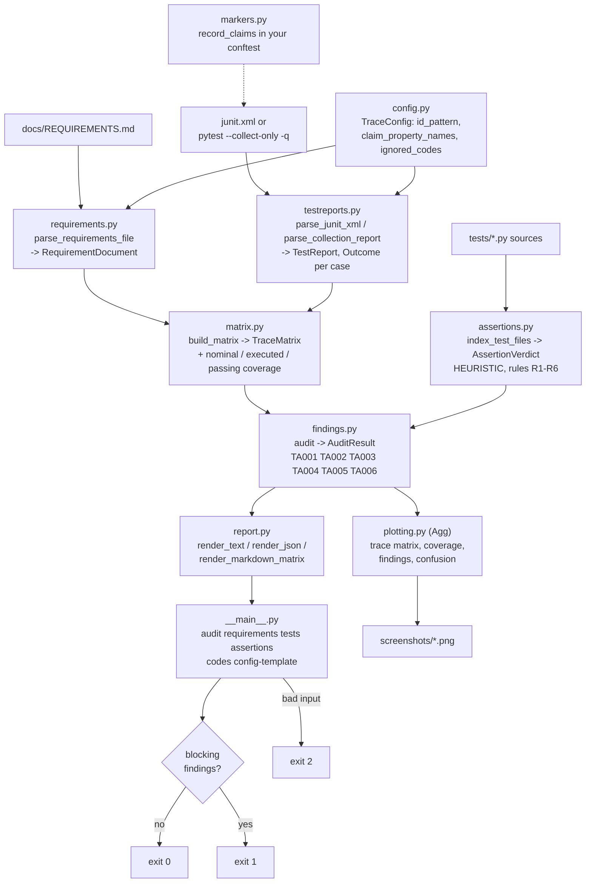
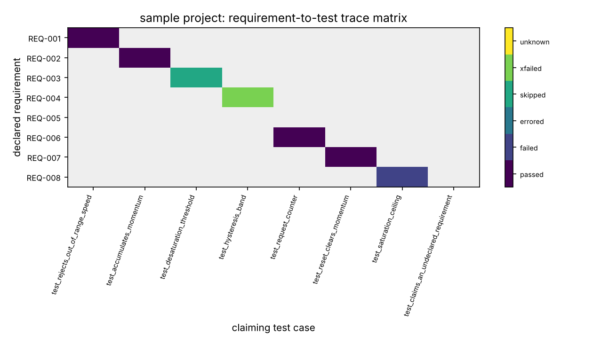
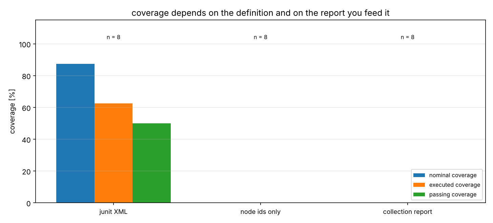
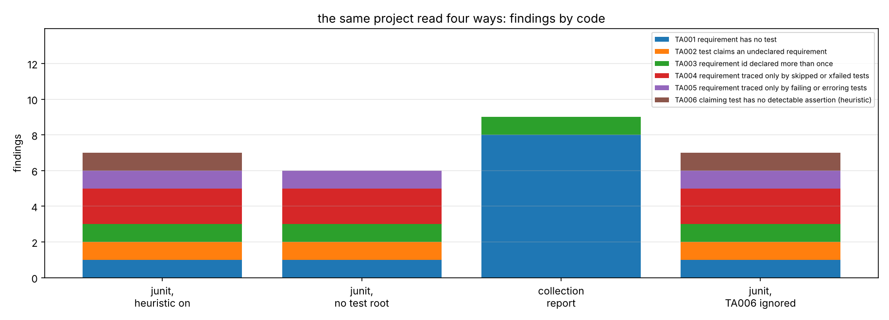
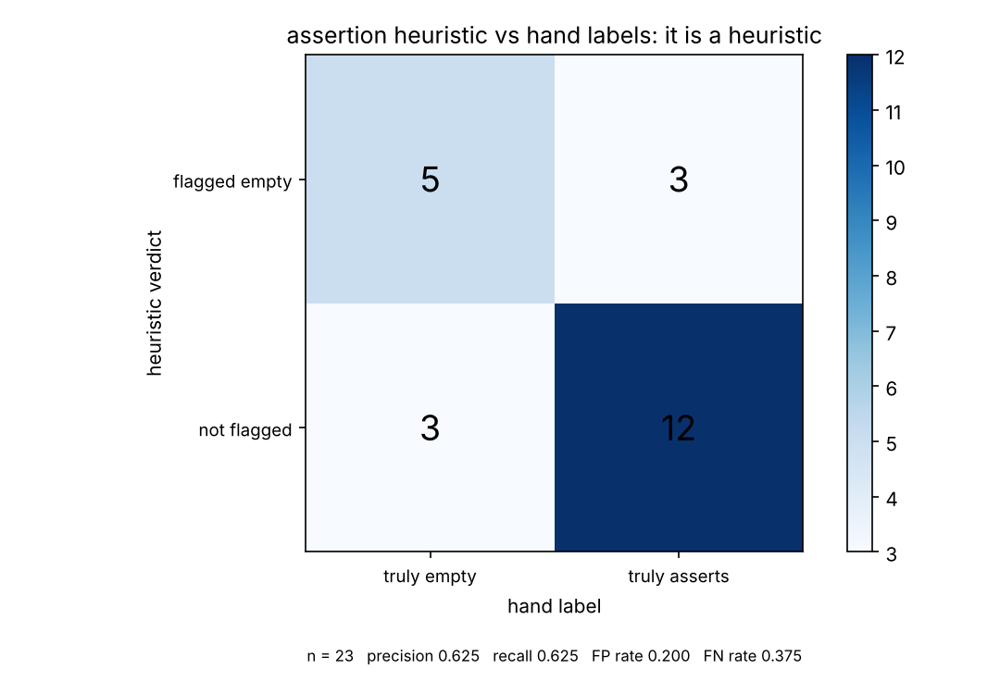

# traceaudit

Requirements-to-test traceability computed from a repository, with a non-zero exit on any finding.


**Status: TESTING** · Class: compact · Validation level 1 · AI: no ·
Apache-2.0 · © 2026 OPTIMA Organisation

This software is research-grade. It is **not flight-qualified, not certified,
and not approved for operational aerospace use.** It is **not a DO-178C or
ARP4754A compliance tool**, it produces no certification artifact, and nothing
it prints is evidence that anything has been verified.

**Read this before anything else.** Traceability is a **necessary bookkeeping
condition and not evidence of adequacy.** A requirement traced to a test that
asserts nothing is still traced, and this tool will report it as covered. It
checks that the paperwork closes. It does not and cannot check that the tests
are any good. There is a heuristic here that tries to flag empty tests, and it
is wrong about one asserting test in five — the measured numbers are below.

## The problem

You have a requirements document with numbered clauses and a test suite that
is supposed to exercise them, and the mapping between the two lives in a
spreadsheet somebody updates by hand after the fact. The question a reviewer
asks is not "what is the coverage percentage" but "which requirement has no
test, which test claims a requirement that was deleted two releases ago, and
which requirement is traced only to a test that has been skipped since March".
Those three are computable from the repository itself, and a number maintained
by hand is wrong by the time it is read.

## What this does

- **Computes the bidirectional mapping** between requirement ids parsed out of
  markdown and test cases parsed out of a junit XML report or a pytest
  collection report. On the bundled sample project: **9 declarations, 8 unique
  ids, 8 test cases, 7 traced requirements** (`validation/validate_parsers.py`).
- **Reports six finding codes with a non-zero exit**: untraced requirement,
  undeclared claim, duplicate id, requirement traced only by skipped or
  xfailed tests, requirement traced only by failing tests, and a heuristic
  empty-assertion flag. On the sample project: **7 findings, exit status 1**
  (`validation/validate_findings.py`).
- **Reports three coverage figures, each with its denominator printed.** On the
  sample project: nominal **7/8 = 87.5000 %**, executed **5/8 = 62.5000 %**,
  passing **4/8 = 50.0000 %**. Quoting the first alone overstates the third by
  **37.5000 percentage points** (`validation/validate_coverage.py`).
- **Audits itself.** Run against this repository's own `docs/REQUIREMENTS.md`
  and its own junit XML: **26 declared requirements, 236 test cases, 26/26 =
  100.0000 % on all three figures, 0 findings, exit status 0**
  (`validation/validate_self_trace.py`).
- **Flags tests that appear to assert nothing, and tells you how often that is
  wrong.** On a 23-function hand-labelled corpus: precision **0.625000**,
  recall **0.625000**, false-positive rate **0.200000**, false-negative rate
  **0.375000** (`validation/validate_heuristic.py`).
- **No runtime dependencies.** `re`, `ast`, `xml.etree.ElementTree`, `json`,
  `argparse`. Matplotlib is an optional extra used only by the figures.

## Who it's for

- Someone with a numbered requirements document and a pytest suite, who wants
  the untraced items listed in CI rather than discovered in a review.
- Someone who has to defend a coverage number and needs its denominator and
  definition stated in the same breath.
- Someone who suspects a requirement is traced only to a test that has been
  skipped for months, and wants that specific case named.

## Who it's not for

- Anyone who needs **requirements management** — editing, versioning, review
  state, parent/child links, suspect-link tracking, ReqIF import or export.
  Use **Doorstop** or **StrictDoc**. This tool reads a document and never
  writes one.
- Anyone who needs **traceability inside published documentation**, with
  requirement objects, filters, tables and diagrams rendered into a site. Use
  **sphinx-needs** with **sphinx-test-reports**.
- Anyone who wants evidence that their tests are adequate. This tool cannot
  give you that, and the one check that gestures at it is wrong about 20 % of
  asserting tests.
- Anyone who needs a certification artifact, a DO-178C objective mapping, or
  anything a qualified tool would be used for. Nothing here is qualified for
  anything.
- Anyone whose requirements are not numbered, or are in a format where an id
  does not start a line. The declaration pattern is configurable, but the model
  is line-oriented and that is a real limit.

## Alternatives, honestly

Every package below was checked on PyPI on **2026-10-10** over the JSON API
(`https://pypi.org/pypi/<name>/json`), and the wheels of the first three were
downloaded and unpacked before being described here. The verification method
and what was found are in [validation/VALIDATION.md](validation/VALIDATION.md)
section 8.

| Alternative | Version seen | What it does better | When to use this instead |
|---|---|---|---|
| **`doorstop` 3.2** (LGPL-3.0; 110 releases) | 3.2 | A requirements **management** system: items as YAML under version control, parent/child document trees, link validation, suspect-link detection by fingerprint, external reference resolution through the VCS, review state, a CLI, a GUI, a server, and publishers for HTML, Markdown, LaTeX and text. Everything about owning the requirements rather than reading them. | You already have a plain markdown document and a junit report and want the mapping computed from them. `doorstop` 3.2 ships **no junit XML parsing at all** — a grep of the installed wheel for `junit` returns nothing — so it cannot tell you that a requirement is traced only by a skipped test. |
| **`sphinx-needs` 8.5.0** + **`sphinx-test-reports` 2.0.0** (useblocks) | 8.5.0 / 2.0.0 | The mature answer to this problem. `sphinx-needs` gives typed need objects, links, filters, tables, flow diagrams, constraints, schemas and a configurable warnings mechanism inside your documentation build; `sphinx-test-reports` ingests junit XML (it ships a `JUnit.xsd`) and a pytest plugin, and links test results to needs. Together they do everything here and a great deal more, rendered. | You do not have a Sphinx build and do not want one. This is a single command over two files with no site generator, no extensions and no runtime dependencies, and it exits non-zero in CI. If you are already on Sphinx, **use sphinx-needs and sphinx-test-reports and stop reading here.** |
| **`pytest-requirements` 0.3.1** | 0.3.1 | Provides exactly the marker-to-junit mechanism this tool reads: `@pytest.mark.verifies_requirement("B-DPPS-0123")` is written into the junit XML as `<property name="requirement_id" .../>`, with Allure labels too. Smaller and better scoped than anything here for the recording half. | It records claims and does not analyse them: there is no requirements-document parser and no reporting of untraced requirements. The two compose — this tool reads the `requirement_id` property by default, so a project already using `pytest-requirements` needs no change. |
| **`strictdoc` 0.30.2** | 0.30.2 | Full technical-documentation and requirements management: its own grammar, HTML and PDF export, ReqIF, a web interface, traceability between documents and source code. | Same reason as `doorstop`: this is a linter over files you already have, not a system to move your requirements into. |
| **`pytest` markers alone** | pytest 9.1.1 | Already installed, already how most projects record the link, zero new concepts. With `-m "verifies"` you can select the marked tests. | A marker tells you what a test claims. It cannot tell you what **no** test claims, which is the half of the question that matters, and `pytest` has no notion of your requirements document. |
| **Commercial requirements tools** (IBM DOORS Next, Polarion, Jama Connect, codeBeamer) | not verified | Everything: baselining, electronic signatures, impact analysis, variant management, formal review workflows, audit trails, qualification evidence packages, and vendor support you can put in a contract. This is not a comparison, it is a different category. | You are a small team with a markdown file in git and no budget, and you want the four or five bookkeeping defects listed in CI. Nothing in this repository is a substitute for any of those products, and no output of it should be presented as one. |

**If you are on Sphinx, use `sphinx-needs` with `sphinx-test-reports`. If you
want to manage requirements rather than read them, use `doorstop` or
`strictdoc`.** None of these is a runtime dependency here; they are citations,
not imports.

## Install and first run

```bash
git clone https://github.com/OmAcharya-avtr/traceaudit.git
cd traceaudit
python -m venv .venv && source .venv/bin/activate
pip install -e ".[test]"
python -m pytest tests/ -q
python examples/audit_sample_project.py
```

Expected output of the test run:

```
........................................................................ [ 30%]
........................................................................ [ 61%]
........................................................................ [ 91%]
....................                                                     [100%]
236 passed in 6.46s
```

The wall-clock figure moves by 10 to 40 % between runs on this container's two
contended cores. **The count does not, and the count is the number to read.**
It is measured from junit XML, not from that line — see Limitations.

Expected output of the first example (it also writes
`screenshots/trace_matrix.png`):

```
traceaudit report
  requirements document : docs/REQUIREMENTS.md
  test report           : junit.xml (junit-xml)
  declarations parsed   : 9 (8 unique ids)
  test cases parsed     : 8 (passed 5, failed 1, errored 0, skipped 1, xfailed 1, unknown 0)
  claiming test cases   : 8

coverage, with denominators stated
  nominal coverage: 7/8 = 87.5000 %
      definition: requirements with >=1 claiming test of any outcome
  executed coverage: 5/8 = 62.5000 %
      definition: requirements with >=1 claiming test that actually ran
  passing coverage: 4/8 = 50.0000 %
      definition: requirements with >=1 claiming test that passed

requirement -> tests
  REQ-001    tests/test_monitor.py::test_rejects_out_of_range_speed  [passed]
  REQ-002    tests/test_monitor.py::test_accumulates_momentum  [passed]
  REQ-003    tests/test_monitor.py::test_desaturation_threshold  [skipped]
  REQ-004    tests/test_monitor.py::test_hysteresis_band  [xfailed]
  REQ-005    -
  REQ-006    tests/test_monitor.py::test_request_counter  [passed]
  REQ-007    tests/test_monitor.py::test_reset_clears_momentum  [passed]
  REQ-008    tests/test_monitor.py::test_saturation_ceiling  [failed]

findings
  TA001 REQ-005                      no test claims this requirement  (docs/REQUIREMENTS.md:32)
  TA002 REQ-042                      claimed by tests/test_monitor.py::test_claims_an_undeclared_requirement, but no declaration exists
  TA003 REQ-007                      declared 2 times: docs/REQUIREMENTS.md:40, docs/REQUIREMENTS.md:54  (docs/REQUIREMENTS.md:40)
  TA004 REQ-003                      every claiming test was skipped or xfailed: tests/test_monitor.py::test_desaturation_threshold [skipped]  (docs/REQUIREMENTS.md:22)
  TA004 REQ-004                      every claiming test was skipped or xfailed: tests/test_monitor.py::test_hysteresis_band [xfailed]  (docs/REQUIREMENTS.md:27)
  TA005 REQ-008                      every claiming test failed or errored: tests/test_monitor.py::test_saturation_ceiling [failed]  (docs/REQUIREMENTS.md:44)
  TA006 tests/test_monitor.py::test_request_counter no assertion detected in test_request_counter: no assert, no pytest.raises, no assert* call  (tests/test_monitor.py:42)  [heuristic]

summary by code
  TA001    1  requirement has no test
  TA002    1  test claims an undeclared requirement
  TA003    1  requirement id declared more than once
  TA004    2  requirement traced only by skipped or xfailed tests
  TA005    1  requirement traced only by failing or erroring tests
  TA006    1  claiming test has no detectable assertion (heuristic)

7 finding(s), 7 blocking; exit status 1
NOTE: traceability is a necessary bookkeeping condition, not evidence of adequacy: a requirement traced to a test that asserts nothing is still traced.

wrote screenshots/trace_matrix.png
the CLI would exit 1 on this input
```

To audit **this repository against its own requirements**, which is the second
worked example:

```bash
python -m pytest tests/ -q --junitxml=junit.xml
python -m traceaudit audit -r docs/REQUIREMENTS.md -t junit.xml --test-root tests
```

```
traceaudit report
  requirements document : docs/REQUIREMENTS.md
  test report           : junit.xml (junit-xml)
  declarations parsed   : 26 (26 unique ids)
  test cases parsed     : 236 (passed 236, failed 0, errored 0, skipped 0, xfailed 0, unknown 0)
  claiming test cases   : 236

coverage, with denominators stated
  nominal coverage: 26/26 = 100.0000 %
      definition: requirements with >=1 claiming test of any outcome
  executed coverage: 26/26 = 100.0000 %
      definition: requirements with >=1 claiming test that actually ran
  passing coverage: 26/26 = 100.0000 %
      definition: requirements with >=1 claiming test that passed

findings
  none

summary by code
  TA001    0  requirement has no test
  TA002    0  test claims an undeclared requirement
  TA003    0  requirement id declared more than once
  TA004    0  requirement traced only by skipped or xfailed tests
  TA005    0  requirement traced only by failing or erroring tests
  TA006    0  claiming test has no detectable assertion (heuristic)

0 finding(s), 0 blocking; exit status 0
NOTE: traceability is a necessary bookkeeping condition, not evidence of adequacy: a requirement traced to a test that asserts nothing is still traced.
```

**That clean run means the bookkeeping closes. It does not mean the 26
statements in `docs/REQUIREMENTS.md` are true.**

## A worked example

`validation/worked_example.py`, run verbatim:

```python
from traceaudit import (
    audit,
    parse_junit_xml,
    parse_requirements_file,
    render_markdown_matrix,
)

project = ROOT / "fixtures" / "sample_project"

document = parse_requirements_file(project / "docs" / "REQUIREMENTS.md",
                                   relative_to=project)
report = parse_junit_xml(project / "junit.xml", relative_to=project)
result = audit(document, report, test_root=project / "tests")

print(f"declared ids      : {result.matrix.n_requirements}")
print(f"test cases        : {len(result.report.cases)}")
for figure in result.coverage:
    print(f"{figure.label:<18s}: {figure.numerator}/{figure.denominator} "
          f"= {figure.percent:.4f} %")
print()
for finding in result.findings:
    print(finding.render())
print()
print(f"exit status the CLI would use: {result.exit_code}")
print()
print(render_markdown_matrix(result))
```

Its actual output (`validation/worked_example_output.txt`):

```
declared ids      : 8
test cases        : 8
nominal coverage  : 7/8 = 87.5000 %
executed coverage : 5/8 = 62.5000 %
passing coverage  : 4/8 = 50.0000 %

TA001 REQ-005                      no test claims this requirement  (docs/REQUIREMENTS.md:32)
TA002 REQ-042                      claimed by tests/test_monitor.py::test_claims_an_undeclared_requirement, but no declaration exists
TA003 REQ-007                      declared 2 times: docs/REQUIREMENTS.md:40, docs/REQUIREMENTS.md:54  (docs/REQUIREMENTS.md:40)
TA004 REQ-003                      every claiming test was skipped or xfailed: tests/test_monitor.py::test_desaturation_threshold [skipped]  (docs/REQUIREMENTS.md:22)
TA004 REQ-004                      every claiming test was skipped or xfailed: tests/test_monitor.py::test_hysteresis_band [xfailed]  (docs/REQUIREMENTS.md:27)
TA005 REQ-008                      every claiming test failed or errored: tests/test_monitor.py::test_saturation_ceiling [failed]  (docs/REQUIREMENTS.md:44)
TA006 tests/test_monitor.py::test_request_counter no assertion detected in test_request_counter: no assert, no pytest.raises, no assert* call  (tests/test_monitor.py:42)  [heuristic]

exit status the CLI would use: 1

| requirement | title | tests | outcomes |
|---|---|---|---|
| REQ-001 | Wheel speed input validation | tests/test_monitor.py::test_rejects_out_of_range_speed | passed |
| REQ-002 | Momentum accumulation | tests/test_monitor.py::test_accumulates_momentum | passed |
| REQ-003 | Desaturation threshold | tests/test_monitor.py::test_desaturation_threshold | skipped |
| REQ-004 | Hysteresis | tests/test_monitor.py::test_hysteresis_band | xfailed |
| REQ-005 | Telemetry record | none | - |
| REQ-006 | Request counter | tests/test_monitor.py::test_request_counter | passed |
| REQ-007 | Reset behaviour | tests/test_monitor.py::test_reset_clears_momentum | passed |
| REQ-008 | Saturation ceiling | tests/test_monitor.py::test_saturation_ceiling | failed |
```

## How a test claims a requirement

Two mechanisms, both configurable, both off nothing by default.

**junit properties.** Any `<property>` named `requirement_id`, `requirements`
or `requirement` on a `<testcase>`. This is what `pytest-requirements` 0.3.1
writes, so that plugin works unchanged. To emit them without a plugin, put
this in `conftest.py` — it is what this repository's own suite does:

```python
import pytest
from traceaudit.markers import record_claims

def pytest_configure(config):
    config.addinivalue_line("markers", "verifies(req_id): requirement this test verifies")

@pytest.hookimpl(tryfirst=True)
def pytest_runtest_setup(item):
    record_claims(item)
```

and then `@pytest.mark.verifies("REQ-003")` on the test. `tryfirst=True`
matters: without it the skipping plugin runs first and a skipped test records
no claim.

**The node id.** `REQ[-_ ]?(\d{3})` is matched against the node id, so
`tests/test_REQ_014.py::test_margin` claims `REQ-014`. Case sensitive, and
disabled with `claim_from_node_id: false`.

## Architecture



## Screenshots



The grey row is REQ-005, which no test claims: finding TA001 is an empty row.
The rightmost column has no cell at all — that test claims REQ-042, which is
not declared, so it maps to nothing: finding TA002. The teal and green cells
are the skipped and xfailed tests that make REQ-003 and REQ-004 look covered.



Left group: the same eight requirements and the same eight tests read three
ways, 87.5 / 62.5 / 50 %. Middle and right: with claims taken only from node
ids, or from a collection report that carries no properties at all, every
figure collapses to zero. The denominator `n = 8` is printed over each group
because a coverage bar without one is decoration.



Four readings of one project. Withholding `--test-root` removes exactly the
heuristic finding and nothing else. The collection report loses TA004 and
TA005 — it carries no outcomes — and gains six TA001, because it carries no
claims either: it looks *worse*, which is honest, since it knows less.
`--ignore TA006` keeps the finding visible and drops it from the exit status.



The assertion heuristic against 23 hand labels. The two off-diagonal cells are
the point of the figure: three asserting tests wrongly flagged and three empty
tests missed, out of 23. This is the check you should not trust.

## Finding codes

```
TA001  requirement has no test
TA002  test claims an undeclared requirement
TA003  requirement id declared more than once
TA004  requirement traced only by skipped or xfailed tests
TA005  requirement traced only by failing or erroring tests
TA006  claiming test has no detectable assertion (heuristic)  [heuristic]
```

Any code can be moved out of the exit-status calculation with
`--ignore CODE`; it is still printed, marked `ignored`.

## Validation evidence

Full tables, hand derivations and raw output in
[validation/VALIDATION.md](validation/VALIDATION.md). **Validation level 1**:
every check is against hand-constructed text, hand-counted fixtures and hand
labels. There is no physical reference a text-and-id linter can be validated
against, which is exactly why the level is 1 — see "On the Level 1 label"
below.

| Check | Reference / method | Result | Tolerance |
|---|---|---|---|
| Declarations in the sample document | hand count of the fixture | **9 declarations, 8 unique ids, 1 duplicated id** | exact |
| Declarations in this package's own document | hand count, REQ-001..REQ-026 | **26 declarations, 26 unique, 0 duplicates** | exact |
| Mid-sentence id is not a declaration | purpose-built document | REQ-005 mentioned mid-line, **not declared** | exact |
| Fenced code block excluded, and included when configured | same | **excluded by default, included at `skip_code_fences: false`** | exact |
| junit outcome classification | pytest 9.1.1 output, hand count | **5 passed, 1 failed, 0 errored, 1 skipped, 1 xfailed** | exact |
| junit header vs counted outcomes | `<testsuite skipped="2">` against the cases | **1 skipped + 1 xfailed = 2**, agrees | exact |
| Collection report parses to the same node ids | byte comparison of the id lists | **8 of 8 identical**, all outcomes `unknown` | exact |
| Findings on the sample project | hand enumeration | **TA001 1, TA002 1, TA003 1, TA004 2, TA005 1, TA006 1; total 7; exit 1** | exact |
| Coverage, hand arithmetic | denominator 8 unique ids | **7/8, 5/8, 4/8 = 87.5000 / 62.5000 / 50.0000 %** | exact |
| Nominal overstates passing | same fixture | **37.5000 percentage points** | exact |
| Coverage chain `nominal >= executed >= passing` | 2000 random inputs, seed 60011 | **0 violations**; 822 of 2000 had a strict gap | exact |
| Zero denominator | empty document | reported **undefined**, not 0 % and not 100 % | exact |
| Self-audit of this repository | live pytest run, junit XML | **26/26 on all three figures, 0 findings, exit 0** | exact |
| Test count from junit XML | `<testsuite>` attributes | **tests 236, failures 0, errors 0, skipped 0** | exact |
| Committed fixtures are regenerable | re-run the generator into a scratch directory | **byte-identical, 2513 and 401 bytes** | exact |
| **Assertion heuristic, precision** | 23 hand-labelled functions | **0.625000** — 3 of 8 flags are wrong | — |
| **Assertion heuristic, recall** | same | **0.625000** — 3 of 8 empty tests are missed | — |
| **Assertion heuristic, false-positive rate** | same | **0.200000** — 3 of 15 asserting tests wrongly flagged | — |
| **Assertion heuristic, false-negative rate** | same | **0.375000** | — |
| **Collection report loses two checks and six traces** | same fixture, two inputs | TA004 and TA005 **not computed**; TA001 rises **1 -> 8** | exact |
| **An xpassed test is indistinguishable from a pass** | pytest 9.1.1 junit output | bare `<testcase>`; TA004 **cannot see it** | — |
| CLI exit statuses, 20 commands | subprocess, `returncode` compared with the README | **20 of 20 as documented**, 0 mismatches | exact |

The last four rows are the ones that undercut this package, and they are the
reason to believe the others.

## On the Level 1 label, and what it means

The mission this package belongs to grades products from 1 to 4. **This one is
Level 1**, which here means:

- every check is against **text, identifiers and hand labels** constructed for
  the purpose, and against hand arithmetic reproduced in the test comments;
- there is **no physical quantity anywhere in the product**, no equation, no
  unit, and therefore **no measurement, reference implementation or published
  dataset it could be validated against**;
- the heuristic in `assertions.py` is characterised by its error rates on a
  corpus of 23 functions, which is a small corpus, and that is stated rather
  than smoothed over.

Calling this Level 2 would be dishonest labelling. A linter over markdown and
XML has nothing external to agree with; the only validation available is "does
it compute what the documentation says it computes, on inputs whose answer was
worked out by hand", and that is what sections 1 to 7 of VALIDATION.md are.
Level 1 is not a lesser effort here, it is the accurate description of what
kind of evidence exists.

## API reference

<details>
<summary><code>traceaudit</code> — parsing</summary>

| Function | Returns | Notes |
|---|---|---|
| `parse_requirements_text(text, *, source, config)` | `RequirementDocument` | line-oriented; duplicates retained |
| `parse_requirements_file(path, *, config, relative_to)` | `RequirementDocument` | `relative_to` keeps absolute paths out of output |
| `merge_documents(docs)` | `RequirementDocument` | duplicates across documents are retained |
| `parse_junit_xml(path, *, config, relative_to)` | `TestReport` | outcomes, claims, header totals |
| `parse_collection_report(path, *, config, relative_to)` | `TestReport` | every outcome `unknown` |
| `load_report(path, ...)` | `TestReport` | `.xml` is junit, anything else collection |
| `Requirement` | dataclass | `id`, `title`, `source`, `line`, `.location` |
| `TestCase` | dataclass | `node_id`, `classname`, `name`, `outcome`, `file`, `line`, `claims`, `properties`, `.function_name` |
| `Outcome` | `StrEnum` | `passed` `failed` `errored` `skipped` `xfailed` `unknown`; `.executed`, `.illusory` |

</details>

<details>
<summary><code>traceaudit</code> — mapping, findings and rendering</summary>

| Function | Returns | Notes |
|---|---|---|
| `build_matrix(document, report)` | `TraceMatrix` | both directions plus `unknown_claims` |
| `TraceMatrix.coverage()` | `tuple[CoverageFigure, ...]` | one, or three when outcomes are known |
| `TraceMatrix.traced() / .untraced() / .executed_traced() / .passing_traced() / .illusory_traced() / .failing_only_traced()` | `tuple[str, ...]` | requirement ids |
| `CoverageFigure` | dataclass | `numerator`, `denominator`, `.percent` (`None` at denominator 0), `definition`, `.render()` |
| `audit(document, report, *, config, test_root, relative_to)` | `AuditResult` | every check; `test_root` enables TA006 |
| `AuditResult` | dataclass | `findings`, `.blocking`, `.exit_code`, `coverage`, `notes`, `counts_by_code()` |
| `Finding` | dataclass | `code`, `subject`, `message`, `location`, `heuristic`, `ignored`, `.render()` |
| `render_text(result, *, show_matrix)` | `str` | ends with the finding count and the bookkeeping notice |
| `render_json(result)` / `to_dict(result)` | `str` / `dict` | every figure with its numerator and denominator |
| `render_markdown_matrix(result)` | `str` | requirement, title, tests, outcomes |

</details>

<details>
<summary><code>traceaudit</code> — the assertion heuristic and the marker helper</summary>

| Function | Returns | Notes |
|---|---|---|
| `inspect_source(text, *, file)` | `dict[str, AssertionVerdict]` | keyed by function name |
| `inspect_file(path)` | same | |
| `inspect_function(node, *, file)` | `AssertionVerdict` | takes a parsed `ast` node |
| `index_test_files(root, *, pattern)` | `(index, notes)` | `file` recorded relative to `root` |
| `AssertionVerdict` | dataclass | `function`, `file`, `line`, `has_assertion`, `rules_fired`, `detail` |
| `record_claims(item, *, marker_name, property_name)` | `tuple[str, ...]` | for your `conftest.py` |
| `claims_from_marker_args(args)` | `tuple[str, ...]` | flattens strings and sequences |

Rules: R1 non-constant `assert`; R2 constant-true `assert` **ignored**; R3
`pytest.raises` / `warns` / `deprecated_call`; R4 any call whose final name
starts with `assert`; R5 `fail(...)`; R6 otherwise flagged. Calls are not
followed.

</details>

<details>
<summary>CLI — <code>python -m traceaudit</code></summary>

```
python -m traceaudit audit -r REQUIREMENTS.md [-r MORE.md ...] -t REPORT
       [--test-root DIR] [--config JSON] [--ignore CODE ...] [--no-heuristic]
       [--show-matrix] [--json] [--markdown-matrix] [--relative-to DIR]
python -m traceaudit requirements -r REQUIREMENTS.md [--json]
python -m traceaudit tests -t REPORT [--json]
python -m traceaudit assertions --test-root DIR [--json]
python -m traceaudit codes
python -m traceaudit config-template
```

Exit **0** no blocking finding, **1** at least one, **2** could not run
(missing file, unparseable input, bad configuration). Raw transcripts of every
command, with the status each returned: `validation/validate_cli_output.txt`.

</details>

<details>
<summary>Configuration — <code>python -m traceaudit config-template</code></summary>

```json
{
  "id_pattern": "REQ-\\d{3}",
  "declaration_pattern": null,
  "skip_code_fences": true,
  "claim_property_names": [
    "requirement_id",
    "requirements",
    "requirement"
  ],
  "claim_value_separators": ",; ",
  "claim_from_node_id": true,
  "node_id_claim_pattern": "REQ[-_ ]?(\\d{3})",
  "node_id_claim_template": "REQ-{0}",
  "ignored_codes": [],
  "heuristic_assertions": true
}
```

Every key is optional. An unknown key is rejected by name rather than ignored,
because a silently ignored misspelled key is how a configurable linter lies to
its user. `declaration_pattern: null` builds the pattern from `id_pattern`;
supply your own to parse, say, a table row.

</details>

## Limitations

1. **Traceability is bookkeeping.** This is first in the list because it is
   the one that matters. A requirement traced to a test that asserts nothing
   is reported as covered, and `passing coverage: 26/26 = 100.0000 %` on this
   very repository is a statement about markers and outcomes, not about
   correctness.
2. **The assertion heuristic is wrong about one asserting test in five.**
   Measured on 23 hand-labelled functions: false-positive rate 0.200000,
   false-negative rate 0.375000, precision 0.625000. Both error modes have a
   single cause each — it does not follow calls, so an assertion in a helper
   or a fixture reads as empty; and it is syntactic, so `assert x == x` and
   `assert len(r) >= 0` read as assertions. Treat TA006 as a prompt to look,
   and `--ignore TA006` if it is noisy on your codebase.
3. **An xpassed test looks exactly like a pass.** pytest writes a test that
   was marked `xfail` and unexpectedly passed as a bare `<testcase>` with no
   child element, so TA004 cannot see it. A requirement traced only to an
   xpassed test is reported as fully covered. There is no fix available from
   junit XML alone.
4. **A collection report is much weaker input.** `pytest --collect-only -q`
   carries no outcomes and no properties, so TA004 and TA005 are not computed,
   executed and passing coverage are undefined, and unless your requirement
   ids are in the test names nothing is claimed at all. Measured on the sample
   project: TA001 rises from 1 to 8. Use junit XML.
5. **The declaration model is line-oriented.** An id must start a line,
   optionally behind a heading marker, a bullet or bold markers. A requirement
   whose id lives in a table cell, a YAML front-matter block or an inline span
   needs a custom `declaration_pattern`. There is no markdown parser here and
   none is planned.
6. **An unclosed code fence hides the rest of the document.** The fence state
   is a toggle. This is tested and documented rather than fixed, because the
   alternative — silently parsing inside fences — loses the ability to show
   example requirements in the document itself.
7. **Duplicate test function names need the file.** The heuristic index is
   keyed by `(file stem, function name)`. The junit `file` attribute only
   exists under `junit_family = xunit1`; under the default `xunit2` the file
   is recovered from the classname, which is usually enough and occasionally
   is not. Set `junit_family = xunit1` in your pytest configuration.
8. **The id pattern is matched case-sensitively** everywhere, including
   against node ids. `test_req_014` does not claim `REQ-014`.
9. **No requirement text is read.** Hierarchy, derived requirements, rationale,
   verification method, review state, baselines and approvals are all outside
   the model. If you need those, the alternatives table is above.
10. **Nothing here is qualified for anything.** Level 1, research-grade, no
    certification claim of any kind, and no output of this tool should be
    presented in a certification context.
11. **The container this was built in has two shared cores.** Every wall-clock
    figure quoted anywhere in this repository is a software measurement on
    contended hardware and moves between runs. Counts are the numbers to
    quote.

12. **A hostile junit XML file can exhaust memory in the process reading it,
    and this tool does not defend against that.** `testreports.py` parses
    reports with `xml.etree.ElementTree`, which does not retrieve external
    entities or remote DTDs — so XXE and SSRF do not apply — but which does
    expand internal entity declarations, leaving the "billion laughs" and
    quadratic-blowup denial-of-service classes open. `bandit` flags the parse
    site as B314 and the flag is correct. For the documented use, reading the
    junit XML your own test run has just written, the exposure is low. For
    anyone pointing this tool at a report that arrives from outside their trust
    boundary — a vendor's or a subcontractor's build output, which in an
    assurance context is not far-fetched — it is not low. The mitigation is to
    parse with `defusedxml` instead. It is **not** applied here, because this
    package declares no runtime dependency at all and that property is
    documented and tested; adding one to close a denial-of-service path on
    trusted input is a trade a user should make deliberately. If your reports
    are not trusted, parse them with `defusedxml` or size-limit them before
    they reach this tool. Recorded as an open finding, not a resolved one.

## Hardware requirements

Any machine that runs CPython 3.11 or newer. No compiled extension, no GPU
path, no hardware-in-the-loop component, and no runtime dependency outside the
standard library. The whole suite runs in under fifteen seconds on two shared
cores.

## Reproducing every number

Section 10 of [validation/VALIDATION.md](validation/VALIDATION.md) has the
command list with what each one produces. In short, from the repository root:

```bash
python -m pytest tests/ -q --junitxml=junit.xml
ruff check src/ tests/ examples/ validation/
python validation/validate_environment.py
python validation/validate_parsers.py
python validation/validate_findings.py
python validation/validate_coverage.py
python validation/validate_heuristic.py
python validation/validate_fixtures.py
python validation/validate_self_trace.py
python validation/validate_cli.py
python validation/worked_example.py
MPLBACKEND=Agg python examples/audit_sample_project.py
MPLBACKEND=Agg python examples/coverage_definitions.py
MPLBACKEND=Agg python examples/finding_breakdown.py
MPLBACKEND=Agg python examples/heuristic_error_rates.py
python fixtures/regenerate_fixtures.py
```

**Every script in `validation/` exits 0**, including `validate_cli.py`, which
runs commands that deliberately exit 1 and asserts on their `returncode`
inside a `subprocess.run`. A validation script that exits non-zero would be a
defect in the script, not a finding.

## Roadmap

No dates are promised. In rough order of usefulness: following one level of
call into a module-level helper, which would remove two of the three measured
false positives at the cost of a new error mode; reading claims from source
markers directly so a collection report becomes usable; an id-renaming check
that spots a requirement whose id changed between two revisions of the
document; and a larger labelled corpus for the heuristic, since 23 functions
is a small sample for a 0.2 error rate.

## Safety statement

This software is research-grade. It is **not flight-qualified, not certified,
and not approved for operational aerospace use.** It is **not a DO-178C or
ARP4754A compliance tool**, it supports no certification objective, and it
produces no qualification evidence. It compares identifiers in a text file
with identifiers in a test report. A clean run is a statement about
bookkeeping and about nothing else.

## Licence

Apache-2.0. Copyright © 2026 OPTIMA Organisation. See [LICENSE](LICENSE).

## Credits

This is under reserved rights obtained by OPTIMA Organisation.

## Citation

```bibtex
@software{traceaudit2026,
  title   = {traceaudit: requirements-to-test traceability computed from a
             repository},
  author  = {Acharya, Om},
  year    = {2026},
  version = {0.1.0},
  license = {Apache-2.0},
  url     = {https://github.com/OmAcharya-avtr/traceaudit}
}
```

See `CITATION.cff`.
